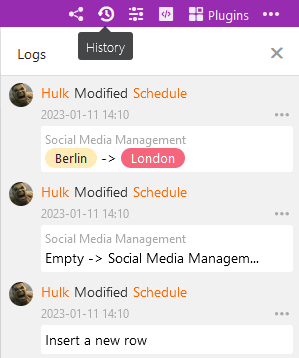

SeaTable регистрирует все действия в пределах базы в журнале. Этот журнал можно использовать для восстановления не только отдельных значений, но и строк, столбцов и таблиц. Журналы позволяют более детально просмотреть изменения и отменить их более чем через корзину.

## Чтобы открыть журнал базы

Вы открываете журналы, как корзину, с помощью значка версий в правом верхнем углу.

В открывшейся панели вы найдете последние изменения, сделанные в Base, в антихронологическом порядке. Каждая запись журнала содержит следующую информацию:

- Имя редактора
- Характер изменений
- Таблица, касающаяся
- Дата изменения
- Описание изменения

## Загрузка старых записей журнала

Если вы интенсивно работаете на базе, журнал содержит много записей, и может возникнуть необходимость **прокрутить журнал вниз**. При открытии список записей загружается не полностью. При прокрутке вниз последовательно перезагружаются старые записи журнала, которые можно затем искать.

Для каждой базы можно просмотреть максимум 1 000 последних записей в журнале. Документация об изменениях, внесенных еще дальше в прошлое, удаляется и обычно больше не нужна.

## Отменить изменения

Вы можете отменить изменения, нажав на **Восстановить** через **значок с тремя точками** в записи журнала. Восстановление немедленно выполняется в соответствующей таблице и подтверждается коротким сообщением.

Отмененное действие остается задокументированным в журнале, но не может быть выполнено повторно. Соответствующая попытка подтверждается сообщением об ошибке.


