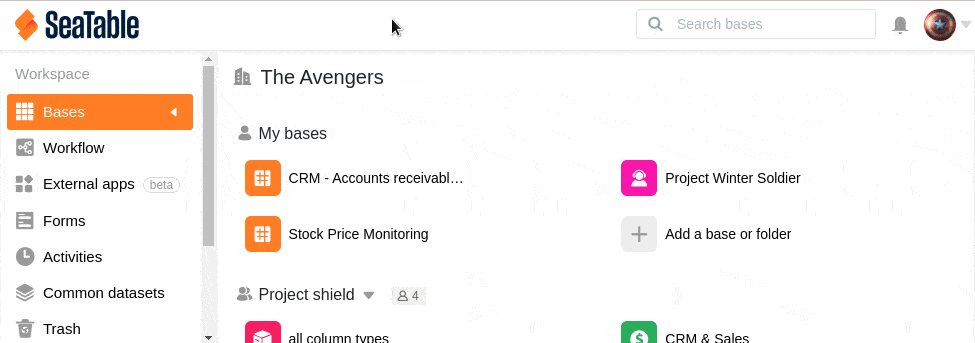
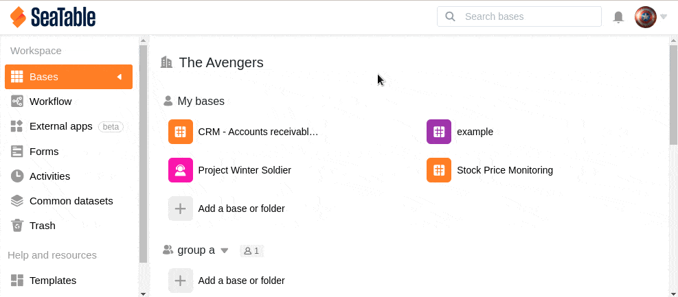

Bases that you have created under "My Bases" or in groups can be deleted and restored from the respective recycle bin if required. Note that you can restore a Base only up to 30 days after deleting it. After this time, deleted Bases are permanently removed from SeaTable and can no longer be restored.

## Restore a Base deleted from "My Bases

1. Switch to the SeaTable **home** page.
2. Open the **recycle bin**.
3. Select the **base** you want to restore. To do this, click either on the **name of the base** or on **Restore** to the right of the deletion date.
4. Confirm the recovery by clicking **Restore** again.
5. You can now find the restored base on the home page under **My Bases**.

## Restore deleted base of a group

You **cannot** restore bases that have been deleted from a group in the way described above, because each group has its own **recycle bin**. Using the recycle bin of a group, you can restore all bases of the group that have been deleted in the last 30 days.

1. Switch to the SeaTable **home** page.
2. Click the **triangle icon to** the right of the name of the group where the deleted Base was located.
3. Open the **recycle bin**.
4. Select the **base** you want to restore. To do this, click either on the **name of the base** or on **Restore** to the right of the deletion date.
5. Confirm the recovery by clicking **Restore** again.
6. You will now find the restored base in the corresponding **group** on the home page.
