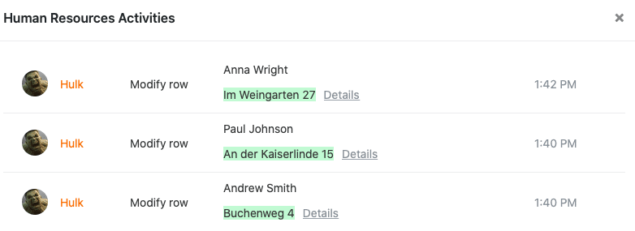
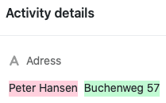

Damit Sie jederzeit nachvollziehen können, wer wann welche **Änderungen** an den Daten in Ihren Bases vorgenommen hat, wird die **Historie** temporär an verschiedenen Stellen in SeaTable gespeichert. Es gibt ein übergreifendes **Aktivitätenprotokoll** auf der Startseite, ein **Log** für jede Base und für jede Zeile. Zudem können Sie erfolgte Automationen und Skripte jeweils in einem **Ausführungslog** überprüfen.

## Aktivitätenprotokoll

Das Aktivitätenprotokoll können Sie jederzeit über die **Startseite** von SeaTable erreichen.

In dieser Übersicht finden Sie jegliche **Änderungen**, die in Ihren **Bases** vorgenommen wurden. Beachten Sie dabei, dass im Aktivitätenprotokoll alle Bearbeitungen angezeigt werden, die von Ihnen selbst, Ihren Teammitgliedern, anderen Benutzern und Automationen durchgeführt wurden.

Jedoch werden Ihnen lediglich die Änderungen angezeigt, die sich **innerhalb der letzten 7 Tage** in Ihren Bases ereignet haben. Änderungen, die mehr als eine Woche zurückliegen, werden automatisch wieder aus dem Protokoll **gelöscht** und können hier **nicht** mehr eingesehen werden.

Mit einem Klick auf den **Namen** einer im Protokoll zu findenden **Base** können Sie diese in einem neuen Fenster öffnen.

Um Näheres über die an einer Base durchgeführten Änderungen zu erfahren, klicken Sie im Aktivitätenprotokoll einfach auf die neben dem Namen einer Base stehenden **Änderungen**.

Im Anschluss öffnet sich ein Fenster, in dem Sie diverse Informationen zu den an der entsprechenden Base durchgeführten Änderungen einsehen können, zum Beispiel die **Einträge**, die in einer Base hinzugefügt bzw. aus einer Base entfernt wurden, eine **Beschreibung** der Änderungen und den genauen **Zeitpunkt**, zu dem die Bearbeitung erfolgt ist.

Beachten Sie dabei, dass **hinzugefügte Einträge** stets **grün** markiert werden, während **entfernte Einträge** im Protokoll **rot** sind.

Mit einem Klick auf **Details** können Sie sich die entsprechenden Änderungen in einem separaten Fenster anzeigen lassen.

## Base-Log

Alle in einer Base durchgeführten Aktivitäten können Sie im sogenannten **Base-Log** einsehen, welches Sie über den Base-Header erreichen.

In einem Base-Log finden Sie die jüngsten Änderungen, die an der entsprechenden Base vorgenommen wurden. Jeder Log-Eintrag enthält dabei folgende Informationen:

- Name des Bearbeiters
- Art der Änderung
- Betroffene Tabelle
- Zeitpunkt der Änderung
- Beschreibung der Änderung

Weitere Informationen über das Base-Log und eine detaillierte **Anleitung**, wie Sie darüber Änderungen rückgängig machen können, finden Sie in diesem [Hilfe-Artikel](https://seatable.io/docs/historie-und-versionen/aenderungen-ueber-die-logs-rueckgaengig-machen/).

Um die Nachvollziehbarkeit von Änderungen an Zeilen im [Big-Data-Speicher]() zu erhöhen, bietet SeaTable ein separates **Big Data Log**. Dieses Log kommt aber erst zum Vorschein, sobald der Big-Data-Speicher in der Base aktiviert ist.



## Zeilen-Log

Alle in einer Zeile durchgeführten Änderungen können Sie im sogenannten **Zeilen-Log** einsehen, welches Sie mit einem Klick auf das **Doppelpfeil-Symbol** in der Nummerierungsspalte einer Zeile erreichen können.

Das **Zeilen-Log** bietet Ihnen die Möglichkeit nachzuvollziehen, wann welcher Benutzer welche Änderung an dem Datensatz in einer **Zeile** vorgenommen hat. Wenn Sie sich stattdessen sämtliche Änderungen in einer Base ansehen wollen, müssen Sie auf das **Base-Log** zurückgreifen.

Wenn Sie nähere Informationen über das Zeilen-Log benötigen, werfen Sie gerne einen Blick in den entsprechenden [Hilfe-Artikel]().

## Ausführungslog von Automationen

Um die korrekte Ausführung einer **Automation** zu überprüfen, haben Sie die Möglichkeit, das **Ausführungslog** einzusehen, welches Sie über die Base-Optionen erreichen können.

In diesem hält SeaTable für jeden Automationslauf folgende Informationen fest: Ausführungszeit, Ausführungsbedingung, Status und ggf. Warnungen.

Nähere Informationen zum Ausführungslog einer Automation finden Sie [hier](https://seatable.io/docs/automationen/ausfuehrungslog-einer-automation-anzeigen/).

## Ausführungslog von Skripten

In Ihren Bases angelegte Skripte verfügen ebenfalls über ein **Ausführungslog**, das Sie über die Base-Optionen erreichen können.

Im Ausführungslog finden Sie diverse nützliche Informationen wie Startzeit, Endzeit, Gesamtdauer und Status eines Skript-Laufs.

Falls Sie weitere Informationen zum Ausführungslog von Skripten benötigen, werfen Sie gerne einen Blick in diesen [Hilfe-Artikel](https://seatable.io/docs/javascript-python/das-ausfuehrungslog-von-skripten/).
