In order to keep track of who made what **changes to** the data in your Bases and when, the **history** is temporarily stored in various places in SeaTable. There is an overall **activity log** on the start page, a **log** for each Base and for each row. In addition, you can review automations and scripts that have been performed in an **execution log** for each.

## Activity log

You can access the activity log at any time from the SeaTable **home** page.

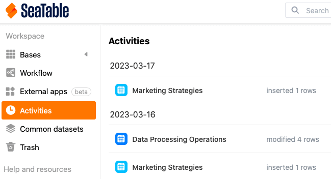

In this overview you will find any **changes** that have been made in your **bases**. Note that the activity log shows all edits made by yourself, your team members, other users, and automations.

However, only the changes that have occurred in your bases **within the last 7 days** are displayed. Changes that occurred more than a week ago are automatically **deleted** from the log and can **no** longer be viewed here.

By clicking on the **name of** a **base** to be found in the log, you can open it in a new window.

To learn more about the changes made to a Base, simply click on the **changes** next to a Base's name in the Activity Log.

A window will then open where you can view various information about the changes made to the corresponding base, for example, the **entries** that were added to or removed from a base, a **description of** the changes, and the exact **time when** the editing took place.

Note that **added entries** are always highlighted in **green**, while **removed entries** are **red** in the log.

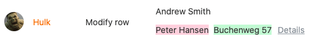

By clicking **Details** you can view the corresponding changes in a separate window.

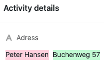

## Base log

All activities performed in a base can be viewed in the so-called base **log**, which you can access via the base header.

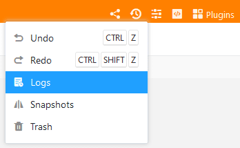

In a base log you will find the latest changes that have been made to the corresponding base. Each log entry contains the following information:

- Name of the processor
- Nature of the change
- Table concerned
- Date of the change
- Description of the change

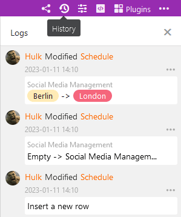

For more information about the base log and detailed **instructions on** how to undo changes above it, see this [help article](https://seatable.io/en/docs/historie-und-versionen/aenderungen-ueber-die-logs-rueckgaengig-machen/).

To increase the traceability of changes to rows in the [big data storage](), SeaTable offers a separate **big data log**. However, this log only appears as soon as the big data storage is activated in the base.

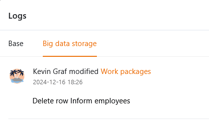



## rows-Log

All changes made in a row can be viewed in the so-called **rows-log, which you can reach by clicking on the** **double arrow symbol** in the numbering column of a row .

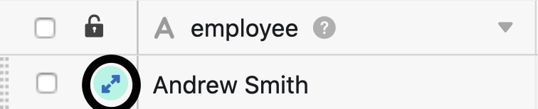

The **rows-Log offers you the possibility to track when which user made which change to the record in a** **row** file. If you want to view all changes in a Base instead, you have to resort to the **Base log**.

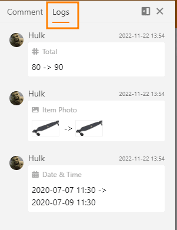

If you need more information about the rows log, please have a look at the corresponding [help article]().

## Automation execution log

To check the correct execution of an **automation**, you have the possibility to view the **execution log**, which you can reach via the Base options.

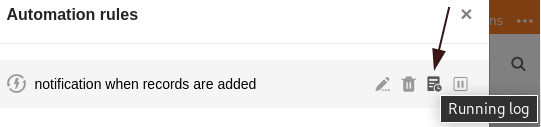

In this, SeaTable records the following information for each automation run: execution time, execution condition, status and warnings, if any.

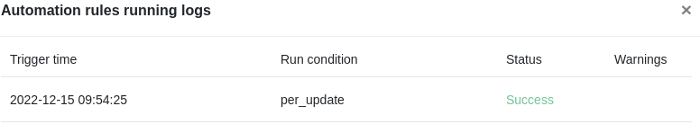

More information about the execution log of an automation can be found [here](https://seatable.io/en/docs/automationen/ausfuehrungslog-einer-automation-anzeigen/).

## Execution log of scripts

Scripts created in your bases also have an **execution log**, which you can access through the base options.

In the execution log you can find various useful information such as start time, end time, total duration and status of a script run.

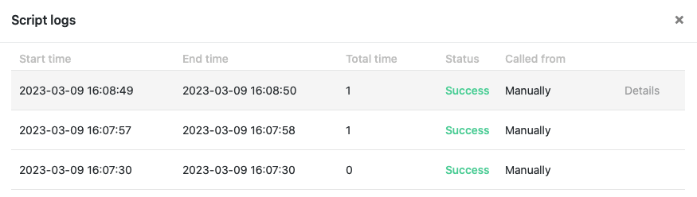

If you need more information about the execution log of scripts, feel free to take a look at this [help article](https://seatable.io/en/docs/javascript-python/das-ausfuehrungslog-von-skripten/).
