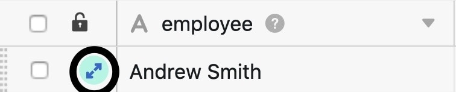

Para que pueda controlar quién ha realizado qué **cambios** en los datos de sus bases y cuándo, el **historial** se almacena temporalmente en varios lugares de SeaTable. Hay un **registro de actividad** general en la página de inicio, un **registro** para cada base y para cada fila. Además, puede comprobar las automatizaciones y scripts que han tenido lugar en un registro **de ejecución**.

## Registro de actividades

Puede acceder al registro de actividades en cualquier momento desde la página **de inicio** de SeaTable.

En esta vista general encontrará todos los **cambios** que se han realizado en sus **bases**. Tenga en cuenta que el registro de actividad muestra todas las ediciones realizadas por usted, los miembros de su equipo, otros usuarios y automatizaciones.

Sin embargo, sólo se muestran los cambios que se han producido en sus bases **en los últimos 7 días**. Los cambios que se produjeron hace más de una semana se **eliminan** automáticamente del registro y ya **no** se pueden ver aquí.

Haciendo clic en el **nombre de** una **base** del protocolo, puede abrirla en una nueva ventana.

Para saber más sobre los cambios realizados en una base, basta con hacer clic en los **cambios** junto al nombre de una base en el registro de actividades.

A continuación, se abre una ventana en la que puede ver diversa información sobre los cambios realizados en la base correspondiente, por ejemplo, las **entradas** que se han añadido o eliminado de una base, una **descripción de** los cambios y la **hora exacta en** que se produjo la edición.

Tenga en cuenta que las **entradas añadidas** siempre se marcan **en verde**, mientras que **las eliminadas** aparecen **en rojo** en el registro.

Haga clic en **Detalles** para visualizar los cambios correspondientes en una ventana aparte.

## Registro base

Puede consultar todas las actividades realizadas en una base en el denominado **registro de** la base, al que puede acceder a través de la cabecera de la base.

En el registro de una base, encontrará los cambios más recientes que se han realizado en la base correspondiente. Cada entrada de registro contiene la siguiente información:

- Nombre del editor
- Naturaleza del cambio
- Cuadro correspondiente
- Fecha del cambio
- Descripción del cambio

Para más información sobre el registro base e **instrucciones** detalladas sobre cómo deshacer cambios sobre él, consulte este [artículo de ayuda]().

Para aumentar la trazabilidad de los cambios en las filas de la [memoria de big data](), SeaTable ofrece un **registro de big data** independiente. Sin embargo, este registro solo aparece en cuanto se activa la memoria de big data en la base.



## Registro de líneas

Puede ver todos los cambios realizados en una fila en el denominado **registro de filas**, al que puede acceder haciendo clic en el **símbolo de la doble flecha** situado en la columna de numeración de una fila.

El registro de **línea** le permite ver cuándo qué usuario realizó qué cambio en el registro de una **línea**. Si en cambio desea ver todos los cambios en una base, debe utilizar el registro de **base**.

Si necesita más información sobre el registro de líneas, consulte el [artículo de ayuda]() correspondiente.

## Registro de ejecución de automatizaciones

Para comprobar la correcta ejecución de una **automatización**, tienes la posibilidad de ver el **registro de ejecución**, al que puedes acceder a través de las opciones de la Base.

SeaTable registra la siguiente información para cada ejecución de automatización: tiempo de ejecución, condición de ejecución, estado y cualquier advertencia.

Puede encontrar más información sobre el registro de ejecución de una automatización [aquí]().

## Registro de ejecución de scripts

Los scripts creados en tus bases también tienen un **registro de ejecución al que** puedes acceder a través de las opciones de la base.

En el registro de ejecución encontrará diversa información útil, como la hora de inicio, la hora de finalización, la duración total y el estado de la ejecución de un script.

Si necesitas más información sobre el registro de ejecución de scripts, no dudes en echar un vistazo a este [artículo de ayuda]().
