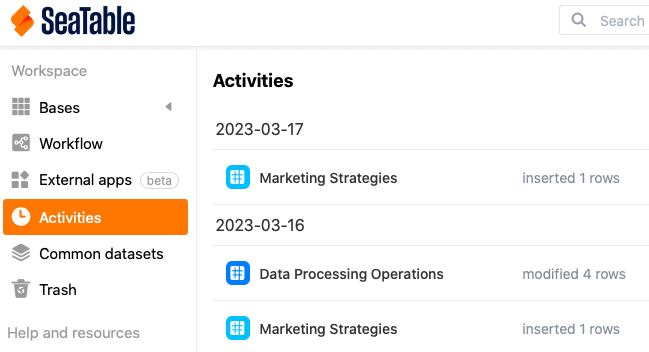
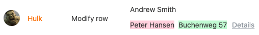
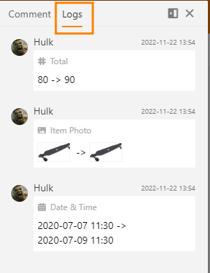

Para lhe permitir seguir quem fez as **alterações aos** dados nas suas bases e quando, o **histórico** é temporariamente armazenado em vários locais no SeaTable. Há um **registo de actividade** global na página inicial, um **registo** para cada base e para cada linha. Além disso, é possível verificar as automatizações e os scripts que tiveram lugar num **registo de execução**.

## Diário de actividades

Pode aceder ao registo de actividades em qualquer altura a partir da página **inicial do** SeaTable.

Nesta síntese, encontrará quaisquer **alterações** que tenham sido feitas nas suas **bases**. Note que o registo de actividades mostra todas as edições feitas por si, pelos membros da sua equipa, outros utilizadores e automatizações.

No entanto, apenas as alterações que ocorreram nas suas bases **nos últimos 7 dias** são exibidas. As alterações que ocorreram há mais de uma semana são automaticamente **apagadas** do registo e já **não** podem ser visualizadas aqui.

Ao clicar no **nome** de uma **base** a ser encontrada no protocolo, pode abri-la numa nova janela.

Para saber mais sobre as alterações feitas a uma base, basta clicar nas **alterações** ao lado do nome de uma base no diário de actividades.

Abre-se então uma janela na qual se pode ver várias informações sobre as alterações feitas à base correspondente, por exemplo, as **entradas** que foram adicionadas ou removidas de uma base, uma **descrição** das alterações e o **momento** exacto **em** que a edição teve lugar.

Note-se que as **entradas adicionadas** são sempre marcadas **a verde**, enquanto as **entradas removidas** são marcadas **a vermelho** no registo.

Clicar em **Detalhes** para exibir as alterações correspondentes numa janela separada.

## Diário base

Pode ver todas as actividades realizadas numa base no chamado **registo de** base, ao qual pode aceder através do cabeçalho da base.

Num registo de base, encontrará as alterações mais recentes que foram feitas à base correspondente. Cada entrada de registo contém as seguintes informações:

- Nome do editor
- Natureza da mudança
- Tabela em questão
- Data da alteração
- Descrição da alteração

Para mais informações sobre o registo de base e **instruções** detalhadas **sobre** como desfazer as alterações acima dele, ver este [artigo de ajuda]().

Para aumentar a rastreabilidade das alterações nas linhas da [memória de grandes volumes de dados](), o SeaTable oferece um **registo de grandes volumes de dados** separado. No entanto, este registo só aparece assim que a memória de grandes volumes de dados é activada na base.



## Registo de linha

Pode ver todas as alterações feitas numa linha no chamado **registo de linha**, que pode alcançar clicando no **símbolo da seta dupla** na coluna de numeração de uma linha.

O **registo de linha** permite ver quando é que o utilizador fez que alteração ao registo numa **linha**. Se quiser ver todas as alterações numa base, deve utilizar o **registo de base**.

Se precisar de mais informações sobre o registo de linha, por favor consulte o [artigo de ajuda]() correspondente.

## Diário de execução das automatizações

Para verificar a correcta execução de uma **automatização**, tem a possibilidade de visualizar o **registo de execução**, ao qual pode aceder através das opções da Base.

SeaTable regista as seguintes informações para cada execução de automatização: tempo de execução, condição de execução, estado e quaisquer avisos.

Mais informações sobre o registo de execução de uma automatização podem ser encontradas [aqui]().

## Registo de execução de guiões

Os scripts criados nas suas bases também têm um **registo de execução que** pode aceder através das opções da base.

No registo de execução encontrará várias informações úteis tais como a hora de início, hora de fim, duração total e estado de um script executado.

Se precisar de mais informações sobre o registo de execução de scripts, sinta-se à vontade para dar uma vista de olhos a este [artigo de ajuda]().
