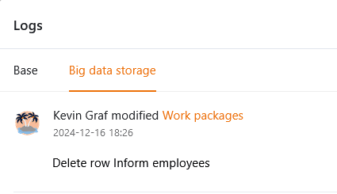
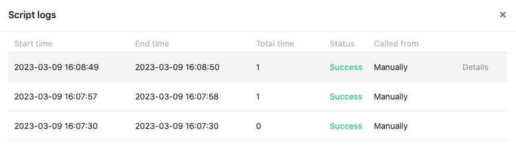

Чтобы вы могли отслеживать, кто и когда **вносил изменения в** данные в ваших базах, **история** временно сохраняется в различных местах SeaTable. Есть общий **журнал активности** на стартовой странице, **журнал** для каждой базы и для каждой строки. Кроме того, в **журнале выполнения** можно проверить выполненные автоматизированные действия и скрипты.

## Журнал активности

Вы можете в любое время получить доступ к журналу активности с **главной** страницы SeaTable.

В этом обзоре вы найдете все **изменения**, которые были сделаны в ваших **базах**. Обратите внимание, что в журнале активности отображаются все правки, сделанные вами, членами вашей команды, другими пользователями и автоматами.

Однако отображаются только те изменения, которые произошли в ваших базах **в течение последних 7 дней**. Изменения, произошедшие более недели назад, автоматически **удаляются** из журнала и больше **не** могут быть просмотрены здесь.

Щелкнув по **названию** **базы**, которую можно найти в протоколе, вы можете открыть ее в новом окне.

Чтобы узнать больше об изменениях, внесенных в базу, просто нажмите на **изменения** рядом с названием базы в журнале активности.

Затем откроется окно, в котором можно просмотреть различную информацию об изменениях, внесенных в соответствующую базу, например, **записи**, которые были добавлены или удалены из базы, **описание** изменений и точное **время**, в которое происходило редактирование.

Обратите внимание, что **добавленные записи** всегда помечаются **зеленым цветом**, а **удаленные** - **красным**.

Нажмите кнопку **Подробности**, чтобы отобразить соответствующие изменения в отдельном окне.

## Базовый журнал

Все действия, выполненные в базе, можно просмотреть в так называемом **журнале** базы, доступ к которому можно получить через шапку базы.

В журнале базы вы найдете последние изменения, которые были внесены в соответствующую базу. Каждая запись в журнале содержит следующую информацию:

- Имя редактора
- Характер изменений
- Таблица, касающаяся
- Дата изменения
- Описание изменения

Для получения дополнительной информации о базовом журнале и подробных **инструкций о** том, как отменить изменения над ним, смотрите эту [статью справки](https://seatable.io/ru/docs/historie-und-versionen/aenderungen-ueber-die-logs-rueckgaengig-machen/).

Для повышения отслеживаемости изменений строк в [памяти больших данных]() SeaTable предлагает отдельный **журнал больших данных**. Однако этот журнал появляется только после активации памяти больших данных в базе.



## Линейный журнал

Все изменения, сделанные в строке, можно просмотреть в так называемом **журнале строк**, который можно открыть, нажав на **символ двойной стрелки** в колонке нумерации строки.

**Журнал строк** позволяет увидеть, когда какой пользователь внес то или иное изменение в запись в **строке**. Если вы хотите просмотреть все изменения в базе вместо этого, вы должны использовать **журнал базы**.

Если вам нужна дополнительная информация о журнале строк, пожалуйста, посмотрите соответствующую [статью справки]().

## Журнал выполнения автоматизаций

Чтобы проверить правильность выполнения **автоматизации**, у вас есть возможность просмотреть **журнал выполнения**, который доступен через опции Base.

SeaTable записывает следующую информацию для каждого запуска автоматизации: время выполнения, условие выполнения, статус и любые предупреждения.

Более подробную информацию о журнале выполнения автоматизации можно найти [здесь](https://seatable.io/ru/docs/automationen/ausfuehrungslog-einer-automation-anzeigen/).

## Журнал выполнения сценариев

Сценарии, созданные в ваших базах, также имеют **журнал выполнения,** к которому вы можете получить доступ через опции базы.

В журнале выполнения вы найдете различную полезную информацию, такую как время начала, время окончания, общая продолжительность и статус выполнения сценария.

Если вам нужна дополнительная информация о журнале выполнения скриптов, ознакомьтесь с этой [справочной статьей](https://seatable.io/ru/docs/javascript-python/das-ausfuehrungslog-von-skripten/).
