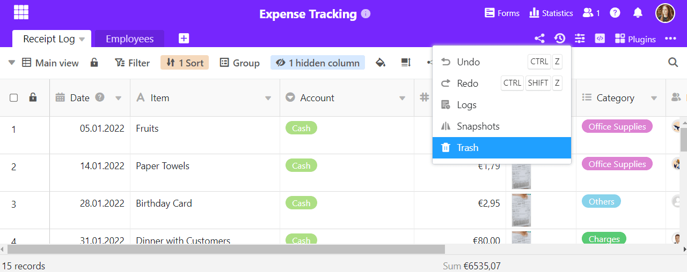

Schnell ist es passiert, dass man aus Versehen Zeilen oder Werte aus einer Tabelle gelöscht hat. Oder man möchte die aktuellen Daten mit einem früheren Versionsstand der Tabelle vergleichen und ggf. auf den früheren Versionsstand zurückspringen. Mit SeaTable ist die Wiederherstellung gelöschter Daten und früherer Versionsstände ganz einfach.

Erfahren Sie hier, wie Sie in SeaTable gelöschte Daten wiederherstellen können und welche anderen Optionen Ihnen SeaTable zur "Zeitreise" bietet.

## 6 verschiedene Möglichkeiten zur Datenwiederherstellung in SeaTable

SeaTable bietet Ihnen nicht nur _eine_ Art der Datenwiederherstellung. Je nach Situation benötigen Sie eine der folgenden **sechs Optionen**:

1. Gelöschte Bases können Sie aus dem Papierkorb auf der Startseite wiederherstellen.
2. In einer Base können Sie gelöschte Zeilen, Spalten oder Tabellen wiederherstellen.
3. Die letzten Änderungen können Sie bequem per Tastenkürzel rückgängig machen.
4. Mithilfe der Logs können Sie jede Änderung in einer Base nachvollziehen und rückgängig machen.
5. Mit einem Snapshot können Sie frühere Versionen einer Base wiederherstellen.
6. Sie können eine gespeicherte Base mithilfe einer DTABLE-Datei importieren.

Der folgende Artikel gibt Ihnen einen Überblick, wann welche Wiederherstellungsoption die richtige für Sie ist, und verlinkt die Hilfeartikel mit zusätzlichen Informationen.

## 1\. Wiederherstellung gelöschter Bases

Wenn Sie eine komplette Base gelöscht haben, können Sie diese über einen Papierkorb auf der Startseite von SeaTable wiederherstellen. Wie das funktioniert, erfahren Sie im Artikel [Eine gelöschte Base wiederherstellen](https://seatable.io/docs/historie-und-versionen/eine-geloeschte-base-wiederherstellen/).

## 2\. Wiederherstellung gelöschter Zeilen, Spalten oder Tabellen

Einzelne gelöschte Zeilen, Spalten oder Tabellen zurückzuholen ist vermutlich der häufigste Wiederherstellungswunsch. Über den Papierkorb einer Base ist dies glücklicherweise denkbar schnell gemacht.

Mehr dazu erfahren Sie im Artikel [Tabellen, Zeilen und Spalten aus dem Papierkorb zurückholen](https://seatable.io/docs/historie-und-versionen/tabellen-und-zeilen-aus-dem-papierkorb-zurueckholen/).

Sie erreichen den Base-Papierkorb per Klick auf das Versionen-Icon in der rechten oberen Ecke. In diesem Drop-down-Menü finden Sie auch noch andere Wiederherstellungsoptionen, die weiter unten erläutert werden.

## 3\. Aktionen rückgängig machen

Bestimmt kennen Sie die Tastenkombination  + , um die letzte Aktion rückgängig zu machen. Genau diese Funktion bietet auch SeaTable. Außerdem ist sie per Mausklick im oben gezeigten Drop-down-Menü ausführbar.

Details finden Sie im entsprechenden Hilfeartikel [Aktionen rückgängig machen](https://seatable.io/docs/historie-und-versionen/aktionen-rueckgaengig-machen/).

## 4\. Änderungen über die Logs rückgängig machen

SeaTable protokolliert alle Aktivitäten innerhalb einer Base in einem Log. Über dieses lassen sich nicht nur einzelne Werte, sondern auch Zeilen, Spalten und Tabellen wiederherstellen. Über die Logs können Sie also detaillierter die Änderungen einsehen und mehr wieder rückgängig machen als über den Papierkorb.

Weitere Informationen erhalten Sie im Artikel [Änderungen über die Logs rückgängig machen](https://seatable.io/docs/historie-und-versionen/aenderungen-ueber-die-logs-rueckgaengig-machen/).

## 5\. Wiederherstellung über Snapshots

Ein Snapshot speichert eine Momentaufnahme von einer Base, also alle Tabellen, Ansichten, Statistiken und Formulare, die zu einem bestimmten Zeitpunkt in einer Base vorhanden sind. SeaTable erstellt alle 24 Stunden einen Snapshot für Bases, in denen aktiv gearbeitet wurde – Sie können aber auch manuell Snapshots anlegen. Die Snapshots können Sie sich anzeigen lassen und die früheren Versionsstände wiederherstellen.

Alles Weitere erfahren Sie in den Artikeln [Speichern der aktuellen Base als Snapshot](https://seatable.io/docs/historie-und-versionen/speichern-der-aktuellen-base-als-snapshot/) und [Wiederherstellung eines Snapshots](https://seatable.io/docs/historie-und-versionen/wiederherstellung-eines-snapshots/).



## 6\. Eine als DTABLE-Datei gespeicherte Base importieren

Sie können eine Base jederzeit als DTABLE-Datei exportieren und so ein umfangreiches Backup auf Ihrem Gerät speichern. Lesen Sie im Artikel [Speichern einer Base als DTABLE-Datei](https://seatable.io/docs/historie-und-versionen/speichern-einer-base-als-dtable-datei/), wie das geht und was Sie dabei beachten sollten.

Wie Sie eine solche Datei wieder in SeaTable importieren, erfahren Sie im Artikel [Erstellen einer Base aus einer DTABLE-Datei](https://seatable.io/docs/import-von-daten/erstellen-einer-base-aus-einer-dtable-datei/).
