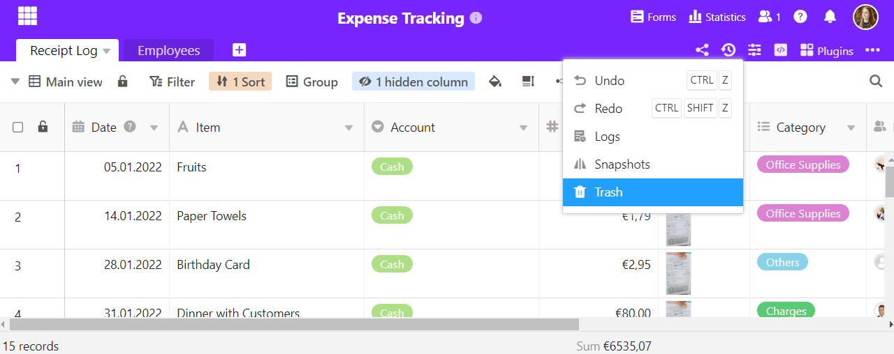

It can quickly happen that you have accidentally deleted rows or values from a table. Or you want to compare the current data with a previous version of the table and jump back to the previous version if necessary. With SeaTable the recovery of deleted data and earlier versions is very easy.

Learn here how to recover data deleted in SeaTable and what other options SeaTable offers you for "time travel".

## 6 different ways to recover data in SeaTable

SeaTable does not offer you only _one_ type of data recovery. Depending on the situation, you will need one of the following **six options**:

1. You can restore deleted bases from the recycle bin on the home page.
2. In a Base you can restore deleted rows, columns or tables.
3. You can conveniently undo the last changes using keyboard shortcuts.
4. With the help of the logs, you can track and undo any change in a base.
5. You can use a snapshot to restore previous versions of a base.
6. You can import a saved base using a DTABLE file.

The following article gives you an overview of when which recovery option is right for you and links to the help articles with additional information.

## 1\. recovery of deleted bases

If you have deleted an entire Base, you can restore it using a recycle bin on the SeaTable home page. To learn how to do this, see the article [Restore a Deleted Base](https://seatable.io/en/docs/historie-und-versionen/eine-geloeschte-base-wiederherstellen/).

## 2\. recovery of deleted rows, columns or tables

Retrieving individual deleted rows, columns or tables is probably the most common recovery request. Fortunately, this can be done very quickly via the recycle bin of a base.

You can learn more about this in the article [Retrieve tables, rows and columns from the trash](https://seatable.io/en/docs/historie-und-versionen/tabellen-und-zeilen-aus-dem-papierkorb-zurueckholen/).

You can access the Base Recycle Bin by clicking on the versions icon in the upper right corner. In this drop-down menu you will also find other recovery options, which will be explained below.

## 3\. undo actions

Surely you know the key combination  + to undo the last action. Exactly this function is also offered by SeaTable. Moreover, it is executable by mouse click in the drop-down menu shown above.

For details, see the corresponding help article [Undo Actions](https://seatable.io/en/docs/historie-und-versionen/aktionen-rueckgaengig-machen/).

## 4\. undo changes via the logs

SeaTable logs all activities within a base in a log. This log can be used to restore not only individual values, but also rows, columns and tables. With the logs you can see the changes in more detail and undo more than with the recycle bin.

For more information, see the article [Undoing changes via the logs](https://seatable.io/en/docs/historie-und-versionen/aenderungen-ueber-die-logs-rueckgaengig-machen/).

## 5\. recovery via snapshots

A snapshot stores a snapshot of a Base, i.e. all tables, views, statistics and forms that exist in a Base at a given time. SeaTable creates a snapshot every 24 hours for Bases that have been actively worked on - but you can also create snapshots manually. You can view the snapshots and restore the previous versions.

For more information, see the articles [Saving the Current Base as a Snapshot](https://seatable.io/en/docs/historie-und-versionen/speichern-der-aktuellen-base-als-snapshot/) and [Restoring a Snapshot](https://seatable.io/en/docs/historie-und-versionen/wiederherstellung-eines-snapshots/).



## 6\. import a base saved as a DTABLE file

You can export a Base as a DTABLE file at any time and thus save a comprehensive backup on your device. Read the article [Saving a Base as a DTABLE File](https://seatable.io/en/docs/historie-und-versionen/speichern-einer-base-als-dtable-datei/) to learn how to do this and what you should keep in mind.

To learn how to import such a file back into SeaTable, see the article [Creating a Base from a DTABLE File](https://seatable.io/en/docs/import-von-daten/erstellen-einer-base-aus-einer-dtable-datei/).
