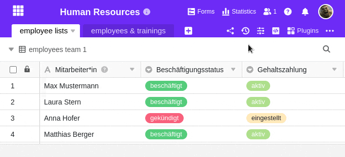

You can save a base in SeaTable as a **snapshot** at any time. Snapshots are part of SeaTable's DNA: Ever since the first version, you have been able to create **snapshots** of the status of a base and restore them at a later point in time. Snapshots are useful, for example, if you want to save the current version of a base before making extensive changes.

Good to know: SeaTable automatically creates one snapshot per day of each Base where changes have been made. This way you always have backup copies of your Bases with the latest versions.



## Manual creation of a snapshot

1. Click on  **versions** at the top right of the base options.
2. Select the **Snapshots** option in the drop-down menu that opens.
3. Click **Create Snapshot**.



## Storage duration of snapshots

The snapshots of bases are kept for a certain period of time and then deleted.

With [SeaTable Cloud](https:/cloud.seatable.io), the storage duration of the snapshots depends on [your team's subscription]():

- With the free **subscription**, the snapshots are saved for one month.
- With the **Plus** or **Enterprise subscription**, snapshots are stored for 6 or 12 months. (The extended storage period applies from the time of the upgrade).

If you operate your own [SeaTable server](), you can set the snapshot storage duration individually.

## Want to learn more about snapshots?

You might be interested in the following articles regarding the handling of snapshots:

- [Restoring a snapshot]()
- [Data recovery options with SeaTable]()

## Frequently asked questions

A snapshot saves all **table data** (columns and rows) as well as **views** and their settings. **Statistics**, **plugins** and their settings and **scripts** are also saved.

**Comments**, **web forms**, **automations**, **apps** and **content in the recycle bin** (deleted tables, columns and rows) are **not** saved in snapshots. Data in the big data storage is also not included in a snapshot.

Snapshots are created automatically **once a day** if changes have been made to the base. The time at which this happens cannot currently be influenced.

You can create a snapshot manually every **10 minutes** at most.


