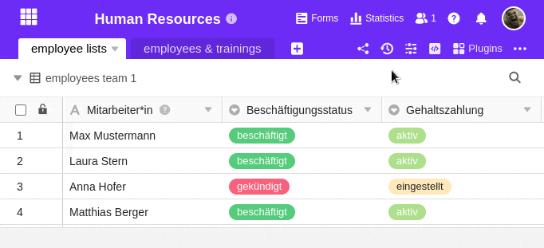

Puede guardar una base en SeaTable como **instantánea** en cualquier momento. Las instantáneas forman parte del ADN de SeaTable: desde la primera versión, ha podido crear **instantáneas** del estado de una base y restaurarlas en un momento posterior. Las instantáneas son útiles, por ejemplo, si desea guardar la versión actual de una base antes de realizar cambios extensos.

Conviene saber: SeaTable crea automáticamente una instantánea al día de cada base en la que se hayan realizado cambios. De este modo, siempre dispondrá de copias de seguridad de sus bases con las últimas versiones.



## Creación manual de una instantánea

1. Haga clic en  **versions** en la esquina superior derecha de las opciones de base.
2. Seleccione la opción **Instantáneas** en el menú desplegable que se abre.
3. Haga clic en **Crear instantánea**.



## Duración de almacenamiento de las instantáneas

Las instantáneas de las bases se conservan durante cierto tiempo y luego se borran.

Con [SeaTable Cloud](https://seatable.io/es/), la duración del almacenamiento de las instantáneas depende de [la suscripción de su equipo]():

- Con la **suscripción** gratuita, las instantáneas se guardan durante un mes.
- Con la **suscripción** **Plus** o **Enterprise**, las instantáneas se almacenan durante 6 o 12 meses. (El periodo de almacenamiento ampliado se aplica desde el momento de la actualización).

Si opera su propio [servidor SeaTable](), puede establecer individualmente la duración del almacenamiento de instantáneas.

## ¿Quieres saber más sobre las instantáneas?

Los siguientes artículos podrían interesarle en relación con el tratamiento de las instantáneas:

- [Restaurar una instantánea]()
- [Opciones de recuperación de datos con SeaTable]()

## Preguntas frecuentes

Una instantánea guarda todos los **datos de la tabla** (columnas y filas), así como **las vistas** y su configuración. También se guardan **las estadísticas**, los **plugins** y su configuración y los **scripts**.

Los **comentarios**, los **formularios web**, las **automatizaciones**, las **aplicaciones** y el **contenido de la papelera de reciclaje** (tablas, columnas y filas eliminadas) **no** se guardan en las instantáneas. Los datos del almacenamiento de big data tampoco se incluyen en una instantánea.

Las instantáneas se crean automáticamente **una vez al día** si se han realizado cambios en la base. Actualmente no se puede influir en la hora a la que esto ocurre.

Puedes crear una instantánea manualmente cada **10 minutos** como máximo.


