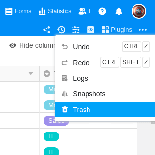

Gelöschte Tabellen, Zeilen und Spalten können Sie jederzeit im Papierkorb der jeweiligen Base finden und wiederherstellen. Sie müssen keine Angst davor haben, Daten zu verlieren, denn innerhalb von Bases bleiben gelöschte Tabellen, Zeilen und Spalten auf unbegrenzte Zeit verfügbar.

## Tabellen, Zeilen und Spalten aus dem Papierkorb zurückholen

1. Klicken Sie rechts oben in den Base-Optionen auf **Versionen**.
2. Öffnen Sie den **Papierkorb**.
3. Im Papierkorb finden Sie nun alle innerhalb der Base **gelöschten Tabellen**, **Zeilen** und **Spalten**. Mit einem Klick auf **Wiederherstellen** können Sie diese aus dem Papierkorb zurückholen.

Der Base-Papierkorb stellt eine Liste in **antichronologischer** Reihenfolge dar – also die jüngsten Löschvorgänge ganz oben. Sie sehen den löschenden Benutzer, den Namen der gelöschten Tabelle, Spalte oder Zeile (der Name der Zeile ist der Wert aus der ersten Spalte des gelöschten Eintrags) und eine Zeitangabe, wie lange die Löschung her ist. Bei Klick auf **Wiederherstellen** werden die gelöschten Daten unmittelbar wieder in die Base bzw. Tabelle eingefügt.

## Häufige Fragen



Kann man auch die letzten Eingaben rückgängig machen?

|||

Selbstverständlich haben Sie die Möglichkeit, Ihre letzten Änderungen rückgängig zu machen. Lesen Sie mehr unter [Aktionen rückgängig machen](https://seatable.io/docs/historie-und-versionen/aktionen-rueckgaengig-machen/).

---

Werden automatische Sicherungen meiner Base angefertigt?

|||

Ja. Wenn Änderungen an einer Base vorgenommen werden, wird täglich ein sogenannter **Snapshot** der Base angelegt, den Sie anschließend wiederherstellen können. Ausführlichere Informationen finden Sie unter [Speicherung der aktuellen Base als Snapshot]() und [Wiederherstellung eines Snapshots](https://seatable.io/docs/historie-und-versionen/wiederherstellung-eines-snapshots/).

---

Besteht auch die Möglichkeit, eine vollständige Sicherung einer Base anzufertigen?

|||

Ja, auch das ist in SeaTable mithilfe der Exportfunktion möglich. Lesen Sie mehr dazu unter [Datenimport und -export](https://seatable.io/docs/seatable-nutzen/datenimport-und-export/).


