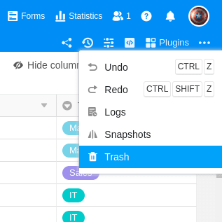

Вы можете в любое время найти и восстановить удаленные таблицы, строки и столбцы в корзине соответствующей базы. Вам не нужно бояться потери данных, поскольку в базах удаленные таблицы, строки и столбцы остаются доступными неограниченное время.

## Извлечение таблиц, строк и столбцов из корзины

1. Нажмите на **Версии** в правом верхнем углу опций базы.
2. Откройте **корзину**.
3. Теперь в корзине вы найдете все **таблицы**, **строки** и **столбцы**, **удаленные** в Base. Нажав кнопку **"Восстановить"**, вы можете извлечь их из корзины.

Базовая корзина отображает список в **антихронологическом** порядке - т.е. самые последние удаления вверху. Вы видите удаляющего пользователя, имя удаленной таблицы, столбца или строки (имя строки - это значение из первого столбца удаляемой записи) и указание времени, как давно было произведено удаление. Когда вы нажимаете кнопку **"Восстановить"**, удаленные данные немедленно вставляются обратно в базу или таблицу.

## Часто задаваемые вопросы

Конечно, у вас есть возможность отменить последние изменения. Подробнее читайте в разделе " [Действия отмены]()".

Да, когда в базу вносятся изменения, ежедневно создается так называемый **снимок** базы, который затем можно восстановить. Для получения более подробной информации см. разделы [Сохранение текущей базы в виде моментального снимка]() и [Восстановление моментального снимка]().

Да, это возможно и в SeaTable с помощью функции экспорта. Подробнее об этом читайте в разделе [Импорт и экспорт данных]().


