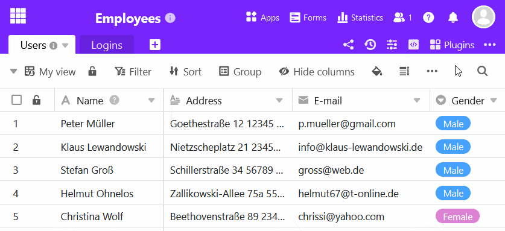
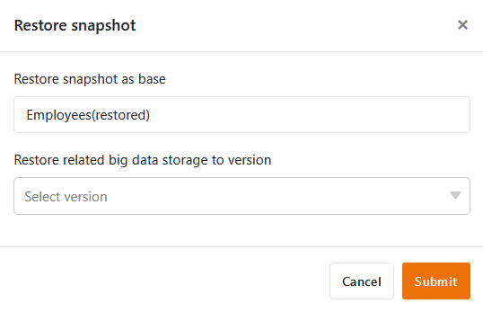

A snapshot created from a base can be restored as a new base at any time. Before you restore a snapshot, you can first display it in a separate view. In this way, you can always find out in advance exactly what the base looked like at the time it was saved.



There are two different ways to restore a snapshot:

1. Restore a snapshot from the home page
2. Restore a snapshot within a base

## Restore a snapshot from the home page

1. Switch to the SeaTable **home** page.
2. Move the mouse over the desired base and click on the **three dots**.
3. Click **Snapshots**.
4. Select any **snapshot** and click **Restore**.
5. Give the snapshot a **name** and confirm your entry.

## Restore a snapshot within a base

1. Click on  **versions** at the top right of the base options.
2. Click on **Snapshots** in the drop-down menu that opens.
3. Select any **snapshot** and click on the **three dots** on the right.
4. Click **Restore**.
5. Give the snapshot a **name**.
6. Confirm with **Submit**.

## Restoring a previous version of the big data store

If you have [activated]() in a base, you can also restore a previous version of the big data storage when restoring snapshots in order to prevent unwanted data loss. To do this, click in the corresponding field in step 5 and select the version of the big data storage that is to be restored with the snapshot.

