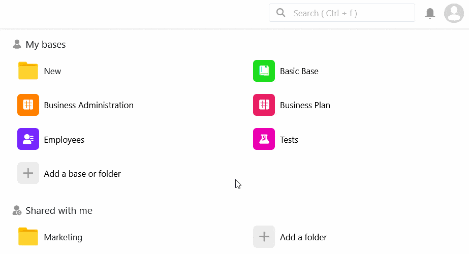
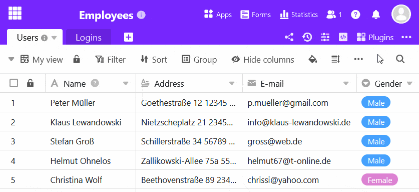

Um instantâneo criado a partir de uma base pode ser restaurado como uma nova base em qualquer altura. Antes de restaurar um instantâneo, pode primeiro exibi-lo numa vista separada. Desta forma, pode sempre saber antecipadamente qual era o aspeto exato da base no momento em que foi guardada.



Existem duas formas diferentes de restaurar um instantâneo:

1. Restaurando um Instantâneo da Página Principal
2. Restaurar um instantâneo dentro de uma base

## Restaurando um Instantâneo da Página Principal

1. Mudar para a página **inicial** da SeaTable.
2. Mova o rato sobre a base desejada e clique nos **três pontos**.
3. Clique em **Snapshots**.
4. Seleccione qualquer **instantâneo** e clique em **Restore**.
5. Dê um **nome** ao instantâneo e confirme a sua entrada.

## Restaurar um instantâneo dentro de uma base

1. Clique em  **versions** no canto superior direito das opções de base.
2. Clique em **Instantâneos** no menu pendente que se abre.
3. Seleccione qualquer **instantâneo** e clique nos **três pontos** à direita.
4. Clique em **Restaurar**.
5. Dê um **nome** ao instantâneo.
6. Confirmar com **Submeter**.

## Restaurar uma versão anterior do armazenamento de Big Data

Se tiver [ativado](https://seatable.io/pt/docs/big-data/aktivieren-des-big-data-backends-in-einer-base/) o [armazenamento de grandes volumes](https://seatable.io/pt/docs/big-data/aktivieren-des-big-data-backends-in-einer-base/) de [dados](https://seatable.io/pt/docs/big-data/aktivieren-des-big-data-backends-in-einer-base/) numa base, pode também restaurar uma versão anterior do armazenamento de grandes volumes de dados ao restaurar instantâneos, de modo a evitar perdas de dados indesejadas. Para isso, clique no campo correspondente no passo 5 e seleccione a versão do big data storage que deve ser restaurada com o snapshot.

