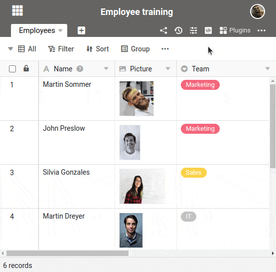

**Plugins** bieten Ihnen vielfältige Möglichkeiten, die Daten in Ihren Tabellen anschaulich darzustellen. Indem Sie ein Plugin in Ihrer Base einrichten, können Sie leicht zwischen der **Tabellen-Ansicht** und beispielsweise der **Kalender- oder Kanban-Darstellung** wechseln.



Für einen schnellen Zugriff auf Ihre Plugins können Sie diese der **Toolbar** neben den Ansichtsoptionen hinzufügen.

## Ein Plugin aktivieren

1. Klicken Sie auf **Plugins** im Base-Header.
2. Gehen Sie im erschienenen Panel auf **Plugins einrichten**.
3. Richten Sie das gewünschte Plugin mit einem Klick auf **Hinzufügen** ein.

Sie können das Plugin nun bereits nutzen. Wenn Sie das Plugin noch Ihrer Toolbar hinzufügen möchten, gehen Sie so vor:

6. Bewegen Sie den Mauszeiger über das eingerichtete Plugin und klicken Sie auf die **drei Punkte**.
7. Wählen Sie im Drop-down-Menü die Option **Der Toolbar hinzufügen** aus.
