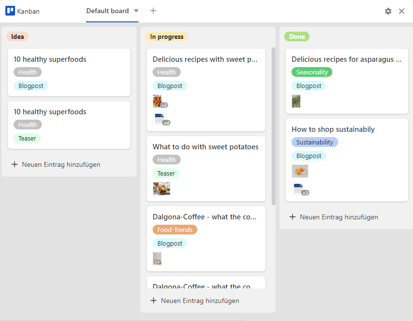

SeaTable **plugins** give you the opportunity to see your data from a completely different perspective. Visualize appointments, tasks and locations and create laid-out documents and profiles from your data. In the following article, we explain which plugins are available in SeaTable and how you can use them.

## What is a plugin?

In SeaTable you can create different **views** for your tables, where you can [filter](https://seatable.io/en/docs/ansichtsoptionen/filtern-von-eintraegen-in-einer-ansicht/), [sort](https://seatable.io/en/docs/ansichtsoptionen/sortieren-von-eintraegen-in-einer-ansicht/), [group](https://seatable.io/en/docs/ansichtsoptionen/gruppieren-von-eintraegen-in-einer-ansicht/) and [hide](https://seatable.io/en/docs/ansichtsoptionen/ausblenden-und-verschieben-von-spalten/) data as you wish.

A **plugin** is an optional software component in SeaTable that offers you additional display options. Various plugins can be activated in each base, which display the data of the respective tables and views in **calendars**, **documents** or **galleries**, for example. Read more about [how to activate a plug](https://seatable.io/en/docs/plugins/aktivieren-eines-plugins-in-einer-base/)in in the linked help article.

## Calendar plugin

In the calendar plugin you can display dates from a [date column](https://seatable.io/en/docs/datum-dauer-und-personen/die-datum-spalte/) in a **year**, **month**, **week**, **day** or **agenda view**. You can also use two date columns to display **time spans** and keep track of all important dates, etc.

[More about the calendar plugin](https://seatable.io/en/docs/plugins/anleitung-zum-kalender-plugin/)

These articles may also be of interest to you:

- [Create multiple calendars for one Base](https://seatable.io/en/docs/kalender-plugin/mehrere-kalender-fuer-eine-base-anlegen/)
- [Create new calendar entries in the calendar plugin](https://seatable.io/en/docs/kalender-plugin/neue-kalendereintraege-im-kalender-plugin-anlegen/)

## Timeline plugin

The timeline plugin represents different periods of time in the form of a **timeline** by a start and end date or by a start date and duration. This way you can keep a good overview of parallel running projects or overlapping appointments. Also for vacation planning in the team and for the occupancy planning of rooms this plugin is excellent.

[More about the timeline plugin](https://seatable.io/en/docs/plugins/anleitung-zum-timeline-plugin/)

## Gallery plugin

The gallery plugin is particularly suitable for displaying records with **images**, as it primarily refers to the contents of an [image column](https://seatable.io/en/docs/dateien-und-bilder/die-bild-spalte/). Below the images, the entries of a column are displayed as **titles**. In addition, it is possible to show more columns of the table in this plugin and thus supplement the images with more information from the data sets. Especially for creative and artistic projects this is very helpful to summarize all information at a glance.

[More about the gallery plugin](https://seatable.io/en/docs/galerie-plugin/anleitung-zum-galerie-plugin/)

This article might also be interesting for you:

- [A new row via the gallery plugin](https://seatable.io/en/docs/galerie-plugin/eine-neue-zeile-ueber-das-galerie-plugin-hinzufuegen/)

## Map plugin

**Locations** can be displayed on a map with the map plugin. You can visualize the entered geographic information with position markers or images. The map plugin can handle **GPS coordinates** as well as **addresses**. However, addresses must be unique in order to be displayed.

[More about the map plugin](https://seatable.io/en/docs/plugins/anleitung-zum-karten-plugin/)

## Data deduplication plugin

The data deduplication plugin uncovers **duplicate entries** in a table. This is especially helpful with large amounts of data to detect duplicates and remove them. You can delete all duplicate entries with just one click.

[More about the data duplication plugin](https://seatable.io/en/docs/plugins/anleitung-zum-datendeduplizierungs-plugin/)

## Page design plugin

Using the Page Design plugin, you can layout **documents** such as form letters, business cards, and certificates and populate them with the data in your table. More precisely, you can build layouts with **static elements** that are completed and customized with **dynamic elements** and **table fields**. These offer you the great advantage of inserting all related information (for example, a person's name, address, and job title) into standardized templates, depending on the record, without the need to manually copy data into the documents. In this way, you can create print-ready invoices, certificates or other important documents from the stored data with just a few clicks.

[More about the page design plugin](https://seatable.io/en/docs/seitendesign-plugin/anleitung-zum-seitendesign-plugin/)

These articles may also be of interest to you:

- [Static image](https://seatable.io/en/docs/seitendesign-plugin/statisches-bild/)
- [Static Text](https://seatable.io/en/docs/seitendesign-plugin/statischer-text/)
- [Dynamic elements](https://seatable.io/en/docs/seitendesign-plugin/dynamische-elemente/)
- [Header and footer](https://seatable.io/en/docs/seitendesign-plugin/kopf-und-fusszeile/)
- [Entries and pages](https://seatable.io/en/docs/seitendesign-plugin/eintraege-und-seiten/)
- [Table fields](https://seatable.io/en/docs/seitendesign-plugin/tabellenfelder/)

## Kanban plugin

With the Kanban plugin you can display table entries on a **Kanban board**. Each entry is visualized with a card and can be moved between different columns. You can use the Kanban method in agile **project and workflow management**. By visualizing **tasks** grouped by status or project phase, you gain an excellent overview of the progress of workflows.

[More about the Kanban plugin](https://seatable.io/en/docs/kanban-plugin/anleitung-zum-kanban-plugin/)

## SQL query plugin

The SQL query plugin is perfect for direct **execution of SQL commands** and is therefore especially interesting for database professionals who work with larger amounts of data.

[More about SQL query plugin](https://seatable.io/en/docs/plugins/anleitung-zum-sql-abfrage-plugin/)

## Whiteboard plugin

The whiteboard plugin gives you the freedom to graphically visualize processes and structures that you cannot display with the previous plugins. You can also **freely sketch** layouts and mockups. For the design, you have various **elements** such as squares, ellipses and arrows as well as **tools** such as pen, eraser and the text tool to choose from.

[More about the whiteboard plugin](https://seatable.io/en/docs/plugins/anleitung-zum-whiteboard-plugin/)

## Organizational chart plugin

You can use the organization chart plugin to display **hierarchies** between the data records in a table. This is useful, for example, to visualize the positions in a company or superordinate and subordinate tasks in a project.

[More about the organization chart plugin](https://seatable.io/en/docs/plugins/anleitung-zum-organigramm-plugin/)

## Table relations plugin

Especially when there are many tables with dozens of columns in a base, it is easy to lose track of how they relate to each other. Using the table relationships plugin, you can visualize **which tables are linked to each other via which columns**.

[More about the table relationships plugin](https://seatable.io/en/docs/plugins/anleitung-zum-tabellenbeziehungen-plugin/)

## Other helpful articles

### Statistics

The **statistics module** allows you to display data in all kinds of graphics and statistics. The following **chart types** are available to you: column, bar, line and pie charts, as well as maps, thermal images, speedometers and pivot tables. You can configure the right visualization for you in the various **graphics** and build a **dashboard with the most important statistics**.

[More about the statistics module](https://seatable.io/en/docs/plugins/anleitung-zum-statistik-plugin)

### Forms

With the **form editor**, you can create a web form from the columns of a table with which you can have users enter certain data in the fields of an **online survey**.

[More about the web forms](https://seatable.io/en/docs/webformulare/webformulare/)
