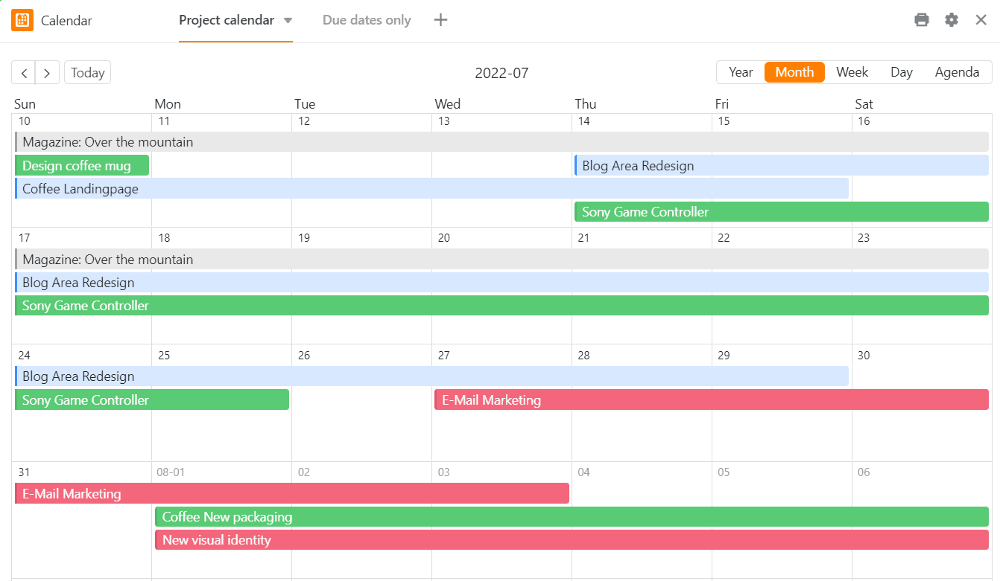
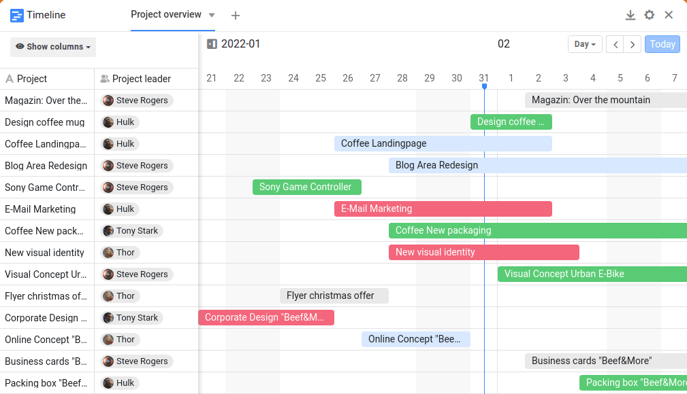
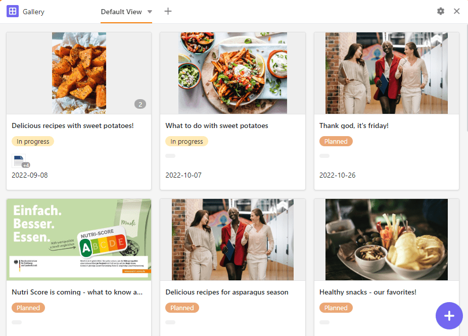
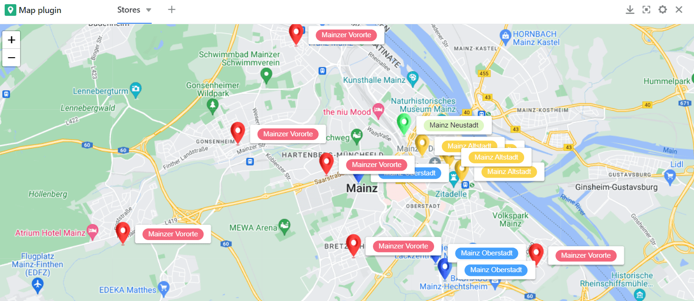
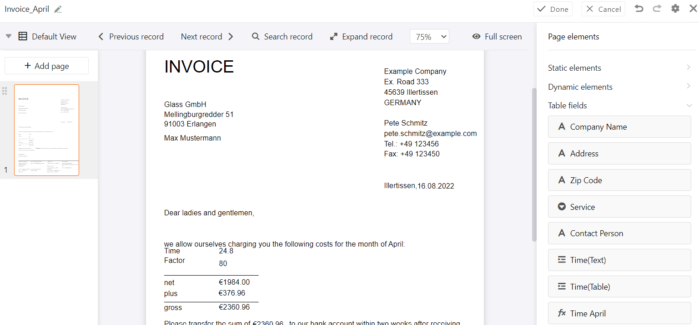
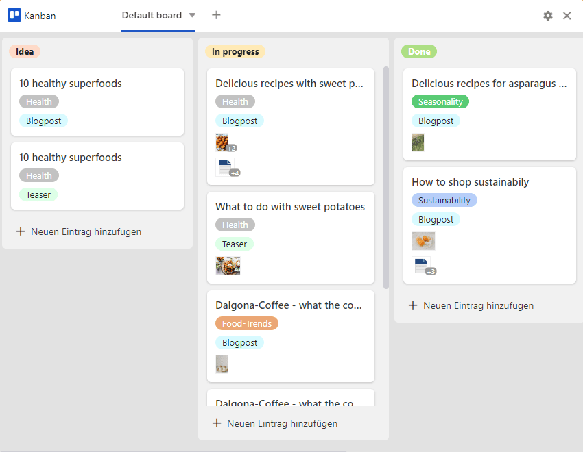
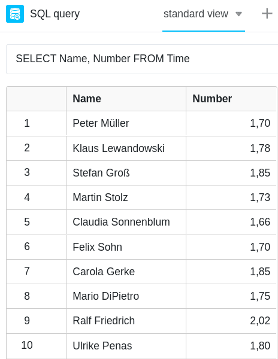

**Los plugins** de SeaTable le ofrecen la oportunidad de ver sus datos desde una perspectiva completamente diferente. Visualice citas, tareas y ubicaciones, y cree documentos diagramados y perfiles a partir de sus datos. En el siguiente artículo le explicamos qué plugins están disponibles en SeaTable y cómo puede utilizarlos.

## ¿Qué es un plugin?

En SeaTable puede crear diferentes **vistas** para sus tablas en las que puede [filtrar]() datos como desee.

Un **plugin** es un componente de software opcional en SeaTable que le ofrece opciones de visualización adicionales. Se pueden activar varios plugins en cada base, que muestran los datos de las respectivas tablas y vistas en **calendarios**, **documentos** o **galerías**, por ejemplo. Lea más sobre [cómo activar un plugin]() en el artículo de ayuda enlazado.

## Plugin de calendario

En el complemento de calendario, puede mostrar los datos de una [columna]() de fecha en una **vista de** **año**, **mes**, **semana**, **día** o **agenda**. También puede utilizar dos columnas de fecha para mostrar **intervalos de tiempo** y mantener así una visión general de todas las fechas importantes, etc.

[Más información sobre el plugin de calendario]()

Estos artículos también pueden interesarle:

- [Crear varios calendarios para una base]()
- [Crear nuevas entradas de calendario en el complemento de calendario]()

## Complemento de línea de tiempo

El plug-in de línea de tiempo representa distintos periodos de tiempo en forma de **línea de tiempo** mediante una fecha de inicio y una de finalización o una fecha de inicio y una duración. Esto le permite mantener una buena visión general de los proyectos que se ejecutan en paralelo o de las citas que se solapan. Este plugin también es excelente para planificar las vacaciones del equipo y la ocupación de las salas.

[Más información sobre el plugin de cronología]()

## Plugin de galería

El complemento de galería es especialmente adecuado para mostrar registros con **imágenes**, ya que se refiere principalmente al contenido de una columna [de imágenes](). Debajo de las imágenes, las entradas de una columna se muestran como **títulos**. Además, es posible mostrar otras columnas de la tabla en este plug-in y complementar así las imágenes con más información de los conjuntos de datos. Especialmente para proyectos creativos y artísticos, esto resulta muy útil para resumir toda la información de un vistazo.

[Más información sobre el plugin de galerías]()

Este artículo también puede interesarle:

- [Añadir una nueva fila a través del plugin de galería]()

## Complemento de mapas

**Las ubicaciones** pueden visualizarse en un mapa con el complemento de mapa. Puede visualizar la información geográfica introducida con marcadores de posición o imágenes. El plug-in de mapa puede manejar **coordenadas GPS**, así como **direcciones**. Sin embargo, las direcciones deben ser únicas para poder mostrarse.

[Más información sobre el plugin de mapas]()

## Plugin de deduplicación de datos

El complemento de deduplicación de datos descubre **entradas duplicadas** en una tabla. Esto es especialmente útil con grandes cantidades de datos para detectar duplicados y eliminarlos. Puede eliminar todas las entradas duplicadas con un solo clic.

[Más información sobre el plugin de duplicación de datos]()

## Plugin de diseño de páginas

Con ayuda del plug-in de diseño de páginas, puede maquetar **documentos** como cartas-formulario, tarjetas de visita y certificados y rellenarlos con los datos de su tabla. Más concretamente, puede crear maquetaciones con **elementos estáticos** que se complementan e individualizan con **elementos dinámicos** y **campos de** tabla. Éstos le ofrecen la gran ventaja de que, en función del registro de datos, insertan toda la información relacionada (por ejemplo, el nombre, la dirección y el cargo de una persona) en plantillas estandarizadas sin que usted tenga que copiar manualmente los datos en los documentos. De este modo, puede crear facturas, certificados u otros documentos importantes listos para imprimir a partir de los datos almacenados con sólo unos clics.

[Más información sobre el plugin de diseño de páginas]()

## Complemento Kanban

Con el plugin Kanban puede visualizar las entradas de la tabla en **un tablero Kanban**. Cada entrada se visualiza con una tarjeta y se puede mover hacia adelante y hacia atrás entre las diferentes columnas. Puede utilizar el método Kanban en la **gestión** ágil **de proyectos y flujos de trabajo**. Mediante la visualización de **las tareas** agrupadas por estado o fase del proyecto, se obtiene una excelente visión general del progreso de los flujos de trabajo.

[Más información sobre el plugin Kanban]()

## Complemento de consulta SQL

El complemento de consulta SQL está perfectamente adaptado para la **ejecución** directa **de comandos SQL**, por lo que resulta especialmente interesante para los profesionales de bases de datos que trabajan con grandes cantidades de datos.

[Más información sobre el complemento de consulta SQL]()

## Plugin de pizarra blanca

El plugin de pizarra blanca te da la libertad de visualizar gráficamente procesos y estructuras que no puedes mostrar con los plugins anteriores. También puedes **esbozar libremente** diseños y maquetas. Para el diseño, dispones de varios **elementos** como cuadrados, elipses y flechas, así como de **herramientas** como el bolígrafo, el borrador y la herramienta de texto.

[Más información sobre el plugin de la pizarra]()

## Plugin de organigrama

Puede utilizar el complemento de organigrama para mostrar **jerarquías** entre los registros de datos de una tabla. Esto es útil, por ejemplo, para visualizar los cargos en una empresa o las tareas superordinadas y subordinadas en un proyecto.

[Más información sobre el plugin de organigrama]()

## Plugin de relaciones entre tablas

Especialmente cuando hay muchas tablas con docenas de columnas en una base, es fácil perder la pista de cómo se relacionan entre sí. Puedes utilizar el complemento de relaciones entre tablas para visualizar **qué tablas están vinculadas entre sí a través de qué columnas**.

[Más información sobre el plugin de relaciones entre tablas]()

## Otros artículos útiles

### Estadísticas

El **módulo de estadísticas** le permite visualizar datos en todo tipo de gráficos y estadísticas. Tienes a tu disposición los siguientes **tipos de** gráficos: de columnas, de barras, de líneas y circulares, así como mapas, imágenes térmicas, velocímetros y tablas dinámicas. Puedes configurar la visualización que más te convenga en los distintos **gráficos** y construir un **cuadro de mandos con las estadísticas más importantes**.

[Más información sobre el módulo estadístico]()

### Formularios web

Puede utilizar el **editor de formularios** para crear un formulario web a partir de las columnas de una tabla, con el que puede hacer que los usuarios introduzcan determinados datos en los campos de una **encuesta en línea**.

[Más información sobre los formularios web]()
