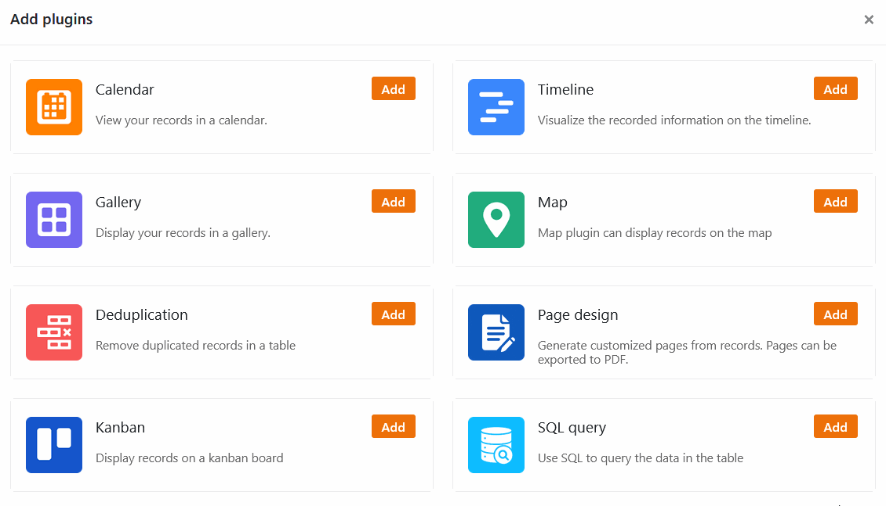
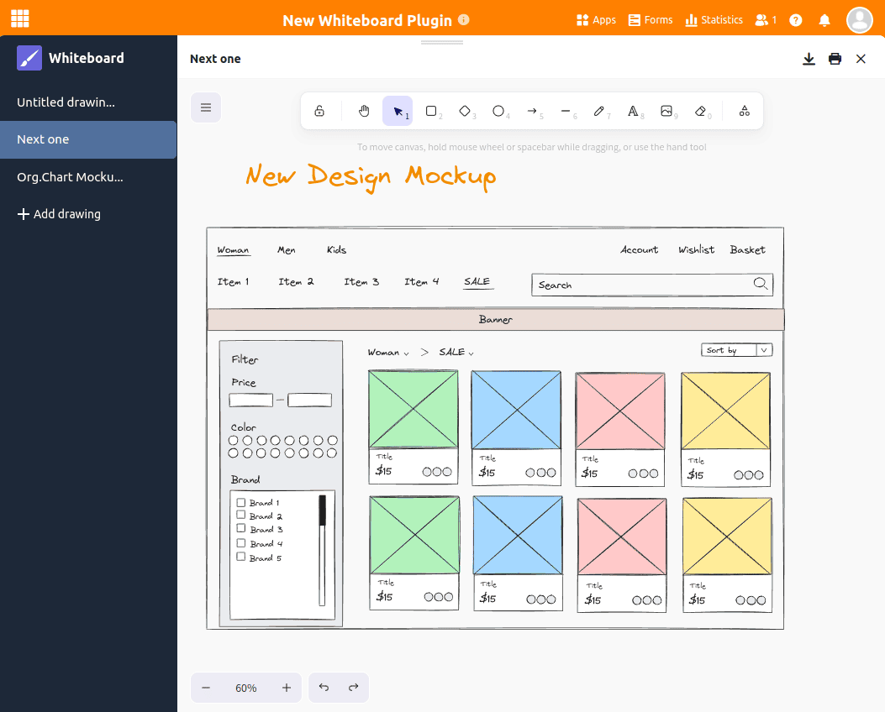

Avec les **plugins** de SeaTable, vous avez la possibilité de voir vos données sous des angles complètement différents. Visualisez les rendez-vous, les tâches et les lieux et créez des documents mis en page et des fiches descriptives à partir de vos données. Dans l'article suivant, nous expliquons quels sont les plugins disponibles dans SeaTable et comment vous pouvez les utiliser.

## Qu'est-ce qu'un plugin ?

SeaTable vous permet de créer différentes **vues** pour vos tableaux, dans lesquelles vous pouvez [filtrer]() les données à votre guise.

Un **plugin** est un composant logiciel optionnel de SeaTable qui vous offre des possibilités d'affichage supplémentaires. Dans chaque base, il est possible d'activer différents plugins qui affichent les données des tableaux et vues correspondants, par exemple dans **des calendriers**, des **documents** ou **des galeries**. Pour en savoir plus sur l'[activation d'un plugin](), consultez l'article d'aide en lien.

## Plugin de calendrier

Le plug-in Calendrier vous permet d'afficher les données d'une [colonne de dates]() dans une **vue** **annuelle**, **mensuelle**, **hebdomadaire**, **quotidienne** ou **d'agenda**. Vous pouvez également afficher **des périodes de temps** à l'aide de deux colonnes de dates et garder ainsi une vue d'ensemble de tous les rendez-vous importants, etc.

[En savoir plus sur le plugin calendrier]()

Ces articles pourraient également vous intéresser :

- [Créer plusieurs calendriers pour une base]()
- [Création de nouvelles entrées de calendrier dans le plug-in de calendrier]()

## Plugin de ligne de temps

Le plugin Timeline représente différentes périodes sous la forme d'une **ligne de temps** grâce à une date de début et de fin ou à une date de début et une durée. Cela permet d'avoir une bonne vue d'ensemble des projets qui se déroulent en parallèle ou des rendez-vous qui se chevauchent. Ce plugin convient également parfaitement à la planification des congés de l'équipe et à la planification de l'occupation des salles.

[En savoir plus sur le plugin Timeline]()

## Plugin de la galerie

Le plug-in Galerie est particulièrement adapté à la présentation de jeux de données avec **des images**, car il se réfère en premier lieu au contenu d'une [colonne d'images](). Les entrées d'une colonne sont affichées sous forme de **titre** sous les images. En outre, ce plugin offre la possibilité d'afficher d'autres colonnes du tableau et de compléter ainsi les images par davantage d'informations provenant des enregistrements. Cela est particulièrement utile pour les projets créatifs et artistiques, afin de regrouper toutes les informations en un seul coup d'œil.

[En savoir plus sur le plugin de la galerie]()

Cet article pourrait également vous intéresser :

- [Ajouter une nouvelle ligne via le plugin de la galerie]()

## Plugin de cartographie

**Les sites** peuvent être représentés sur une carte à l'aide du plug-in de carte. Vous pouvez visualiser les informations géographiques saisies à l'aide de marqueurs de position ou d'images. Le plug-in de carte s'occupe aussi bien des **coordonnées GPS** que des **adresses**. Les adresses doivent toutefois être uniques pour pouvoir être affichées.

[En savoir plus sur le plug-in de carte](/)

## Plugin de déduplication de données

Le plug-in de déduplication des données détecte les **entrées en double** dans un tableau. Cela est particulièrement utile pour les grandes quantités de données afin de détecter les doublons et de les supprimer. Ce faisant, vous pouvez supprimer toutes les entrées en double en un seul clic.

[En savoir plus sur le plugin de duplication de données]()

## Plugin de conception de pages

À l'aide du plug-in de conception de pages, vous pouvez mettre en page **des documents** tels que des lettres en série, des cartes de visite et des certificats et les remplir avec les données de votre tableau. Plus précisément, vous pouvez construire des mises en page avec des **éléments statiques** qui sont complétés et personnalisés par des **éléments dynamiques** et **des champs de tableau**. Ces derniers vous offrent le grand avantage d'insérer, en fonction de l'enregistrement, toutes les informations associées (par exemple le nom, l'adresse et le titre du poste d'une personne) dans des modèles standardisés, sans que vous ayez à copier manuellement des données dans les documents. Vous créez ainsi en quelques clics des factures, des certificats ou d'autres documents importants prêts à être imprimés à partir des données enregistrées.

[En savoir plus sur le plugin de conception de pages]()

## Plugin Kanban

Le plug-in Kanban permet de représenter les entrées du tableau sur un **tableau Kanban**. Chaque entrée est visualisée par une carte et peut être déplacée entre différentes colonnes. Vous pouvez utiliser la méthode Kanban dans la **gestion** agile de **projets et de flux de travail**. En visualisant les **tâches** regroupées par statut ou par phase de projet, vous obtenez un excellent aperçu de l'avancement des processus de travail.

[En savoir plus sur le plugin Kanban]()

## Plugin de requête SQL

Le plug-in de requête SQL est parfaitement adapté à l'**exécution** directe **de commandes SQL** et est donc particulièrement intéressant pour les professionnels des bases de données qui travaillent avec de grandes quantités de données.

[En savoir plus sur le plugin de requête SQL]()

## Plugin pour tableau blanc

Le plug-in Whiteboard vous donne la liberté de visualiser graphiquement des processus et des structures que vous ne pouvez pas représenter avec les plug-ins précédents. De même, vous pouvez **esquisser librement** des mises en page et des mockups. Pour la conception, vous avez le choix entre différents **éléments** tels que des carrés, des ellipses et des flèches ainsi que **des outils** tels que le stylo, la gomme et l'outil de texte.

[En savoir plus sur le plug-in Whiteboard]()

## Plugin d'organigramme

Le plug-in Organigramme permet de représenter **les hiérarchies** entre les enregistrements d'un tableau. C'est utile, par exemple, pour visualiser les postes dans une entreprise ou les tâches supérieures et inférieures dans un projet.

[En savoir plus sur le plugin d'organigramme]()

## Plugin de relations entre les tableaux

Surtout lorsque de nombreux tableaux avec des dizaines de colonnes se trouvent dans une base, on perd rapidement la vue d'ensemble de la manière dont ils sont reliés entre eux. Le plug-in Relations entre les tableaux permet de voir **quels tableaux sont reliés entre eux et par quelles colonnes**.

[En savoir plus sur le plugin de relations entre les tableaux]()

## Autres articles utiles

### Statistiques

Le **module Statistiques** vous permet une représentation polyvalente des données sous forme de graphiques et de statistiques de toutes sortes. Pour cela, vous disposez entre autres des **types de graphiques** suivants : diagrammes en colonnes, en barres, en lignes et en camemberts, mais aussi cartes, images thermiques, tachymètres ou tableaux croisés dynamiques. Vous pouvez configurer la visualisation qui vous convient dans les différents **graphiques** et vous construire un **tableau de bord avec les statistiques les plus importantes**.

[En savoir plus sur le module Statistiques]()

### Formulaires web

L'**éditeur de formulaires** vous permet de créer un formulaire web à partir des colonnes d'un tableau. Vous pouvez ainsi demander aux utilisateurs de saisir certaines données dans les champs d'une **enquête en ligne**.

[En savoir plus sur les formulaires web]()
