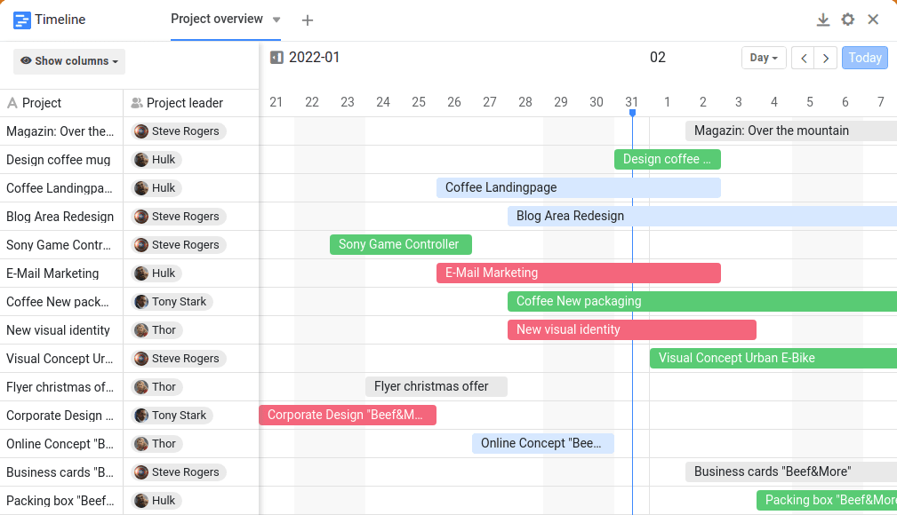
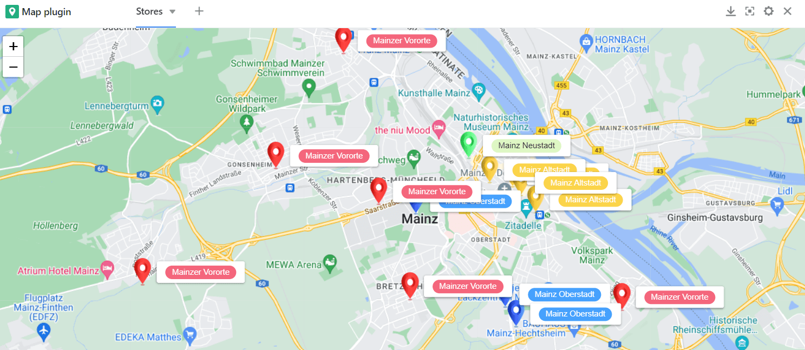
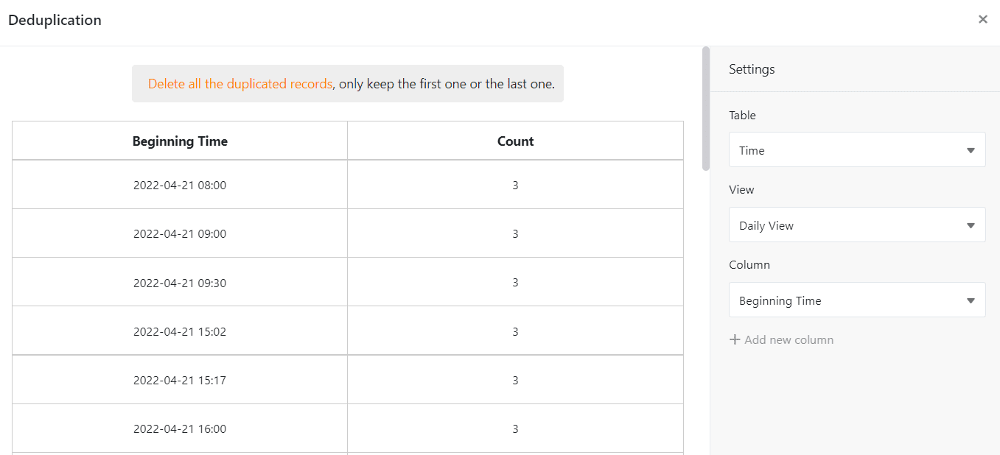

**Os plugins** SeaTable dão-lhe a oportunidade de ver os seus dados de uma perspetiva completamente diferente. Visualize compromissos, tarefas e localizações e crie documentos e perfis a partir dos seus dados. No artigo seguinte, explicamos quais os plugins disponíveis no SeaTable e como os pode utilizar.

## O que é um plugin?

No SeaTable pode criar diferentes **vistas** para as suas tabelas nas quais pode [filtrar]() dados como desejar.

Um **plugin** é um componente de software opcional do SeaTable que oferece opções de visualização adicionais. Podem ser activados vários plugins em cada base, que apresentam os dados das respectivas tabelas e vistas em **calendários**, **documentos** ou **galerias**, por exemplo. Para mais informações sobre [como ativar um plugin](), consulte o artigo de ajuda.

## Plugin de calendário

No plug-in de calendário, é possível apresentar dados de uma [coluna de data]() numa **vista** de **ano**, **mês**, **semana**, **dia** ou **agenda**. Também é possível utilizar duas colunas de datas para apresentar **intervalos de tempo** e, assim, manter uma visão geral de todas as datas importantes, etc.

[Mais informações sobre o plugin de calendário]()

Estes artigos também podem ser interessantes para si:

- [Criar vários calendários para uma base]()
- [Criar novas entradas de calendário no plug-in do calendário]()

## Plug-in na linha do tempo

O plug-in de cronologia representa diferentes períodos de tempo sob a forma de uma **cronologia** através de uma data de início e de fim ou de uma data de início e duração. Isto permite-lhe manter uma boa visão geral dos projectos que decorrem em paralelo ou dos compromissos que se sobrepõem. Este plugin é também excelente para o planeamento das férias da equipa e para o planeamento da ocupação dos quartos.

[Mais informações sobre o plug-in da linha de tempo]()

## Galeria plugin

O plug-in da galeria é particularmente adequado para a apresentação de registos com **imagens**, uma vez que se refere principalmente ao conteúdo de uma [coluna de imagens](). Por baixo das imagens, as entradas de uma coluna são apresentadas como **títulos**. Além disso, é possível mostrar outras colunas da tabela neste plug-in e, assim, complementar as imagens com mais informações dos conjuntos de dados. Especialmente para projectos criativos e artísticos, isto é muito útil para resumir toda a informação num relance.

[Mais informações sobre o plug-in da galeria]()

Este artigo também pode ser interessante para si:

- [Adicionar uma nova linha através do plugin da galeria]()

## Plug-in do mapa

**As localizações** podem ser apresentadas num mapa com o plug-in de mapa. Pode visualizar as informações geográficas introduzidas com marcadores de posição ou imagens. O plug-in de mapas pode tratar **coordenadas GPS** e **endereços**. No entanto, os endereços têm de ser únicos para poderem ser apresentados.

[Mais informações sobre o plug-in do mapa]()

## Plugin de desduplicação de dados

O plugin de desduplicação de dados descobre **entradas duplicadas** numa tabela. Isto é especialmente útil com grandes quantidades de dados para detectar duplicados e removê-los. Pode eliminar todas as entradas duplicadas com apenas um clique.

[Mais informações sobre o plugin de duplicação de dados]()

## Plugin de desenho de página

Com a ajuda do plug-in de design de páginas, pode criar o layout de **documentos** como cartas de formulário, cartões de visita e certificados e preenchê-los com os dados da sua tabela. Mais precisamente, pode criar layouts com **elementos estáticos** que são complementados e individualizados por **elementos dinâmicos** e **campos de tabela**. Estes oferecem-lhe a grande vantagem de, dependendo do registo de dados, inserirem todas as informações relacionadas (por exemplo, o nome de uma pessoa, a morada e o cargo) em modelos normalizados, sem que tenha de copiar manualmente os dados para os documentos. Desta forma, pode criar facturas prontas a imprimir, certificados ou outros documentos importantes a partir dos dados armazenados com apenas alguns cliques.

[Mais informações sobre o plugin de design de páginas]()

## Plug-in Kanban

Com o plugin Kanban, pode visualizar entradas de tabela num **quadro Kanban**. Cada entrada é visualizada com um cartão e pode ser movida para a frente e para trás entre diferentes colunas. Pode utilizar o método Kanban na **gestão** ágil de **projectos e fluxos de trabalho**. Ao visualizar **as tarefas** agrupadas por estado ou fase do projecto, obtém uma excelente visão geral do progresso dos fluxos de trabalho.

[Mais informações sobre o plugin Kanban]()

## Plug-in de consulta SQL

O plug-in de consulta SQL é perfeitamente adequado para a **execução** directa **de comandos SQL**, pelo que é particularmente interessante para os profissionais de bases de dados que trabalham com grandes quantidades de dados.

[Mais informações sobre o plug-in de consulta SQL]()

## Plugin de quadro branco

O plugin de quadro branco dá-lhe a liberdade de visualizar graficamente processos e estruturas que não pode apresentar com os plugins anteriores. Também pode **esboçar livremente** esquemas e maquetas. Para o desenho, tem à sua disposição vários **elementos** como quadrados, elipses e setas, bem como **ferramentas** como caneta, borracha e a ferramenta de texto.

[Mais informações sobre o plug-in do quadro branco]()

## Plugin de organograma

Pode utilizar o plugin do organigrama para apresentar **hierarquias** entre os registos de dados de uma tabela. Isto é útil, por exemplo, para visualizar os cargos numa empresa ou as tarefas superiores e subordinadas num projeto.

[Mais informações sobre a ficha do organigrama]()

## Plugin de relações de tabela

Especialmente quando existem muitas tabelas com dezenas de colunas numa base, é fácil perder a noção de como estão relacionadas umas com as outras. Pode utilizar o plugin de relações entre tabelas para visualizar **as tabelas que estão ligadas entre si através de que colunas**.

[Mais informações sobre o plugin de relações de tabela]()

## Outros artigos úteis

### Estatísticas

O **módulo de estatísticas** permite-lhe visualizar os dados em todos os tipos de gráficos e estatísticas. Tem à sua disposição os seguintes **tipos de gráficos**: coluna, barra, linha e pizza, bem como mapas, imagens térmicas, velocímetros e tabelas dinâmicas. Pode configurar a visualização que mais lhe convém nos vários **gráficos** e construir um **painel de controlo com as estatísticas mais importantes**.

[Mais informações sobre o módulo de estatísticas]()

### Formulários Web

Pode utilizar o **editor de formulários** para criar um formulário Web a partir das colunas de uma tabela, com o qual pode fazer com que os utilizadores introduzam determinados dados nos campos de um **inquérito online**.

[Mais informações sobre os formulários Web]()
