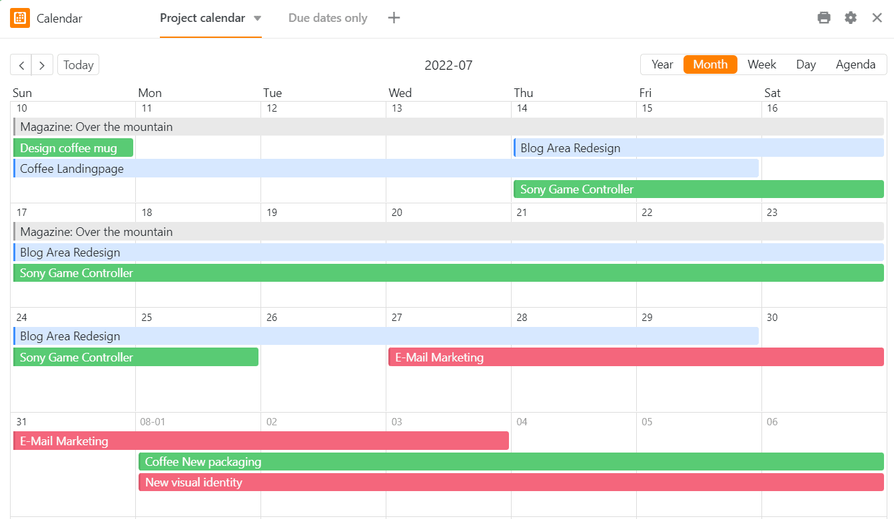
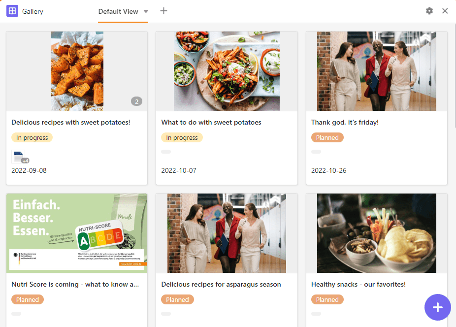

**Плагины** SeaTable позволяют взглянуть на данные с совершенно иной точки зрения. Визуализируйте встречи, задачи и местоположения, создавайте документы и профили на основе ваших данных. В следующей статье мы расскажем, какие плагины доступны в SeaTable и как их использовать.

## Что такое плагин?

В SeaTable вы можете создавать различные **представления** для своих таблиц, в которых вы можете [фильтровать]() данные по своему усмотрению.

**Плагин** - это дополнительный программный компонент SeaTable, который предлагает вам дополнительные возможности отображения. В каждой базе можно активировать различные плагины, которые отображают данные соответствующих таблиц и представлений, например, в **календарях**, **документах** или **галереях**. Подробнее о том [, как активировать плагин](), читайте в статье справки по ссылке.

## Плагин календаря

В плагине календаря можно отображать данные из [столбца даты]() в виде **года**, **месяца**, **недели**, **дня** или **повестки дня**. Вы также можете использовать два столбца даты для отображения **временных промежутков** и, таким образом, вести обзор всех важных дат и т.д.

[Подробнее о плагине для календаря]()

Эти статьи также могут быть вам интересны:

- [Создайте несколько календарей для одной базы]()
- [Создание новых записей календаря в плагине календаря]()

## Подключаемый модуль Timeline

Плагин timeline представляет различные периоды времени в виде **временной шкалы** с помощью даты начала и окончания или даты начала и продолжительности. Это позволяет вести хороший обзор параллельно идущих проектов или накладывающихся друг на друга встреч. Этот плагин также отлично подходит для планирования отпусков в коллективе и для планирования занятости комнат.

[Подробнее о плагине временной шкалы]()

## Плагин галереи

Плагин галереи особенно подходит для отображения записей с **изображениями**, поскольку в первую очередь речь идет о содержимом [колонки изображений](). Под изображениями записи колонки отображаются в виде **заголовков**. Кроме того, в этом плагине можно отобразить дополнительные столбцы таблицы и таким образом дополнить изображения дополнительной информацией из наборов данных. Особенно для творческих и художественных проектов это очень полезно для обобщения всей информации с первого взгляда.

[Подробнее о плагине для галереи]()

Эта статья также может быть вам интересна:

- [Добавьте новый ряд с помощью плагина галереи]()

## Картографический плагин

**Местоположение** можно отобразить на карте с помощью подключаемого модуля карты. Введенную географическую информацию можно визуализировать с помощью маркеров местоположения или изображений. Плагин карты может работать с **GPS-координатами**, а также с **адресами**. Однако для отображения адреса должны быть уникальными.

[Подробнее о плагине для карт]()

## Плагин для дедупликации данных

Плагин дедупликации данных обнаруживает **дубликаты записей** в таблице. Это особенно полезно при работе с большими объемами данных для обнаружения дубликатов и их удаления. Вы можете удалить все дубликаты одним щелчком мыши.

[Подробнее о плагине для дублирования данных]()

## Плагин для дизайна страниц

С помощью плагина дизайна страниц можно верстать такие **документы**, как письма-анкеты, визитные карточки и сертификаты, и заполнять их данными из таблицы. Точнее, вы можете создавать макеты со **статическими элементами**, которые дополняются и индивидуализируются **динамическими элементами** и **полями таблицы**. Их преимущество заключается в том, что в зависимости от записи данных они вставляют всю сопутствующую информацию (например, имя, адрес и должность человека) в стандартизированные шаблоны без необходимости вручную копировать данные в документы. Таким образом, вы можете создавать готовые к печати счета, сертификаты и другие важные документы на основе сохраненных данных всего несколькими щелчками мыши.

[Подробнее о плагине для дизайна страниц]()

## Подключаемый модуль Kanban

С помощью плагина Kanban вы можете отображать записи в таблице на **доске Kanban**. Каждая запись визуализируется в виде карточки, которую можно перемещать вперед и назад между различными колонками. Вы можете использовать метод Kanban в **agile-проектах и управлении рабочими процессами**. Визуализация **задач**, сгруппированных по статусу или фазе проекта, позволяет получить отличный обзор хода выполнения рабочих процессов.

[Подробнее о плагине Kanban]()

## Подключаемый модуль SQL-запросов

Плагин SQL-запросов идеально подходит для прямого **выполнения SQL-команд** и поэтому особенно интересен для специалистов по базам данных, которые работают с большими объемами данных.

[Подробнее о подключаемом модуле SQL-запросов]()

## Плагин для белой доски

Плагин для белой доски дает вам возможность графически визуализировать процессы и структуры, которые невозможно отобразить с помощью предыдущих плагинов. Вы также можете **свободно** создавать макеты и **эскизы**. Для оформления вам предлагаются различные **элементы**, такие как квадраты, эллипсы и стрелки, а также такие **инструменты**, как перо, ластик и текстовый инструмент.

[Подробнее о плагине для белой доски]()

## Плагин организационной диаграммы

Вы можете использовать плагин организационной диаграммы для отображения **иерархии** между записями данных в таблице. Это полезно, например, для визуализации должностей в компании или вышестоящих и нижестоящих задач в проекте.

[Подробнее о плагине организационной диаграммы]()

## Плагин для работы с таблицами

Особенно когда в базе много таблиц с десятками столбцов, легко потерять представление о том, как они связаны друг с другом. Вы можете использовать плагин отношений таблиц, чтобы визуализировать **, какие таблицы связаны друг с другом через какие столбцы**.

[Подробнее о плагине для работы с таблицами]()

## Другие полезные статьи

### Статистика

**Модуль статистики** позволяет визуализировать данные в виде всевозможных графиков и статистических данных. Вам доступны следующие **типы графиков**: столбчатые, столбиковые, линейные и круговые диаграммы, а также карты, тепловые изображения, спидометры и поворотные таблицы. Вы можете настроить подходящую для вас визуализацию в различных **графиках** и создать **приборную панель с наиболее важными статистическими данными**.

[Подробнее о модуле статистики]()

### Веб-формы

С помощью **редактора форм** можно создать веб-форму из столбцов таблицы, с помощью которой пользователи смогут вводить определенные данные в поля **онлайн-опроса**.

[Подробнее о веб-формах]()
