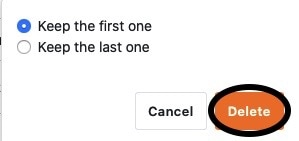

With the data deduplication plugin you can check your tables for **duplicate entries** and have them **deleted** automatically with just one click.

Read the article [Activating a Plugin in a Base]() to learn how to activate the plugin and add it to your toolbar.

## Check a table for duplicate entries

1. Open the **data deduplication plugin** and you will find the **settings** to be made on **the right in** the window that opens.

3. Select the **table** and **view to** be checked and the **column** (s) to be checked for duplicate entries.

For each check, you can display only the duplicate entries in **a** table view, but check **multiple columns** at once.

## Viewing the duplicate entries

The **duplicate entries** are displayed directly in table form as soon as you have selected the table column(s) to be checked.

In the **left** column you will find the **values of the entries found multiple times**. In the **right** column you will find the **number** how often the corresponding entries were found in the checked table view.

## Delete the entries identified as duplicates

You can then **delete** the **entries** identified as duplicates using the data deduplication plugin with just one click. In the course of the deletion you can decide whether the **first** _or_ the **last of** the entries should remain in the table. All other duplicate entries will be **removed** from the table.

11. Click **Delete all duplicate entries**.

13. Select **which entry** should **remain in** the table.

15. Confirm the operation by clicking **Delete**.

## Consequences of deletion

After confirming the deletion, **all duplicate entries** will be **deleted** from the corresponding table, leaving only the single previously selected entry.

Please note that **not only** the **values** identified as duplicates are deleted from the table, but with them also **the whole rows**, which contain one of the duplicate values.

If you have deleted the entries or rows by mistake or need them again afterwards, you can [restore](https://seatable.io/en/docs/historie-und-versionen/tabellen-und-zeilen-aus-dem-papierkorb-zurueckholen/) them [from the Base recycle bin](https://seatable.io/en/docs/historie-und-versionen/tabellen-und-zeilen-aus-dem-papierkorb-zurueckholen/) for a certain time.
