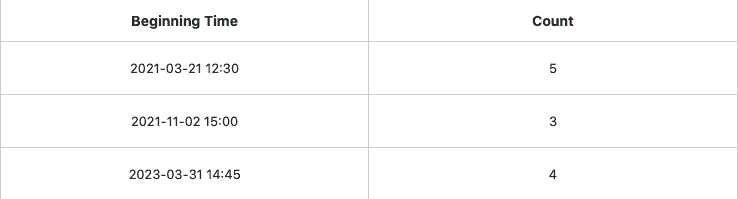

Con el complemento de deduplicación de datos, puede comprobar si hay **entradas duplicadas en** sus tablas y **eliminarlas** automáticamente con un solo clic.

Lea el artículo [Activar un plugin en una base]() para aprender a activar el plugin y añadirlo a su barra de herramientas.

## Comprobación de entradas duplicadas en una tabla

1. Abra el **plug-in de deduplicación de** datos y encontrará los **ajustes** a realizar en la ventana que se abre a la derecha **.**

3. Seleccione la **tabla** y la **vista** que desea comprobar y la(s) **columna(** s) que desea comprobar en busca de entradas duplicadas.

Para cada comprobación, puede mostrar sólo las entradas duplicadas en **una** vista de tabla, pero puede comprobar **varias columnas** al mismo tiempo.

## Ver las entradas duplicadas

Las **entradas duplicadas** se muestran directamente en forma de tabla en cuanto haya seleccionado la columna o columnas de la tabla que desea comprobar.

En la columna de **la** izquierda encontrará los **valores de las entradas encontradas varias veces**. En la columna de **la** derecha encontrará el **número de** veces que se han encontrado las entradas correspondientes en la vista de tabla comprobada.

## Eliminar las entradas identificadas como duplicadas

Las **entradas** identificadas como duplicadas con ayuda del complemento de deduplicación de datos pueden **borrarse** con un solo clic. Durante la eliminación, puede decidir si debe permanecer en la tabla la **primera** _o_ la **última** entrada. Todas las demás entradas que existen más de una vez se **eliminan** de la tabla.

11. Haga clic en **Eliminar todas las entradas duplicadas**.

13. Seleccione **qué entrada** debe **permanecer en** la tabla.

15. Confirme el proceso pulsando **Suprimir**.

## Consecuencias de la supresión

Tras confirmar la eliminación, se **borran** **todas las entradas duplicadas** de la tabla correspondiente, dejando sólo la única entrada seleccionada previamente.

Tenga en cuenta que **no sólo** se eliminan de la tabla los **valores** identificados como duplicados, sino también las **filas completas** que contengan con ellos uno de los valores duplicados.

Si has borrado las entradas o líneas por error o las necesitas de nuevo después, puedes [restaurarlas desde la papelera de reciclaje de la Base]() durante un tiempo determinado.
