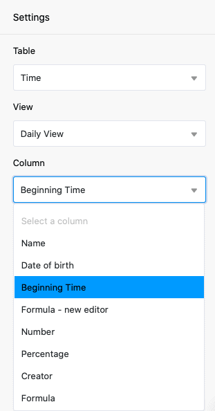
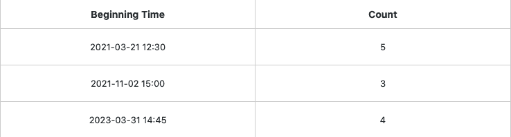
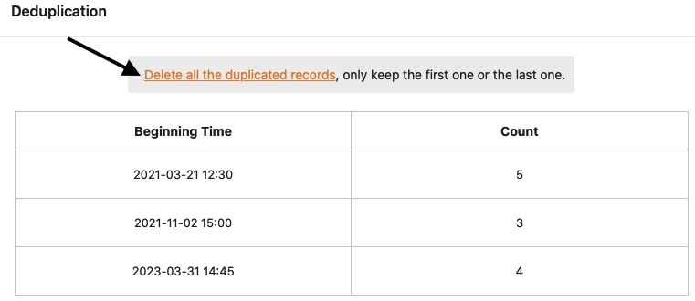

Le plug-in de déduplication des données vous permet de vérifier si vos tableaux **contiennent des entrées en double** et de les **supprimer** automatiquement en un seul clic.

Consultez l'article [Activer un plugin dans une base]() pour savoir comment activer le plugin et l'ajouter à votre barre d'outils.

## Vérifier qu'un tableau ne contient pas d'entrées en double

1. Ouvrez le **plug-in de déduplication des données** et vous trouverez les **paramètres** **à** effectuer **à droite** dans la fenêtre qui s'ouvre.

3. Sélectionnez la **table** et la **vue** à vérifier, ainsi que la ou les **colonnes** à vérifier pour les entrées en double.

Lors de chaque vérification, vous pouvez n'afficher que les entrées en double dans **une** vue de tableau, mais vérifier **plusieurs colonnes** à la fois.

## Visualisation des entrées en double

Les **entrées en double** s'affichent directement sous forme de tableau dès que vous avez sélectionné la ou les colonnes du tableau à vérifier.

Dans la colonne **de gauche**, vous trouverez les **valeurs des entrées trouvées plusieurs fois**. Dans la colonne **de droite**, vous trouverez le **nombre** de fois que les entrées correspondantes ont été trouvées dans la vue de tableau vérifiée.

## Supprimer les entrées identifiées comme étant en double

Les **entrées** identifiées comme doublons à l'aide du plug-in de déduplication des données peuvent ensuite être **supprimées** en un seul clic. Au cours de la suppression, vous pouvez décider si le **premier** _ou_ le **dernier** des enregistrements doit rester dans le tableau. Toutes les autres entrées en double sont **supprimées** du tableau.

11. Cliquez sur **Supprimer toutes les entrées en double**.

13. Choisissez **quelle entrée** doit **rester** dans le tableau.

15. Confirmez l'opération en cliquant sur **Supprimer**.

## Conséquences de la suppression

Après confirmation de la suppression, **toutes les entrées en double** sont **supprimées** du tableau correspondant, ne laissant que l'entrée unique sélectionnée précédemment.

Notez que **non seulement** les **valeurs** identifiées comme doubles sont supprimées du tableau, mais aussi, avec elles, **les lignes entières** qui contiennent l'une des valeurs en double.

Si vous avez supprimé les entrées ou les lignes par erreur ou si vous en avez à nouveau besoin par la suite, vous pouvez les [restaurer](https://seatable.io/fr/docs/historie-und-versionen/tabellen-und-zeilen-aus-dem-papierkorb-zurueckholen/) pendant un certain temps [à partir de la corbeille de Base](https://seatable.io/fr/docs/historie-und-versionen/tabellen-und-zeilen-aus-dem-papierkorb-zurueckholen/).
