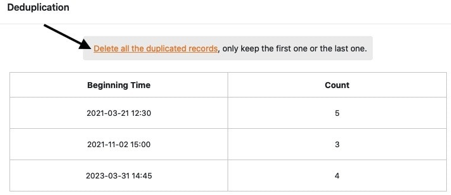

Com o plugin de desduplicação de dados, pode verificar se existem **entradas duplicadas** nas suas tabelas e **eliminá-las** automaticamente com apenas um clique.

Leia o artigo [Activando um Plugin numa Base]() para aprender como activar o plugin e adicioná-lo à sua barra de ferramentas.

## Verificação de entradas duplicadas numa tabela

1. Abra o **plug-in de desduplicação de dados** e encontrará as **definições** a efectuar na janela que se abre **à direita**.

3. Seleccione a **tabela** e a **vista a** serem verificadas e a(s) **coluna** (s) a serem verificadas quanto a entradas duplicadas.

Para cada verificação, é possível exibir apenas as entradas duplicadas **numa** vista de tabela, mas é possível verificar **várias colunas** ao mesmo tempo.

## Visualizar os registos duplicados

As **entradas duplicadas** são exibidas directamente em forma de tabela, logo que se tenha seleccionado a(s) coluna(s) da tabela a ser(em) verificada(s).

Na coluna **da esquerda**, encontrará os **valores das entradas encontradas várias vezes**. Na coluna **da direita**, encontra-se o **número de** vezes que as entradas correspondentes foram encontradas na vista de tabela verificada.

## Eliminar as entradas identificadas como duplicadas

As **entradas** identificadas como duplicadas com a ajuda do plug-in de desduplicação de dados podem então ser **eliminadas** com apenas um clique. No decurso da eliminação, pode decidir se a **primeira** _ou_ a **última** entrada deve permanecer na tabela. Todas as outras entradas que existam mais do que uma vez são **removidas** da tabela.

11. Clique em **Eliminar todas as entradas duplicadas**.

13. Seleccionar **a entrada que** deve **permanecer na** tabela.

15. Confirme o processo clicando em **Eliminar**.

## Consequências da eliminação

Depois de confirmar a eliminação, **todas as entradas duplicadas** são **eliminadas** da tabela correspondente, deixando apenas a única entrada previamente seleccionada.

Tenha em atenção que **não** só os **valores** identificados como duplicados são eliminados da tabela, mas também **as linhas inteiras** que contêm um dos valores duplicados.

Se tiver eliminado as entradas ou linhas por engano ou se voltar a precisar delas mais tarde, pode restaurá-las a [partir da reciclagem da Base](https://seatable.io/pt/docs/historie-und-versionen/tabellen-und-zeilen-aus-dem-papierkorb-zurueckholen/) durante um determinado período de tempo.
