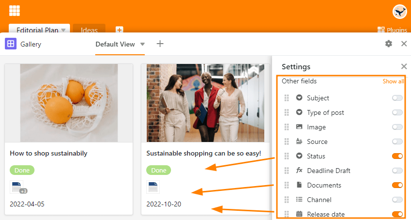
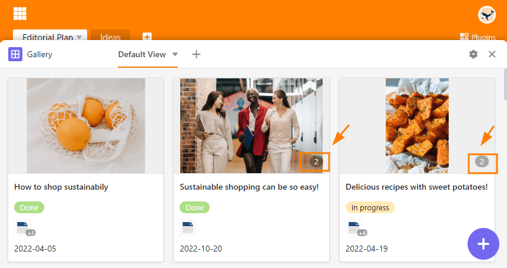
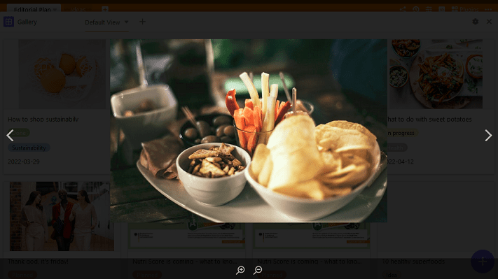

Das **Galerie-Plugin** eignet sich besonders gut, um bebilderte Datensätze darzustellen, da es sich in erster Linie auf die Inhalte einer [Bild-Spalte]() bezieht.

Während die Bilder in der **Tabellen-Ansicht** als Miniatur dargestellt werden und nur einzeln durch Klicken vergrößert werden können, ermöglicht Ihnen das Galerie-Plugin, sich dank der größeren **Vorschaubilder** einen lebendigen Überblick über alle Datensätze zu verschaffen. Dabei fasst das Galerie-Plugin alle Bilder einer Zeile in einem **Album** zusammen.

## So richten Sie das Galerie-Plugin ein

Achtung! Seit SeaTable 6.0 lässt sich das Plugin nicht mehr in Bases installieren. In Bases, in denen das Plugin bereits in Verwendung ist, steht es bis auf Weiteres zur Verfügung und kann uneingeschränkt genutzt werden. Unsere Empfehlung ist jedoch: Nutzen Sie die [Galerie-Ansicht](). Der Wechsel könnte kaum einfacher sein, denn SeaTable bietet die **Migration mit nur einem Klick**. Diese konvertiert einen Tab in einem Plugin ohne weiteren Aufwand in eine Ansicht vom gleichen Typ.

## Informationen ein- und ausblenden

In den **Galerie-Einstellungen**, die Sie über das **Zahnrad-Symbol**  erreichen, können Sie durch Ein- und Ausblenden von Spalten mehr oder weniger Informationen anzeigen lassen. Aktivieren Sie die **Regler** der jeweiligen Spalten (z. B. Dokumente, Status und Datum), um mehr Informationen aus der Tabelle in der Galerie angezeigt zu bekommen.

## Mehrere Bilder in einer Zeile

Die **Anzahl der Bilder** pro Album bzw. Zeile wird in der Galerie mit einer **grau hinterlegten Nummer** angezeigt. Logischerweise wird die Zahl erst eingeblendet, wenn mehr als ein Bild in einem Album vorhanden ist.

Durch einen Klick auf das Vorschaubild öffnen Sie das Album im **Vollbildmodus**, in dem Sie die Bilder mithilfe der **Lupen** vergrößern und verkleinern sowie mithilfe der **Pfeile** zwischen den Bildern wechseln können.

