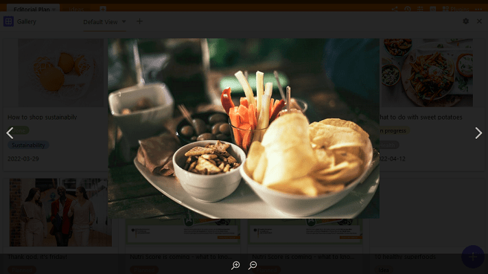

El **plugin de galería** es especialmente adecuado para mostrar registros ilustrados, ya que se refiere principalmente al contenido de una [columna de imágenes]().

Mientras que las imágenes de la **vista de tabla** se muestran como miniaturas y sólo pueden ampliarse individualmente haciendo clic sobre ellas, el complemento de galería permite obtener una visión general animada de todos los conjuntos de datos gracias a las **imágenes de previsualización** de mayor tamaño. El plug-in de galería combina todas las imágenes de una fila en un **álbum**.

## Para configurar el plug-in de la galería

Para utilizar el **plugin de galería**, primero debe [activarlo]() en su Base.

A continuación, en la configuración, determine para qué **vista de tabla** desea crear una galería y de qué columna de [imágenes]() deben proceder las imágenes. En **Título**, introduzca la columna cuyas entradas desea utilizar como título del álbum.

## Mostrar y ocultar información

En los **ajustes de la galería**, a los que se accede a través del **símbolo de la rueda dentada** , puede mostrar más o menos información mostrando u ocultando columnas. Active los **controles deslizantes** de las columnas respectivas (por ejemplo, Documentos, Estado y Fecha) para que se muestre más información de la tabla en la galería.

## Varias imágenes en una línea

El **número de imágenes** por álbum o fila se muestra en la galería con un **número resaltado en gris**. Lógicamente, el número sólo aparece si hay más de una foto en un álbum.

Al hacer clic en la imagen de previsualización se abre el álbum **a pantalla completa**, donde puedes ampliar y reducir las imágenes con las **lupas** y pasar de una a otra con las **flechas**.

