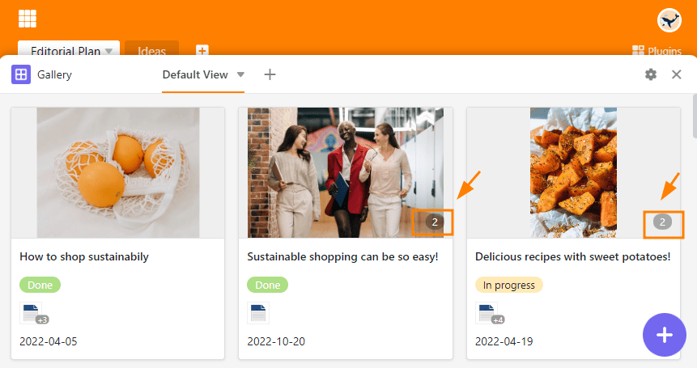

Le **plug-in de galerie** est particulièrement adapté à la présentation de jeux de données illustrés, car il se réfère principalement au contenu d'une [colonne d'images]().

Alors que dans l'**affichage du tableau**, les images sont représentées sous forme de miniatures et ne peuvent être agrandies qu'une à une en cliquant dessus, le plug-in de galerie vous permet d'obtenir une vue d'ensemble vivante de tous les enregistrements grâce aux **miniatures** plus grandes. Le plug-in Galerie regroupe toutes les images d'une ligne dans un **album**.

## Pour configurer le plugin de galerie

Attention ! Depuis la version 6.0 de SeaTable, le plugin ne peut plus être installé dans les bases. Dans les bases où le plugin est déjà utilisé, il est toujours disponible et peut être utilisé sans restriction. Cependant, nous vous recommandons d'utiliser la [vue de galerie](). Le changement ne pourrait pas être plus simple, car SeaTable propose la **Migration en un clic**. Celle-ci convertit un onglet dans un plugin en une vue du même type sans effort supplémentaire.

## Afficher et masquer les informations

Dans les **paramètres de la galerie**, auxquels vous accédez via l'**icône en forme de roue dentée** , vous pouvez afficher plus ou moins d'informations en affichant ou en masquant des colonnes. Activez les **curseurs** des colonnes concernées (par ex. documents, statut et date) afin d'afficher plus d'informations du tableau dans la galerie.

## Plusieurs images sur une seule ligne

Le **nombre d'images** par album ou par ligne est indiqué dans la galerie par un **numéro sur fond gris**. Logiquement, ce nombre n'est affiché que lorsqu'il y a plus d'une image dans un album.

En cliquant sur l'image d'aperçu, vous ouvrez l'album en **mode plein écran**, dans lequel vous pouvez agrandir et réduire les images à l'aide des **loupes** et passer d'une image à l'autre à l'aide des **flèches**.

