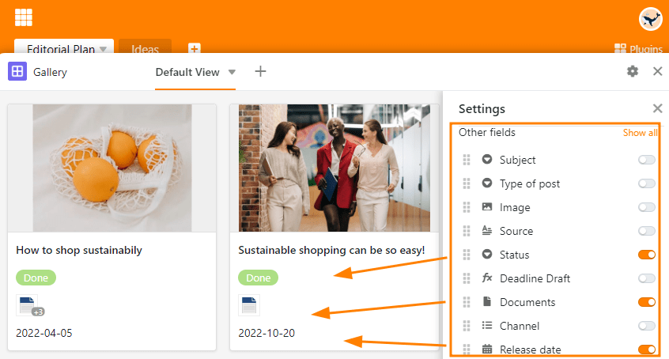

O **plugin da galeria** é particularmente adequado para apresentar registos ilustrados, uma vez que se refere principalmente ao conteúdo de uma [coluna de imagens]().

Enquanto as imagens na **vista de tabela** são exibidas como miniaturas e só podem ser ampliadas individualmente clicando nelas, o plugin da galeria permite obter uma visão geral animada de todos os conjuntos de dados, graças às **imagens de pré-visualização** maiores. O plug-in da galeria combina todas as imagens numa fila de um **álbum**.

## Para instalar o plug-in da galeria

Para poder utilizar o **plugin da galeria**, deve primeiro [activá-lo]() na sua Base.

Em seguida, nas definições, determine para que **vista de tabela** pretende criar uma galeria e de que [coluna de imagens]() devem provir as imagens. Para **Título**, introduza a coluna cujas entradas pretende utilizar como título do álbum.

## Mostrar e esconder informação

Nas **definições da galeria**, a que se chega através do **símbolo da roda dentada** , é possível exibir mais ou menos informação mostrando ou escondendo colunas. Activar os **cursores** das respectivas colunas (por exemplo, Documentos, Estado e Data) para ter mais informações da tabela exposta na galeria.

## Várias imagens numa só linha

O **número de imagens** por álbum ou linha é exibido na galeria com um **número realçado a cinzento**. Logicamente, o número só é exibido se houver mais do que uma imagem num álbum.

Ao clicar na imagem de pré-visualização abre o álbum em **modo de ecrã inteiro**, onde pode ampliar e reduzir as imagens usando as **lupas** e alternar entre as imagens usando as **setas**.

