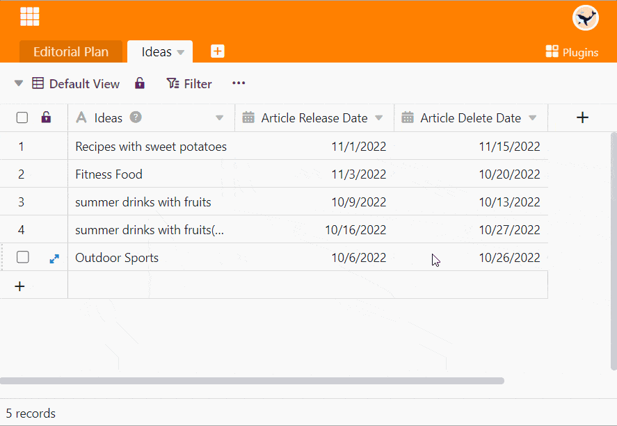

The calendar plugin shows you data from a table in **calendar form.** You can get an overview of different **time periods** (year, month, week, day).

There are 5 display options in total: You can display appointments in a calendar **yearly**, **monthly** or **weekly overview**, in the **daily planner** or as a monthly **agenda** in list form.



To use the calendar display for a table view, you need at least one [date column]().



## Calendar plugin settings

How to make settings in the calendar plugin:

1. Open the **calendar plugin**.
2. A large window appears. Click on the **Gear icon**  and define the following settings:
    - Table
    - View
    - Title column
    - Column for start date
    - Column for end date (optional)
    - Color
    - Start of the week



In the settings, you first specify which **table view the** calendar plugin should refer to. The appointments in the calendar are named after the entries in the selected **title column**.

Under **Column for Start Date** you specify from which date column of the table the entries in the calendar should originate. Optionally, you can specify a **column for End date** to display in the calendar the duration of the appointments.

The **color of** a calendar entry depends on its row color in the table or on the color of the option you assigned to an entry in a selection column. Under **Week start** you can decide whether the weeks in your calendar should start on Sundays or Mondays.

## The display options in detail

You can conveniently switch between the five display options of the calendar plugin. To do this, simply click the corresponding option on the **button** above the calendar.

### Annual overview

Here you can see the **year** at a glance. The **dot** under a date shows you that there is an entry on that day. You also have the option of calling up the **row detail view by** clicking on the date.

### Monthly overview

With this display you have all days of a **month** in view. Here, too, you can call up the **row detail view** by clicking on one of the dates.

### Weekly overview

This display shows you the **times on** the vertical axis and from left to right the seven days of a **week**. Here you can also open the **row detail view by** clicking on one of the dates.

### Day planner

The day planner is particularly suitable if you want to have several appointments on the screen on one **day**. Just like the weekly overview, it shows you the **times** on the vertical axis. Here, too, you can open the **row detail view by** clicking on one of the appointments.

### Agenda presentation

The **agenda** lists all appointments within a **month** and offers you the possibility to see certain **information** about the appointments at a glance.

To do this, simply show the desired **columns of** the table in the **settings of** the calendar plugin - for example, participants, location and images of an event or topic and type of a publication.

