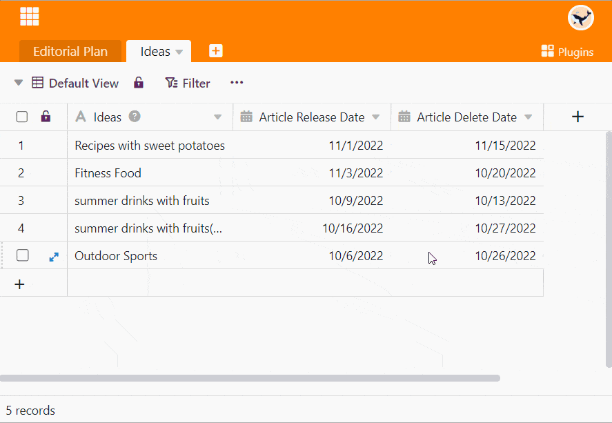
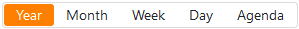
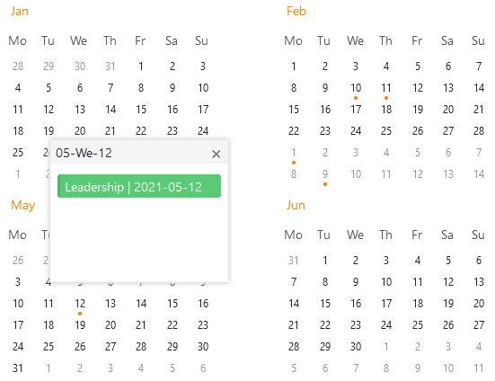
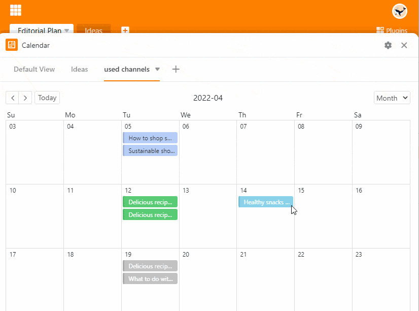
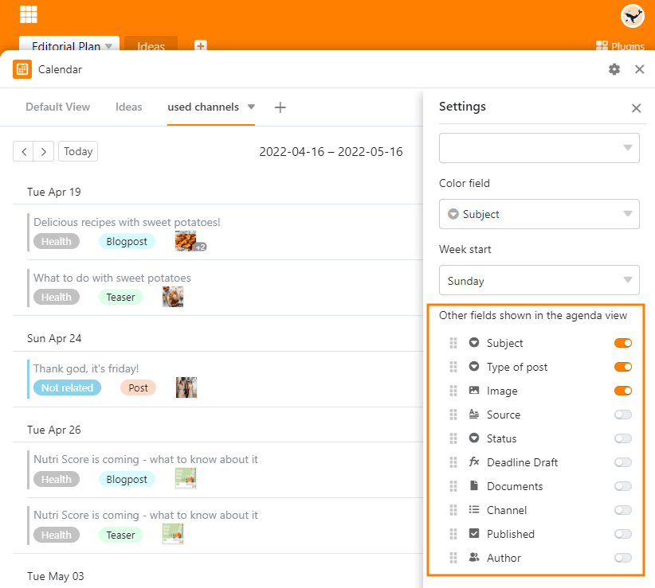

Плагин календаря показывает данные из таблицы в **виде календаря**. Вы можете получить обзор различных **временных периодов** (год, месяц, неделя, день).

Всего существует 5 вариантов отображения: Вы можете отображать встречи в календаре **годового**, **месячного** или **недельного обзора**, в **ежедневнике** или в виде ежемесячной **повестки дня** в форме списка.



Чтобы использовать отображение календаря для табличного представления, вам необходим хотя бы один [столбец с датами]().



## Настройки плагина календаря

Чтобы выполнить настройки в плагине календаря:

1. Откройте **плагин календаря**.
2. Появляется большое окно. Нажмите на **Символ передачи**  и определите следующие параметры:
    - Таблица
    - Посмотреть
    - Титульный столбец
    - Колонка для даты начала
    - Колонка для даты окончания (необязательно)
    - Цвет
    - Начало недели



В настройках вы сначала определяете, к какому **представлению таблицы** должен ссылаться плагин календаря. Встречи в календаре называются по именам записей в выбранном **столбце заголовка**.

В разделе **Колонка для начальной даты** указывается, из какой колонки таблицы дат должны исходить записи в календаре. По желанию вы можете ввести **столбец для даты окончания**, чтобы отобразить продолжительность встреч в календаре.

**Цвет** записи календаря зависит от цвета ее строки в таблице или от цвета опции, которую вы назначили записи в колонке выбора. В разделе **Начало недели** вы можете выбрать, с какого дня должны начинаться недели в вашем календаре - воскресенья или понедельника.

## Параметры отображения в деталях

Вы можете легко переключаться между пятью вариантами отображения плагина календаря. Для этого просто нажмите на соответствующую опцию на **кнопке** над календарем.

### Годовой обзор

Здесь вы можете сразу увидеть **год**. **Точка** под датой показывает, что в этот день есть запись. У вас также есть возможность вызвать **детальное представление строки**, щелкнув по дате.

### Ежемесячный обзор

В этом представлении вы видите все дни **месяца**. Здесь также можно вызвать **детальное представление ряда**, щелкнув на одной из дат.

### Еженедельный обзор

На этом дисплее по вертикальной оси отображается **время**, а слева направо - семь дней **недели**. Здесь также можно открыть **представление детализации ряда**, щелкнув по одной из дат.

### Планировщик дня

Ежедневник особенно удобен, если вы хотите, чтобы в один **день** на экране отображалось несколько встреч. Как и в еженедельном обзоре, он показывает **время на** вертикальной оси. Здесь также можно открыть **подробное представление ряда**, щелкнув по одной из встреч.

### Представление повестки дня

В **ежедневнике** перечислены все встречи в течение **месяца**, и вы можете сразу увидеть определенную **информацию** о встречах.

Для этого просто покажите нужные **столбцы** таблицы в **настройках** плагина календаря - например, участники, место и фотографии мероприятия или тема и тип публикации.

