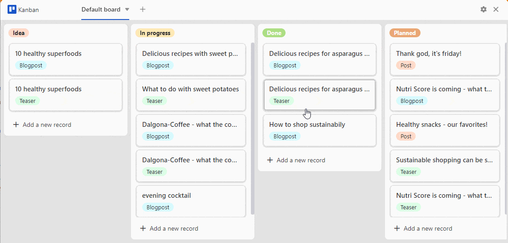
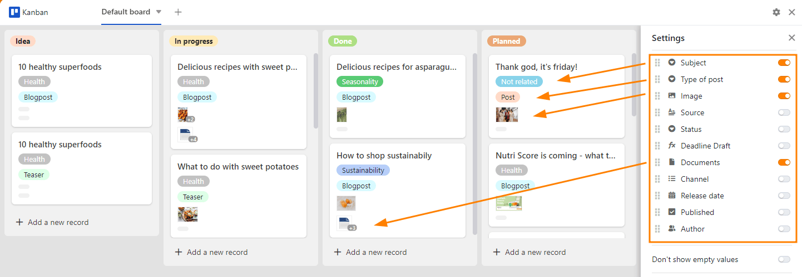

Ein **Kanban-Board** kann sinnvoll sein, um dynamische Prozesse mit verschiedenen Phasen darzustellen. In dieser Hinsicht ermöglicht es Ihnen beispielsweise die Visualisierung von **Workflows** und **Projektfortschritten**. Besonders hilfreich ist dies bei der Projektplanung, Produktentwicklung oder Aufgabenverteilung **im Team**.

Gut, dass SeaTable Ihnen mit dem **Kanban-Plugin** all diese Möglichkeiten bietet. Wie Sie das Plugin in einer Base aktivieren, erfahren Sie [hier]().

## Aufbau des Kanban-Boards

Das Kanban-Board besteht aus **Säulen**, die für verschiedene Schritte oder Phasen in einem Prozess stehen. Bei einem Workflow können das beispielsweise "Idee", "in Arbeit", "erledigt" und "geplant" sein.

Die Säulen versehen Sie mit **beweglichen Karten**, die Sie sowohl innerhalb einer Säule als auch von einer Säule in die nächste **verschieben** können. Eine Karte kann zum Beispiel für ein Arbeitspaket oder eine Aufgabe stehen.

## Einstellungsmöglichkeiten eines Kanban-Boards

Über die **Einstellungen**, die Sie per Klick auf das **Zahnrad-Symbol**  erreichen, können Sie Folgendes für das Kanban-Board festlegen:

- Tabelle
- Ansicht
- Gruppierung
- Titel
- Weitere Spalten
- Regleroptionen

### Tabelle und Ansicht

Wenn Sie mehrere **Tabellen** und **Ansichten** in Ihrer Base angelegt haben, können Sie aus diesen auswählen. 

### Gruppierung

Die **Gruppierung** bestimmt, welche Spalte die **Säulen** definiert. Hierfür eignen sich besonders [Auswahl-]().

 In diesem Beispiel wurde die Spalte **Status** gewählt. Als Säulen wurden dadurch die **Optionen** "Idee", "in Arbeit", "erledigt" und "geplant" definiert.

### Titel

Die Einträge in der Spalte, die Sie unter **Titel** angeben, bestimmen die **Überschrift der Karten** eines Kanban-Boards.

### Weitere Spalten

 Hier werden alle **Spalten** aufgeführt, die Sie in Ihrer Tabelle angelegt haben. Durch die Aktivierung der einzelnen **Regler** werden die Einträge in den jeweiligen Spalten als informative Notizen auf den Karten sichtbar. 

### Regleroptionen

Über die Regler-Optionen haben Sie die Möglichkeit, die visuelle Darstellung des Kanban-Boards zu verändern.

- Durch den Regler **Leere Werte nicht anzeigen** können Sie gegraute Platzhalter auf den Karten entfernen.
- Der Regler **Spaltennamen anzeigen** blendet die Spaltennamen über allen aktivierten Informationen ein.
- Der Regler **Wrap Text** formatiert Texte so, dass sie auf den Karten des Kanban-Boards vollständig lesbar sind.

