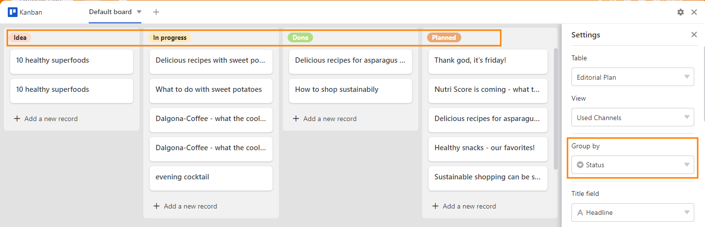
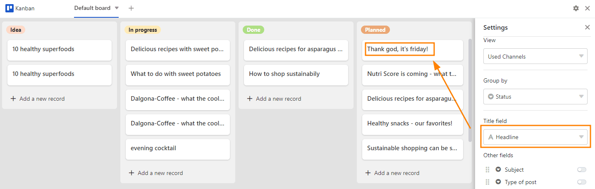

Un **tablero Kanban** puede ser útil para representar procesos dinámicos con distintas fases. En este sentido, permite visualizar **flujos de trabajo** y **avances de proyectos**, por ejemplo. Esto resulta especialmente útil para la planificación de proyectos, el desarrollo de productos o la distribución de tareas **en el equipo**.

## Estructura del tablero Kanban

El tablero Kanban consta de **columnas** que representan los distintos pasos o fases de un proceso. En un flujo de trabajo, por ejemplo, pueden ser "idea", "en curso", "realizado" y "planificado".

Proporcionas a las columnas **tarjetas móviles** que puedes **desplazar** tanto dentro de una columna como de una columna a otra. Por ejemplo, una tarjeta puede representar un paquete de trabajo o una tarea.

## Cómo configurar el plugin Kanban

¡Atención! Desde SeaTable 6.0, el plugin ya no puede instalarse en las bases. En las bases en las que ya se utiliza el plugin, está disponible hasta nuevo aviso y puede utilizarse sin restricciones. Sin embargo, nuestra recomendación es utilizar la [vista Kanban](). El cambio no podría ser más fácil, porque SeaTable ofrece **migración con un solo clic**. Esto convierte una pestaña de un plugin en una vista del mismo tipo sin más esfuerzo.

## Opciones de configuración de un tablero Kanban

A través de los **ajustes**, a los que puede acceder haciendo clic en el **símbolo de la rueda dentada** , puede definir lo siguiente para la tabla Kanban:

- Tabla
- Ver
- Agrupación
- Título
- Más columnas
- Opciones del controlador

### Mesa y vista

Si tiene varios **Tablas** y **Vistas** que ha creado en su base, puede seleccionarlos.



### Agrupación

La **agrupación** determina qué columna define las **columnas**. Las [columnas de]() son especialmente adecuadas para ello.

  
En este ejemplo, la columna **Estado** elegido. Como resultado, los pilares se **Opciones** "idea", "en curso", "realizado" y "previsto" definidos.

### Título

Las entradas de la columna que introduzca en **Título** determinan el **encabezamiento de las tarjetas de** un tablero Kanban.

### Más columnas

  
Aquí todos **Columnas** que ha creado en su tabla. Mediante la activación del individuo **Controlador** las entradas de las columnas respectivas se hacen visibles como notas informativas en las tarjetas.



### Opciones del controlador

A través de las opciones deslizantes tiene la posibilidad de cambiar la representación visual del tablero Kanban.

- El control deslizante **No mostrar valores vacíos** permite eliminar los marcadores de posición en gris de los mapas.
- El control deslizante **Mostrar nombres de columnas** muestra los nombres de las columnas encima de toda la información activada.
- El control deslizante **Ajustar texto** formatea los textos para que sean totalmente legibles en las tarjetas del tablero Kanban.

