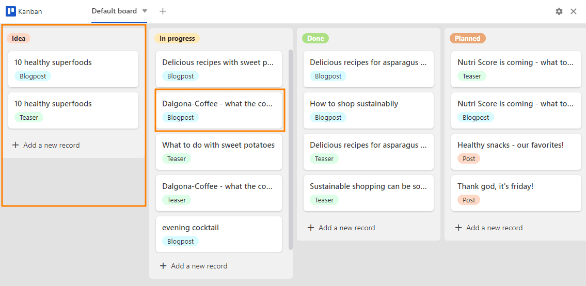
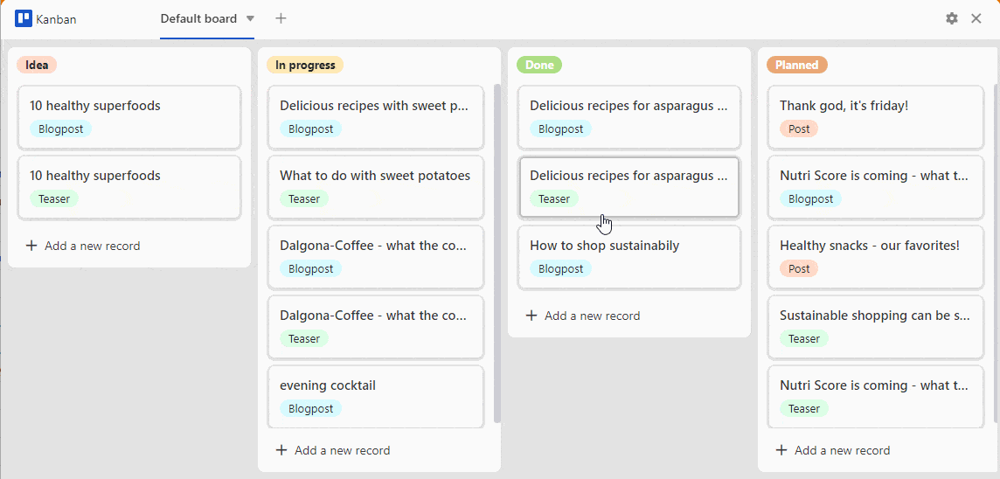
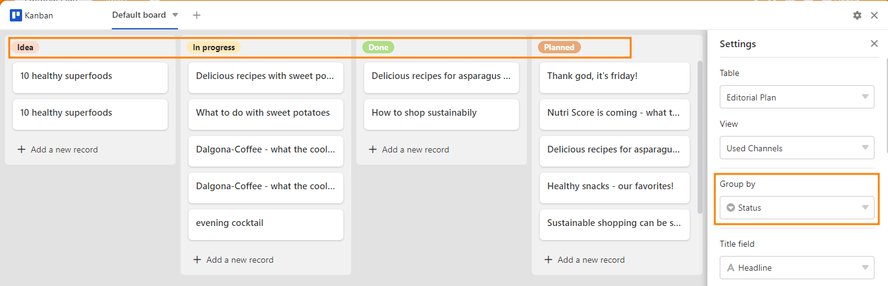
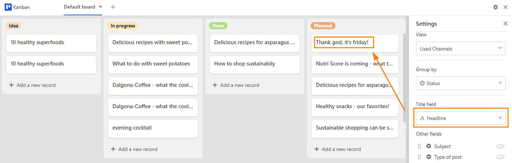
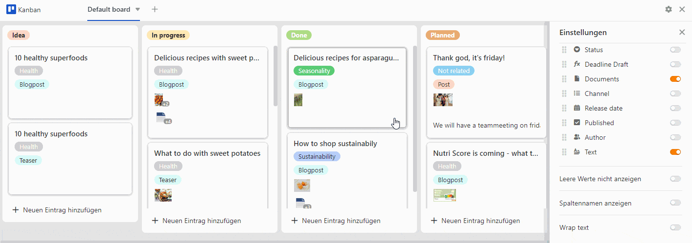

**Доска Kanban** может быть полезна для представления динамических процессов с различными фазами. В этом отношении она позволяет, например, визуализировать **рабочие процессы** и ход выполнения **проекта**. Это особенно полезно при планировании проектов, разработке продуктов или распределении задач **в команде**.

Хорошо, что SeaTable предлагает вам все эти возможности с **плагином Kanban**. О том, как активировать плагин в базе, вы можете узнать [здесь]().

## Структура доски Канбан

Доска Канбан состоит из **столбцов**, обозначающих различные этапы или фазы процесса. Например, в рабочем процессе это могут быть "идея", "в процессе", "сделано" и "запланировано".

Вы снабжаете колонки **подвижными карточками**, которые можно **перемещать** как внутри колонки, так и из одной колонки в другую. Например, карточка может обозначать рабочий пакет или задачу.

## Настройка параметров доски Канбан

В **настройках**, которые можно открыть, нажав на **символ шестеренки** , вы можете определить следующее для доски Канбан:

- Таблица
- Посмотреть
- Группировка
- Название
- Другие колонки
- Параметры контроллера

### Таблица и вид

Если у вас есть несколько **Таблицы** и **Просмотры** которые вы создали в своей базе, вы можете выбрать из них.



### Группировка

**Группировка** определяет, какой столбец определяет **столбцы**. [Колонки]() особенно подходят для этого.

  
В данном примере столбец **Статус** выбранный. Таким образом, столбы стали **Опции** Определены понятия "идея", "в процессе", "сделано" и "планируется".

### Название

Записи в колонке, которые вы вводите в разделе " **Заголовок** ", определяют **заголовок карточек** доски Канбан.

### Другие колонки

  
Здесь все **Колонки** которые вы создали в своей таблице. Активизируя индивидуальные **Контроллер** записи в соответствующих колонках становятся видимыми как информационные заметки на карточках.



### Параметры контроллера

С помощью ползунковых опций можно изменять визуальное представление доски Kanban.

- Ползунок **Не показывать пустые значения** позволяет убрать серые заполнители на картах.
- Ползунок **Показывать названия колонок** отображает названия колонок над всей активированной информацией.
- Ползунок **"Обернуть текст** " форматирует тексты так, чтобы они были полностью читаемы на картах доски Канбан.

