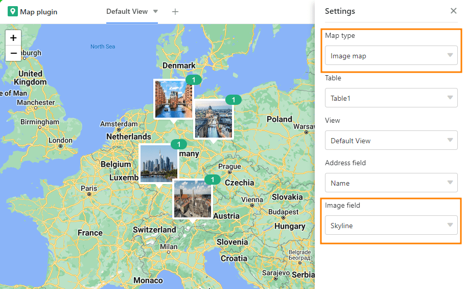

Wenn Sie in Ihrer Tabelle eine Textspalte mit Adressen bzw. Ortsnamen erstellt oder den Spaltentyp [Geoposition](https://seatable.io/docs/andere-spalten/die-geopositions-spalte/) verwendet haben, können Sie mit dem **Karten-Plugin** die in der Spalte eingetragenen Standorte darstellen.

Um das Plugin zu aktivieren, folgen Sie der Anleitung im Artikel [Aktivieren eines Plugins in einer Base](https://seatable.io/docs/arbeiten-mit-plugins/aktivieren-eines-plugins-in-einer-base/).

## Funktionen des Karten-Plugins

### Zoomen

Zum Zoomen verwenden Sie das **Plus-/Minus-Symbol** in der linken oberen Ecke oder drehen einfach am **Mausrad**.

### Kartenausschnitt ändern

Verschieben Sie den Kartenausschnitt, indem Sie mit der Maus **klicken und ziehen**.

### Karte downloaden

Laden Sie den Kartenausschnitt als Bild-Datei herunter, indem Sie auf den **Download-Button** klicken.

### Vollbildmodus

Vergrößern Sie das Fenster des Karten-Plugins so, dass es die gesamte Benutzeroberfläche einnimmt, indem Sie auf  drücken.

## Einstellungsmöglichkeiten des Karten-Plugins

Klicken Sie auf das **Zahnrad-Symbol**, um die Einstellungen zu öffnen.

Sie haben folgende Einstellungsmöglichkeiten:

- Kartentyp
- Tabelle und Ansicht
- Adresszeile
- Markerfarbe
- Anzeigefeld

### Kartentyp

Entscheiden Sie sich zwischen der standardmäßigen Anzeige mit **Standort-Pins** oder verwenden Sie **Bilder** zur Markierung der Standorte.

Wenn Sie sich für die Bildanzeige entscheiden, müssen Sie die [Bild-Spalte](https://seatable.io/docs/dateien-und-bilder/die-bild-spalte/) festlegen, aus der die Bilder angezeigt werden sollen.

### Tabelle und Ansicht

Wenn Sie mehrere Tabellen in Ihrer Base angelegt haben, können Sie an dieser Stelle auswählen, welche Tabelle verwendet werden soll. Das Gleiche gilt für Ansichten. 

### Adresszeile

Legen Sie hier eine Textspalte, in der Sie Adressen oder Ortsnamen erfasst haben, oder eine [Geopositions-Spalte](https://seatable.io/docs/andere-spalten/die-geopositions-spalte/) fest, aus der die Standorte auf der Karte angezeigt werden sollen. Beachten Sie, dass das Karten-Plugin nur funktioniert, wenn Sie in Ihrer Tabelle eine Spalte dieses Typs verwendet haben.

### Markerfarbe

Wenn Sie in der Tabelle [Zeilen farblich markiert](https://seatable.io/docs/ansichtsoptionen/farbliche-markierung-von-zellen/) oder [Auswahlspalten](https://seatable.io/docs/auswahlspalten/hinzufuegen-von-optionen-zu-einer-einfachauswahl-spalte/) mit farbigen Optionen angelegt haben, können Sie an dieser Stelle auswählen, was davon die **Farbe der Kartenmarkierungen** bestimmen soll.

### Anzeigefeld

Bisher müssen Sie mit dem Mauszeiger über eine Kartenmarkierung fahren, um deren **Beschriftung** sichtbar zu machen. Wenn Sie die Orte dauerhaft beschriften möchten, können Sie hier eine Spalte definieren, aus der die jeweiligen Einträge neben den Standort-Pins angezeigt werden.

## Mehrere Karten erstellen

1. Klicken Sie auf das **Plus-Symbol** rechts neben dem Titel Ihrer ersten Karte.
2. Geben Sie der Karte einen **Namen** und bestätigen Sie mit **Abschicken**.
3. Legen Sie in den **Einstellungen** fest, auf welche Tabellenansicht und welche Spalte sich die neue Karte beziehen soll.
