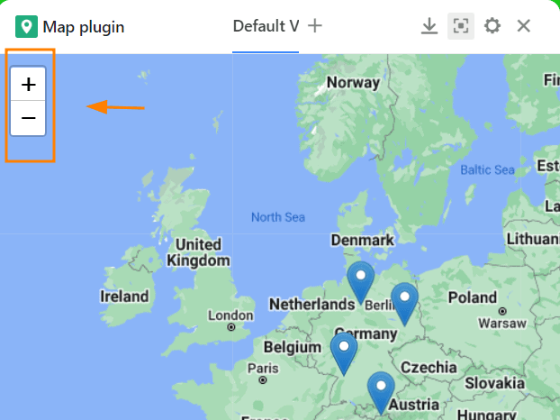
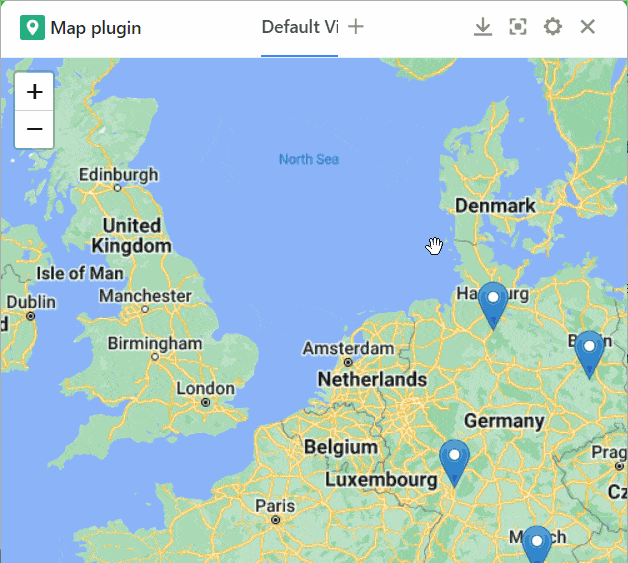
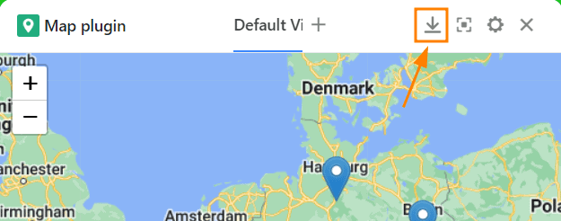
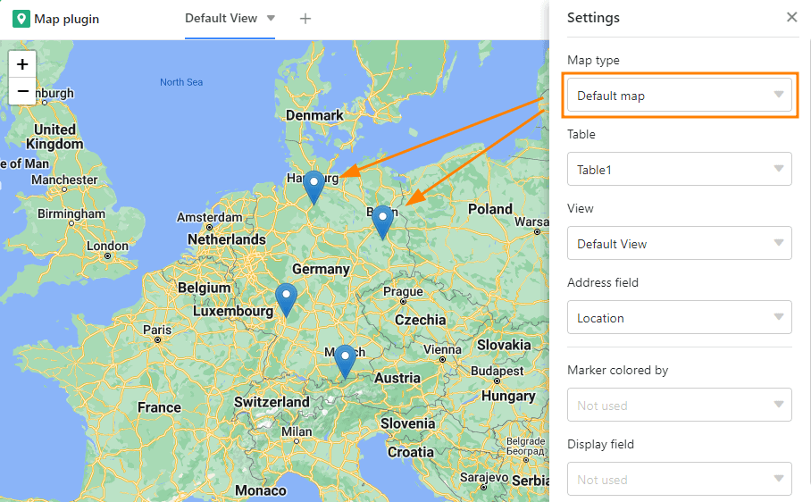

Si vous avez créé une colonne de texte dans votre tableau avec des adresses ou des noms de lieux ou si vous avez utilisé le type de colonne [Géoposition](https://seatable.io/fr/docs/andere-spalten/die-geopositions-spalte/), vous pouvez utiliser le **plugin de carte** pour représenter les lieux saisis dans la colonne.

Pour activer le plugin, suivez les instructions de l'article [Activer un plugin dans une base]().

## Fonctions du plug-in de carte

### Zoom

Pour zoomer, utilisez le **symbole plus/moins** dans le coin supérieur gauche ou tournez simplement la **molette de la souris**.

### Modifier l'extrait de carte

Déplacez la section de la carte en **cliquant et en faisant glisser** la souris.

### Télécharger la carte

Téléchargez l'extrait de carte sous forme de fichier image en cliquant sur le **bouton de téléchargement**.

### Mode plein écran

Agrandissez la fenêtre du plug-in de carte de manière à ce qu'elle occupe toute l'interface utilisateur en appuyant sur .

## Possibilités de réglage du plug-in de carte

Cliquez sur l'**icône représentant une roue dentée** pour ouvrir les paramètres.

Vous avez les possibilités de réglage suivantes :

- Type de carte
- Tableau et vue
- Ligne d'adresse
- Couleur du marqueur
- Champ d'affichage

### Type de carte

Choisissez entre l'affichage standard avec **des pins de localisation** ou utilisez **des images** pour marquer les sites.

Si vous optez pour l'affichage des images, vous devez définir la [colonne d'images]() à partir de laquelle les images doivent être affichées.

### Tableau et vue

Si vous avez créé plusieurs tableaux dans votre base, vous pouvez choisir à cet endroit quel tableau doit être utilisé. Il en va de même pour les vues.



### Ligne d'adresse

Définissez ici une colonne de texte dans laquelle vous avez saisi des adresses ou des noms de lieux, ou une [colonne de géoposition](https://seatable.io/fr/docs/andere-spalten/die-geopositions-spalte/) à partir de laquelle les lieux doivent être affichés sur la carte. Notez que le plugin de carte ne fonctionne que si vous avez utilisé une colonne de ce type dans votre tableau.

### Couleur du marqueur

Si vous avez [mis des lignes en couleur]() avec des options colorées, vous pouvez choisir à ce stade ce qui doit déterminer la **couleur des repères de la carte**.

### Champ d'affichage

Jusqu'à présent, vous deviez passer le curseur de la souris sur un repère de la carte pour faire apparaître son **inscription**. Si vous souhaitez étiqueter les lieux de manière permanente, vous pouvez définir ici une colonne à partir de laquelle les entrées respectives seront affichées à côté des pins de localisation.

## Créer plusieurs cartes

1. Cliquez sur le **symbole plus** à droite du titre de votre première carte.
2. Donnez un **nom** à la carte et confirmez en cliquant sur **Envoyer**.
3. Déterminez dans les **paramètres** à quelle vue du tableau et à quelle colonne la nouvelle carte doit se référer.
