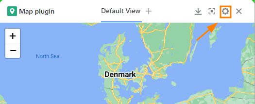
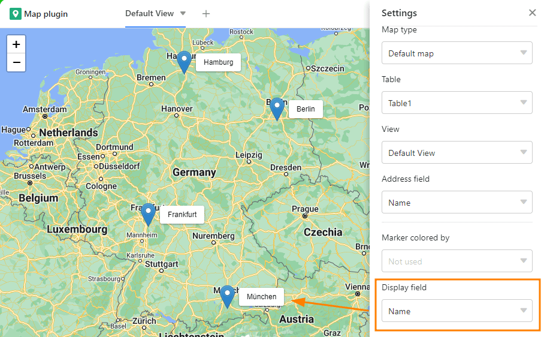

Se criou uma coluna de texto com endereços ou nomes de locais na sua tabela ou utilizou o tipo de coluna [Geoposition](), pode utilizar o **Plugin do Mapa** para exibir os locais introduzidos na coluna.

Para activar o plugin, seguir as instruções do artigo [Activando um Plugin numa Base]().

## Funções do plug-in do mapa

### Zoom

Para fazer zoom, usar o **símbolo mais/menos** no canto superior esquerdo ou simplesmente rodar a **roda do rato**.

### Mudar secção do mapa

Mova a secção do mapa **clicando e arrastando** com o rato.

### Descarregar mapa

Descarregar a secção do mapa como um ficheiro de imagem, clicando no **botão de descarga**.

### Modo ecrã inteiro

Ampliar a janela de plug-in do mapa de modo a ocupar toda a interface do utilizador, premindo .

## Opções de configuração do plug-in do mapa

Clique no **símbolo da roda dentada** para abrir as definições.

Tem as seguintes opções de configuração:

- Tipo de cartão
- Tabela e vista
- Linha de endereço
- Cor do marcador
- Campo de visualização

### Tipo de cartão

Decidir entre a exibição padrão com **pinos de localização** ou usar **imagens** para marcar os locais.

Se decidir apresentar imagens, deve especificar a [coluna de]() imagens a partir da qual as imagens devem ser apresentadas.

### Tabela e vista

Se tiver criado várias tabelas na sua base, pode seleccionar neste momento qual a tabela a ser utilizada. O mesmo se aplica aos pontos de vista.



### Linha de endereço

Defina aqui uma coluna de texto na qual tenha introduzido endereços ou nomes de locais, ou uma [coluna de geoposição]() a partir da qual os locais devem ser exibidos no mapa. Note que o plug-in do mapa só funciona se tiver utilizado uma coluna deste tipo na sua tabela.

### Cor do marcador

Se tiver [linhas com marcas de cor na]() com opções de cor, pode seleccionar neste momento qual destas deve determinar a **cor das marcações do mapa**.

### Campo de visualização

Até agora, é necessário mover o ponteiro do rato sobre um marcador de mapa para tornar visível a sua **etiqueta**. Se desejar rotular permanentemente os locais, pode definir aqui uma coluna a partir da qual as respectivas entradas são exibidas ao lado dos pinos de localização.

## Criar mapas múltiplos

1. Clique no **símbolo de mais** à direita do título do seu primeiro mapa.
2. Dar um **nome** ao cartão e confirmar com **Submeter**.
3. Nas **definições**, definir a que vista de tabela e a que coluna o novo mapa se deve referir.
