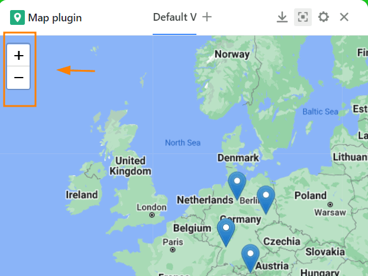
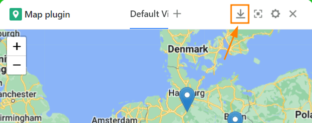
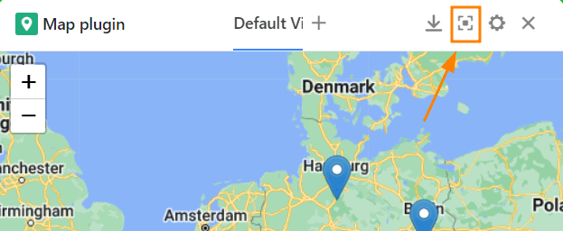
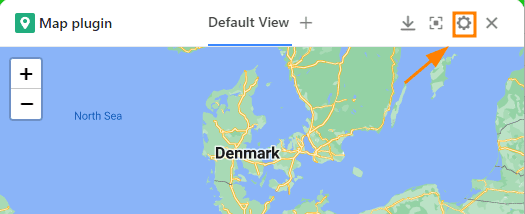
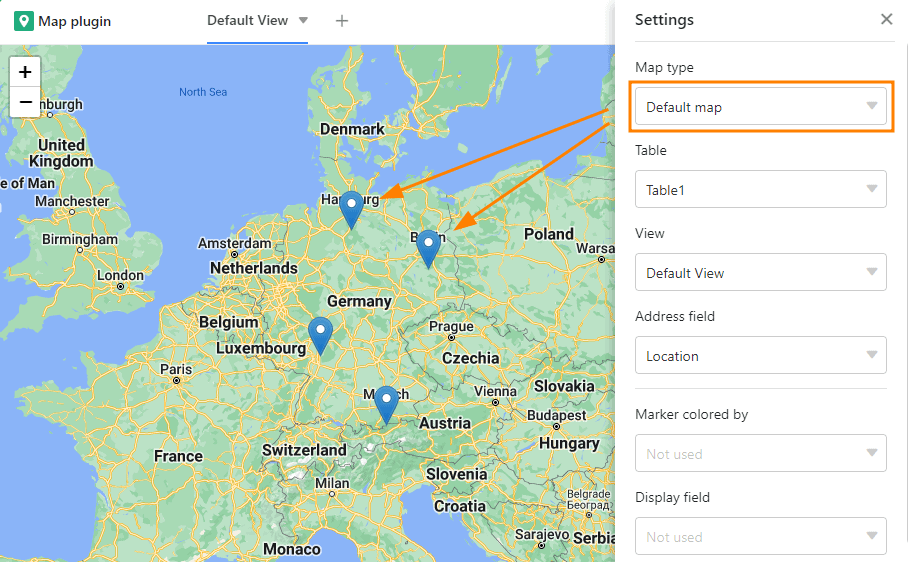
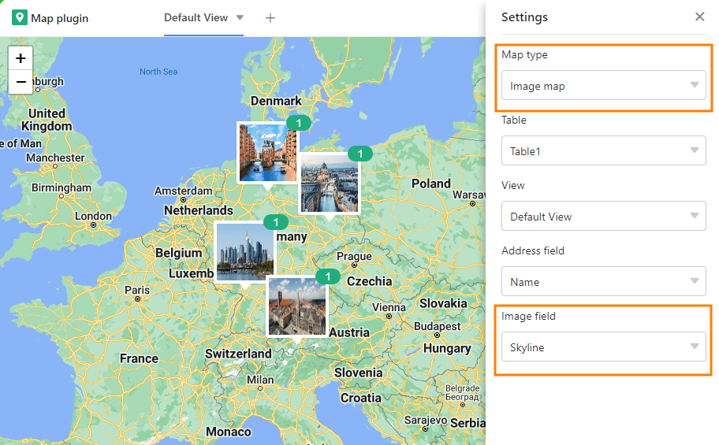
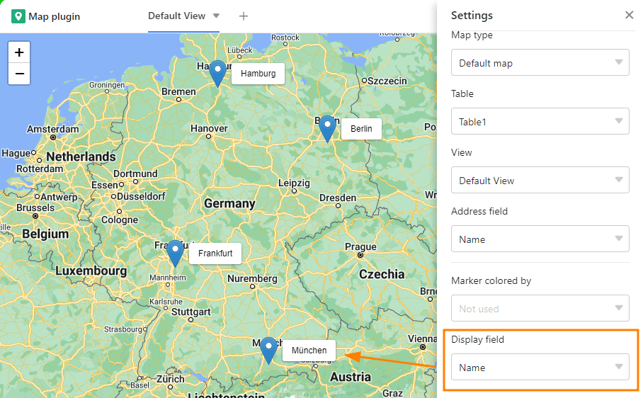

Если вы создали в таблице текстовую колонку с адресами или географическими названиями или использовали тип колонки [Geoposition](), вы можете использовать **Map Plugin** для отображения мест, введенных в колонку.

Чтобы активировать плагин, следуйте инструкциям в статье [Активация плагина в базе]().

## Функции подключаемого модуля карты

### Zoom

Для масштабирования используйте **символ плюс/минус** в левом верхнем углу или просто вращайте **колесико мыши**.

### Изменить раздел карты

Переместите участок карты, **щелкнув и перетащив** его с помощью мыши.

### Скачать карту

Загрузите участок карты в виде файла изображения, нажав на **кнопку загрузки**.

### Полноэкранный режим

Увеличьте окно подключаемого модуля карты так, чтобы оно занимало весь пользовательский интерфейс, нажав .

## Настройка параметров подключаемого модуля карты

Нажмите на **символ шестеренки**, чтобы открыть настройки.

У вас есть следующие возможности настройки:

- Тип карты
- Таблица и вид
- Адресная строка
- Цвет маркера
- Поле отображения

### Тип карты

Выбирайте между стандартным отображением с **булавками** или использованием **изображений** для обозначения мест.

Если вы решили отобразить изображения, необходимо указать [колонку]() изображений, из которой они будут отображаться.

### Таблица и вид

Если вы создали несколько таблиц в своей базе, вы можете выбрать на этом этапе, какая таблица будет использоваться. То же самое относится и к взглядам.



### Адресная строка

Установите здесь текстовый столбец, в который вы ввели адреса или географические названия, или [столбец геопозиции](), из которого местоположения будут отображаться на карте. Обратите внимание, что подключаемый модуль карты работает только в том случае, если вы использовали столбец этого типа в своей таблице.

### Цвет маркера

Если вы [выделили цветом строки]() или [одиночные колонки выбора]() с цветными опциями, вы можете выбрать на этом этапе, какой из них должен определять **цвет маркировки карты**.

### Поле отображения

До сих пор необходимо навести указатель мыши на маркер карты, чтобы его **метка** стала видимой. Если вы хотите постоянно помечать местоположения, вы можете задать здесь колонку, в которой соответствующие записи будут отображаться рядом с булавками местоположений.

## Создание нескольких карт

1. Нажмите на **символ плюса** справа от названия вашей первой карты.
2. Дайте карте **имя** и подтвердите его нажатием кнопки **Submit (Отправить**).
3. В **настройках** определите, к какому представлению таблицы и к какому столбцу должна относиться новая карта.
