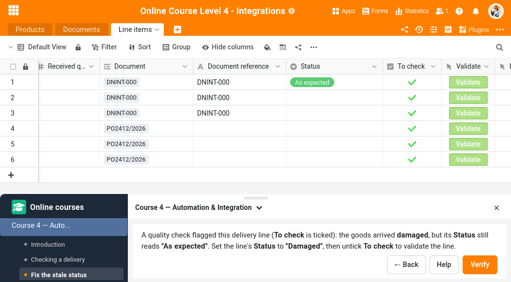

The **Online courses plugin** is a little different from the other plugins: it does not give you a new view of your data — it is a **learning companion**. It walks you through the hands-on exercises of the SeaTable [online courses]() and **checks your work directly in your own base**. You build an automation, write a short script or set up a view by following a course, then open the plugin and let it verify that the expected result is really there in your data.

<!-- TODO: confirm the exact install path for this plugin (marketplace vs. manual upload) once it is published, and link it here. For now this points to the generic "activate a plugin" article. -->
You can find out how to activate a plugin in a base [here]().

## How it works with the courses

You follow each course mainly on our **website**, where the whole story unfolds step by step. At certain points, a course asks you to **open this plugin and pick a step** — that is where you actually do something in your base and the plugin checks it for you.

The website and the plugin play different roles:

- The **website** carries the narrative: it explains each concept and shows you what to build and why.
- The **plugin** works with you inside your base. It is the checkpoint: it reads your data and confirms that the automation you built triggers correctly, that your script produced the right values, or that your view is set up as expected — and gives you immediate feedback.

The plugin is not only there to mark your work at the end, though. When an operation has several stages — the trigger of an automation, then its conditions, then each of its actions — it can **take you through them one at a time**, telling you what to set and confirming each stage before you move on to the next. So you can either build the whole thing yourself and ask for a single verdict, or let the plugin accompany you the entire way.

It can also **make changes in your base itself** when an exercise needs it: bringing in the records a step is supposed to work on, or undoing what a previous step produced so you can run it again from a clean state. You are told each time what it is about to do.

## Your first run

The first time you open the plugin, start with the built-in **Welcome course** — pick it from the list on the left. It is a short, one-minute tour that shows you **how a course works**, what the **buttons** do, and how to slide the panel out of your way with the **movable toolbar**. Everything that follows assumes you are comfortable moving between the website and the plugin, so this is the place to begin.

Once you are familiar with the companion, select the course you are working on from the same list and follow along with the website.

## Which courses are supported

The plugin is being rolled out course by course. [Online Course 4 – Automation & Integration]() is fully supported today, and more courses are being added. A course the plugin does not check yet still opens with a short note telling you so and pointing you to follow it on the website in the meantime.

## Other helpful articles

- [All plugins at a glance]()
- [SeaTable online courses]()
- [How to activate a plugin in a base]()
