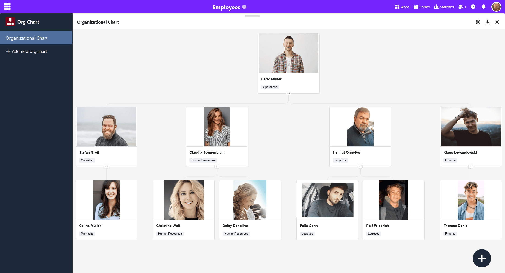
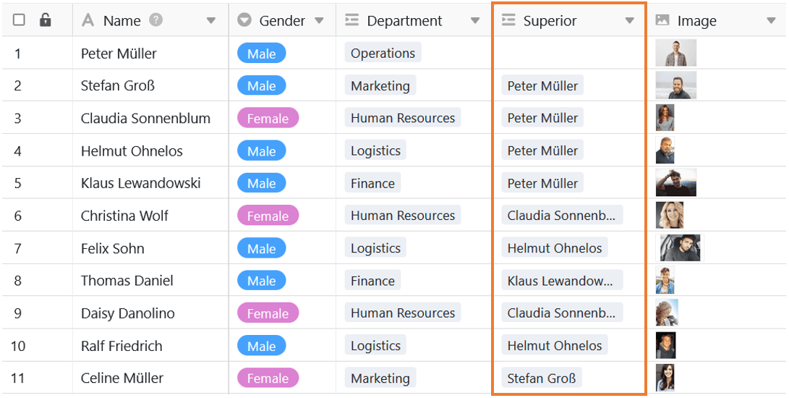
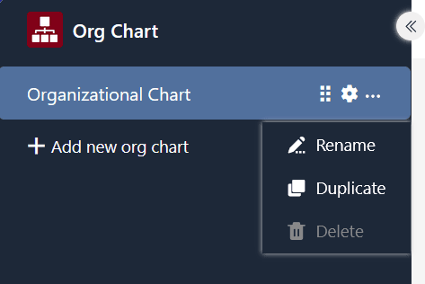
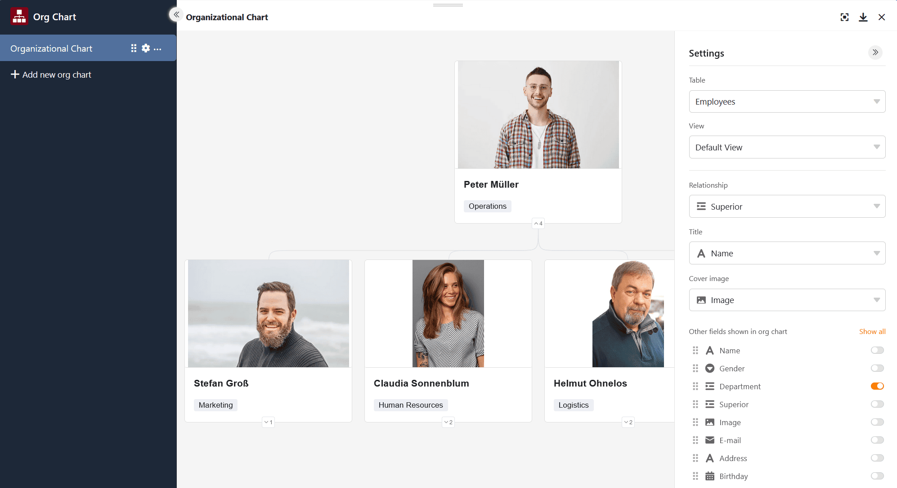

Mithilfe des Organigramm-Plugins können Sie **Hierarchien** zwischen den Datensätzen in einer Tabelle darstellen. Das ist zum Beispiel nützlich, um die Positionen in einem Unternehmen oder [über- und untergeordnete Aufgaben in einem Projekt](https://seatable.io/projektstrukturplan-vorlage/) zu visualisieren.

Wie Sie das Plugin in einer Base aktivieren, erfahren Sie [hier](
).

## Voraussetzungen und Funktionsweise des Organigramm-Plugins

Um zu definieren, welche Datensätze voneinander abhängen, brauchen Sie eine [Verknüpfung, die auf ein und dieselbe Tabelle referiert](https://seatable.io/docs/verknuepfungen/verknuepfungen-innerhalb-einer-tabelle/). Der Eintrag, den Sie in dieser Spalte mit einer anderen Zeile derselben Tabelle verlinken, wird als **übergeordneter Datensatz** dargestellt.

> Im Anwendungsbeispiel mit den Positionen in einem Unternehmen würden Sie also den jeweiligen Vorgesetzten des Mitarbeiters in der Verknüpfungsspalte verlinken. Daraus resultieren die Ebenen des Organigramms: In der zweiten Ebene stünden die Abteilungsleiter und ganz oben der Geschäftsführer.

Wenn Sie die Datensätze im Organigramm mit Bildern illustrieren möchten, benötigen Sie in der Tabelle zudem eine [Bild-Spalte](), in der Sie Fotos und Grafiken hochladen können.

## Einstellungsmöglichkeiten eines Organigramms

Standardmäßig ist beim ersten Öffnen des Organigramm-Plugins bereits ein leeres Organigramm angelegt. Wenn Sie ein weiteres Organigramm erstellen möchten, klicken Sie auf  **Organigramm hinzufügen**. Daraufhin öffnet sich ein Eingabefeld, in das Sie den gewünschten **Namen** tippen.

Um die **Reihenfolge der Organigramme zu ändern**, halten Sie die linke Maustaste an der **Greiffläche**  gedrückt und ziehen das Organigramm **per Drag-and-Drop** an die gewünschte Stelle. Darüber hinaus können Sie Organigramme **umbenennen**, **duplizieren** oder **löschen**.



Über die **Einstellungen**, die Sie per Klick auf das **Zahnrad-Symbol**  erreichen, können Sie Folgendes für das Organigramm festlegen:

- **Tabelle**: Wählen Sie die Tabelle, aus der SeaTable das Organigramm erzeugen soll.
- **Ansicht**: Wählen Sie die Ansicht mit den Datensätzen, die im Organigramm zu sehen sein sollen.
- **Beziehung**: Wählen Sie die Verknüpfungsspalte, auf der die Hierarchie basiert.
- **Titel**: Wählen Sie eine Spalte, deren Werte als Titel angezeigt werden sollen.
- **Titelbild**: Wählen Sie eine Bild-Spalte, um die Datensätze zu illustrieren.
- **Weitere Spalten**: Wählen Sie weitere Spalten aus, deren Werte angezeigt werden sollen.


