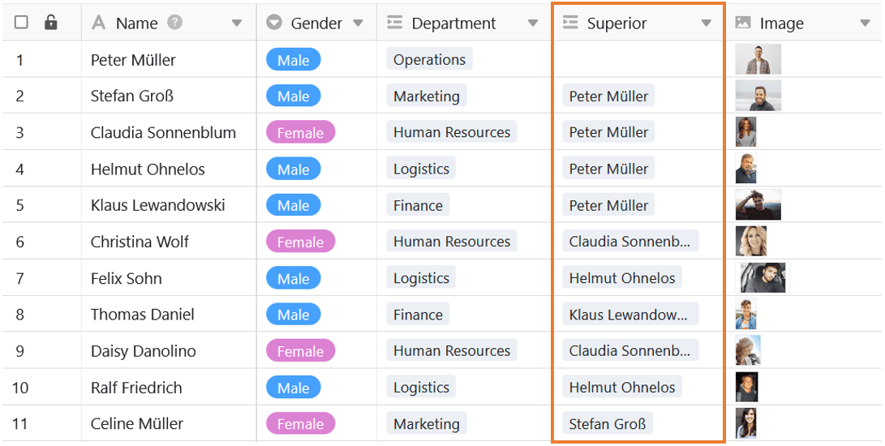
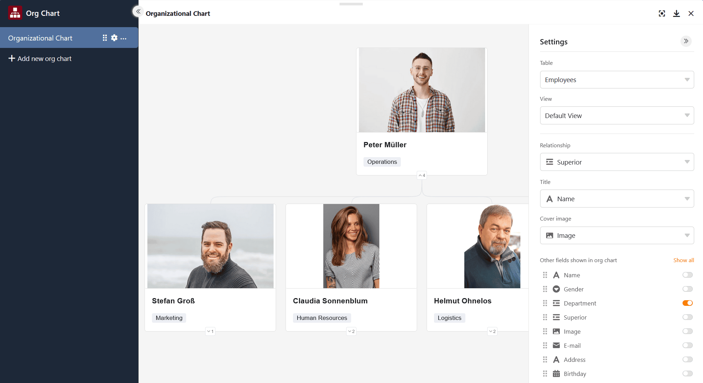

Puede utilizar el complemento de organigrama para mostrar **jerarquías** entre los registros de datos de una tabla. Esto es útil, por ejemplo, para visualizar los cargos en una empresa o las [tareas superordinadas y subordinadas en un proyecto]().

Puede encontrar información sobre cómo activar el plugin en una base [aquí]().

## Requisitos y funcionalidad del plugin de organigrama

Para definir qué registros de datos dependen unos de otros, necesita un [enlace que haga referencia a una misma tabla](). La entrada que vincule en esta columna a otra fila de la misma tabla se mostrará como **registro de datos superior**.

> En el ejemplo de aplicación con los puestos en una empresa, se vincularía por tanto el respectivo responsable del empleado en la columna de vinculación. El resultado son los niveles del organigrama: Los jefes de departamento estarían en el segundo nivel y el director general en el superior.

Si desea ilustrar los registros de datos del organigrama con imágenes, también necesitará una [columna de imágenes]() en la tabla, donde podrá cargar fotos y gráficos.

## Opciones de configuración de un organigrama

Por defecto, se crea un organigrama vacío cuando abre el plugin de organigrama por primera vez.  Si desea crear otro organigrama, haga clic en **Añadir organigrama**. Se abrirá un campo en el que podrá introducir el **nombre** que desee.

 Para **cambiar** el **orden de los organ**igramas, mantenga pulsado el botón izquierdo del ratón en la **zona de agarre** y **arrastre y suelte** el organigrama en la posición deseada. También puede **renombrar**, **duplicar** o **eliminar** organigramas.



 Puede definir lo siguiente para el organigrama a través de los **ajustes**, a los que puede acceder haciendo clic en el **símbolo de la rueda dentada**:

- **Tabla**: Seleccione la tabla a partir de la cual SeaTable debe generar el organigrama.
- **Vista**: seleccione la vista con los registros de datos que se mostrarán en el organigrama.
- **Relación**: Seleccione la columna de relación en la que se basa la jerarquía.
- **Título**: Seleccione una columna cuyos valores deban mostrarse como título.
- **Imagen de portada**: seleccione una columna de imágenes para ilustrar los registros de datos.
- **Otras columnas**: Seleccione columnas adicionales cuyos valores deban mostrarse.


