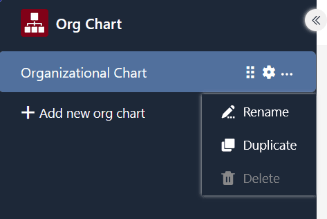

Pode utilizar o plugin do organigrama para apresentar **hierarquias** entre os registos de dados de uma tabela. Isto é útil, por exemplo, para visualizar os cargos numa empresa ou as [tarefas superiores e subordinadas num projeto](https://seatable.io/pt/projektstrukturplan-vorlage/).

Pode descobrir como ativar o plugin numa base [aqui](https://seatable.io/pt/docs/plugins/aktivieren-eines-plugins-in-einer-base/).

## Requisitos e funcionalidade do plugin do organigrama

Para definir quais os registos de dados que são dependentes uns dos outros, é necessária uma [ligação que se refira a uma e à mesma tabela](https://seatable.io/pt/docs/verknuepfungen/verknuepfungen-innerhalb-einer-tabelle/). A entrada que se liga nesta coluna a outra linha na mesma tabela é exibida como um **registo de dados superior**.

> No exemplo de aplicação com as posições numa empresa, o utilizador ligaria o respetivo gerente do empregado na coluna de ligação. Isto resulta nos níveis do organigrama: Os chefes de departamento estariam no segundo nível e o diretor-geral no topo.

Se quiser ilustrar os registos de dados no organigrama com imagens, também precisa de uma [coluna de imagens](https://seatable.io/pt/docs/dateien-und-bilder/die-bild-spalte/) na tabela onde possa carregar fotografias e gráficos.

## Definir opções para um organigrama

Por defeito, já é criado um organigrama vazio quando abre o plugin do organigrama pela primeira vez.  Se quiser criar outro organigrama, clique em **Adicionar organigrama**. Isto abre um campo de entrada no qual pode introduzir o **nome** pretendido.

 Para **alterar a ordem dos organogramas**, mantenha premido o botão esquerdo do rato na **área de aperto** e arraste **e largue** o organograma para a posição pretendida. Também é possível **renomear**, **duplicar** ou **eliminar** organogramas.



 Pode definir o seguinte para o organigrama através das **definições**, às quais pode aceder clicando no **símbolo da roda dentada**:

- **Tabela**: Seleccione a tabela a partir da qual o SeaTable deve gerar o organigrama.
- **Vista**: Selecionar a vista com os registos de dados a apresentar no organigrama.
- **Relação**: Seleccione a coluna de relação na qual a hierarquia se baseia.
- **Título**: Seleccione uma coluna cujos valores devem ser apresentados como um título.
- **Imagem de capa**: Seleccione uma coluna de imagens para ilustrar os registos de dados.
- **Outras colunas**: Selecionar colunas adicionais cujos valores devem ser apresentados.


