Das **Seitendesign-Plugin** bietet Ihnen eine Vielzahl an Möglichkeiten, die Informationen einer Tabelle unter anderem in Form von personalisierten Anschreiben, Visitenkarten und Rundbriefen zu visualisieren. Mithilfe von **statischen Elementen** können Sie Seiten-Layouts erstellen, die durch **dynamische Elemente** und **Tabellenfelder** ergänzt werden.

Lesen Sie im Artikel [Aktivieren eines Plugins in einer Base](), wie Sie das Seitendesign-Plugin aktivieren und Ihrer Toolbar hinzufügen können.

## Ein neues Seitendesign hinzufügen

1. Öffnen Sie das **Seitendesign-Plugin**.
   
2. Klicken Sie auf die **neue Seite mit dem Plus-Symbol**.
   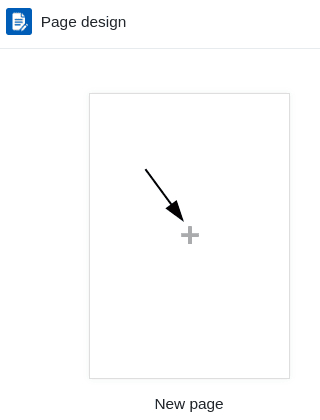
3. Wählen Sie die Option **Leere Seite erstellen** aus.
   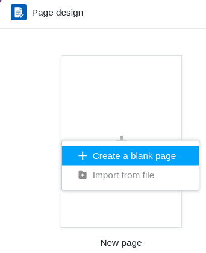
4. Hier können Sie folgende **Einstellungen** vornehmen: 
   - Wählen Sie die **Tabelle**, aus der Sie Daten verwenden möchten. 
   - Entscheiden Sie sich für eine **Papiergröße**. 
   - Legen Sie für das Seiten-Layout **Hochformat** oder **Querformat** fest.
   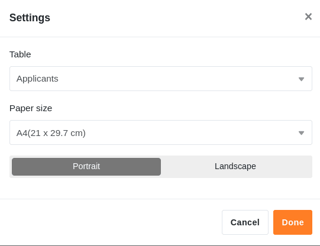



## Ein Seitendesign speichern und bearbeiten

Wenn Sie ein neues Seitendesign angelegt haben, können Sie dieses über die Schaltfläche  **Fertig** speichern. Sie können es wieder bearbeiten, nachdem Sie an der gleichen Stelle auf die Schaltfläche  **Bearbeiten** geklickt haben.

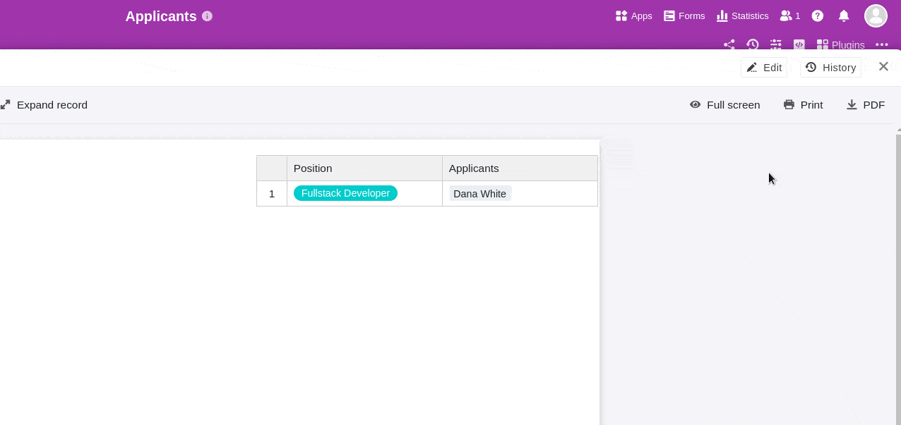

Außerhalb des Bearbeitungsmodus können Sie die gespeicherten  **Versionen** des Seitendesigns ansehen und wiederherstellen.



Per Klick auf die **Pfeil-Symbole**  und  können Sie einzelne Bearbeitungsschritte rückgängig machen oder wiederherstellen.

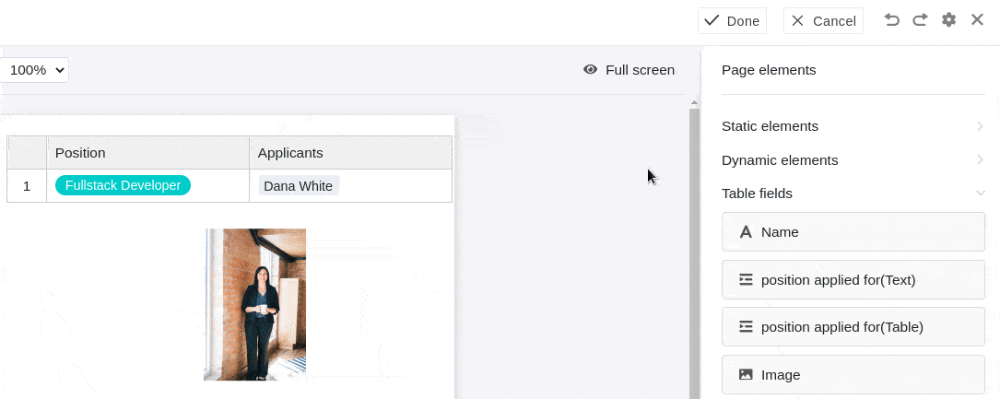

Über die Schaltfläche  **Vollbild** können Sie sich das Seitendesign über Ihren gesamten Bildschirm anzeigen lassen. Wenn Sie ein Dokument als PDF auf Ihrem Gerät speichern möchten, klicken Sie auf  **PDF**, geben Sie den **Namen der Exportdatei** ein und bestätigen Sie mit **Exportieren**.

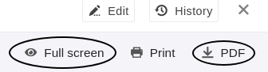

Klicken Sie auf  **Drucken**, um den **aktuellen Eintrag** oder **alle Einträge der Ansicht** zu drucken. Sobald Sie mit **Drucken** bestätigen, öffnet sich das übliche Fenster, in dem Sie die Druckeinstellungen auf Ihrem Gerät vornehmen.

## Die Seitendesign-Übersicht

In der **Seitendesign-Übersicht**, die Sie über den **Zurück-Pfeil**  in der oberen linken Ecke erreichen, sehen Sie alle Ihre gespeicherten Designs. Wenn Sie dort mit dem Mauszeiger über ein Dokument fahren und auf die erscheinenden **drei Punkte** klicken, öffnet sich ein Drop-down-Menü mit den Optionen **Umbenennen**, **Kopieren**, **Exportieren** und **Löschen**.



## Seitenelemente

Die **Seitenelemente** bieten Ihnen die Möglichkeit, **standardisierte Layouts** zu gestalten. Sie haben die Auswahl zwischen folgenden Elementen:

- Statische Elemente
- Dynamische Elemente
- Tabellenfelder
- Ansichtselemente
- Kopf- und Fußzeile

### Aktivieren der Elemente

Sie aktivieren ein Element, indem Sie das jeweilige Feld **per Drag-and-Drop** in die Seite einbetten. Danach können Sie das Element ebenso auf der Seite verschieben, indem Sie es mit der Maus anklicken und ziehen.

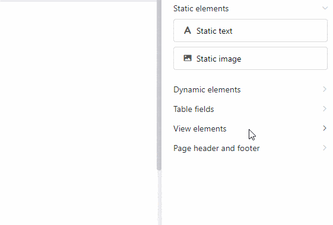

### Auswählen und Einstellen der Elemente

Ein auf der Seite eingefügtes Element wählen Sie aus, indem Sie es mit der **rechten Maustaste** anklicken. Im Panel rechts neben der Seite sehen Sie verschiedene **Einstellungsmöglichkeiten** je nach ausgewähltem Element. Mehr zu den jeweiligen Optionen erfahren Sie in den folgenden Kapiteln zu den Elementen.

### Elemente sperren, duplizieren und löschen

Sie können ein Element mit einem Klick **sperren**, **duplizieren** oder **löschen**, indem Sie die entsprechenden Optionen auswählen.

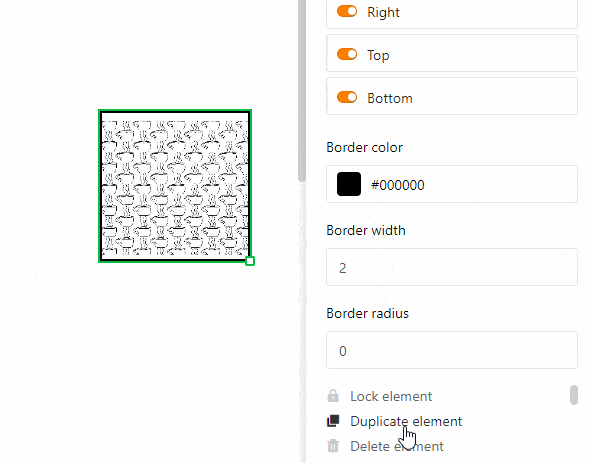

## Statischer Text

Der **statische Text** bietet Ihnen die Möglichkeit, **Textelemente** wie Überschriften oder Fließtext in eine Seite einzubinden. Das ist sehr nützlich, um **Vorlagen für Dokumente** zu erstellen, die Sie später mit Daten aus Ihrer Tabelle personalisieren können.

Im Gegensatz zu Texten, die aus Textspalten Ihrer Tabelle stammen, verändert sich ein statischer Text nicht und bleibt unabhängig von den Einträgen in der Tabelle gleich. Allerdings müssen Sie den entsprechenden **Text manuell einfügen** und **formatieren**.

### Position und Größe des Textelements verändern

Sie können durch Eingabe der **X-** und **Y-Koordinaten** die Position des Textelements auf der Seite bestimmen. Alternativ können Sie das Textelement auch einfach **per Drag-and-Drop** an die gewünschte Stelle verschieben.

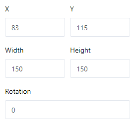 

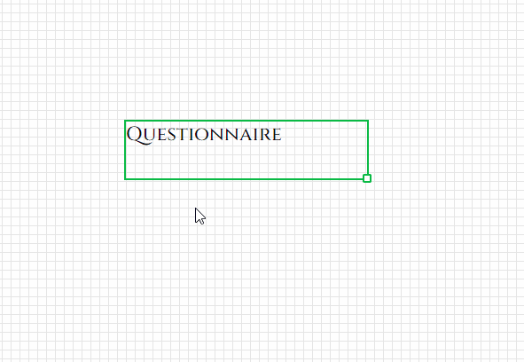

Die Felder **Breite** und **Höhe** verändern die Größe des Textrahmens. Alternativ können Sie die **Größe** auch direkt auf der Seite verändern, indem Sie mit der **rechten Maustaste** auf das Textfeld klicken und am kleinen **Quadrat** an der rechten unteren Ecke des Rahmens **ziehen**.

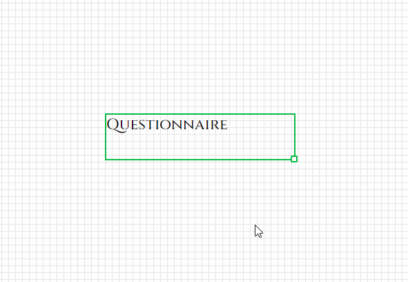

Bei der **Drehung** stellen Sie den Winkel ein, in dem Sie das Textfeld um seinen linken oberen Eckpunkt drehen können. Mit dieser Funktion haben Sie die Möglichkeit, **vertikale Schriftzüge** (bei 90 oder 270 Grad) zu erstellen.

Sobald Sie **mehrere Textelemente** verwenden, werden diese in **Ebenen** übereinandergelegt. Wenn Sie die **Reihenfolge** der Ebenen ändern möchten, können Sie dies über die Einstellungen tun. Klicken Sie auf die verschiedenen Schaltflächen, um den Text entweder **eine Ebene nach vorne/hinten** oder gleich ganz **in den Vordergrund/Hintergrund** zu verschieben.

### Texteinstellungen

Geben Sie den Text entweder in das **Textfeld** bei den Einstellungen oder in den **Textrahmen** direkt auf der Seite ein. Sie können einen Textrahmen auf der Seite jederzeit auswählen, indem Sie ihn mit der **rechten Maustaste** anklicken.

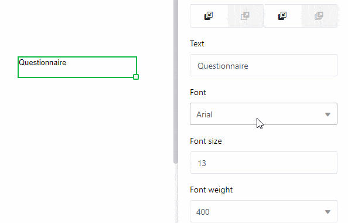

Stellen Sie die **Schriftart**, die **Schriftgröße** und die **Schriftstärke** ein.

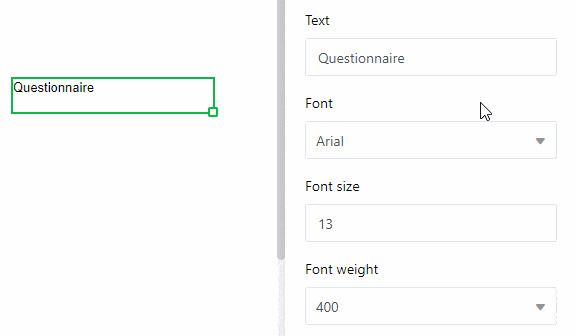

Sie können die **Zeilenhöhe** sowie die **horizontale** und **vertikale Ausrichtung** des Textes in den entsprechenden Feldern anpassen.

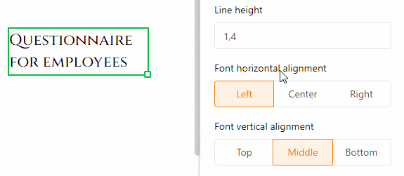

Ändern Sie die **Textfarbe**, indem Sie den Hexadezimal-Farbcode eintragen oder auf das Farbfeld klicken. Die **Hintergrundfarbe** können Sie auf die gleiche Weise anpassen, wenn Sie die Option **Ausgefüllt** auswählen.

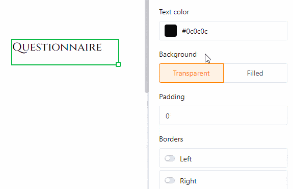

Erhöhen Sie den **Innenabstand des Textes**, um den mit Text gefüllten Bereich innerhalb des Rahmens zu verkleinern.

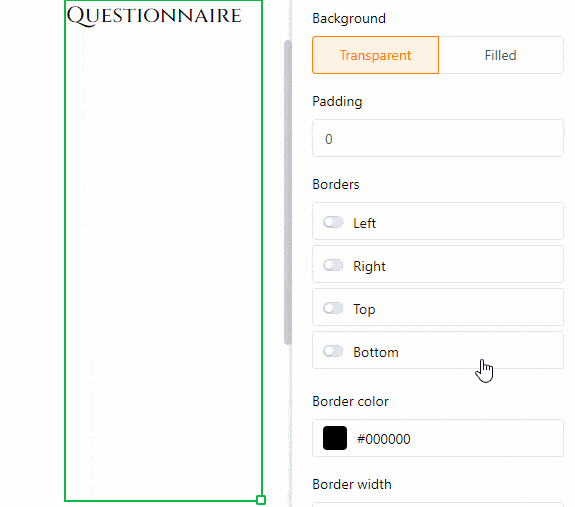

### Rahmeneinstellungen

Fügen Sie dem Text einen **vollständigen Rahmen** hinzu, indem Sie die **Regler** für alle Seiten des Rechtecks aktivieren. Sie können dem Text **einzelne Konturen** geben, wenn Sie nur die Regler für bestimmte Seiten aktivieren. Legen Sie die **Rahmenfarbe** fest, indem Sie den Hexadezimal-Farbcode eintragen oder auf das Farbfeld klicken. Um die **Rahmendicke** anzupassen, stellen Sie einfach den Zahlenwert ein.

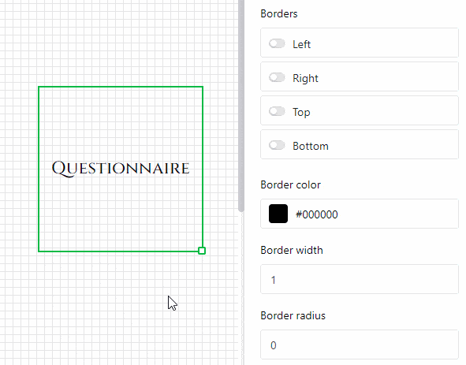

Mit dem **Rahmenradius** können Sie die **Ecken** des Rahmens so lange **abrunden**, bis ein **Kreisbogen** entsteht.

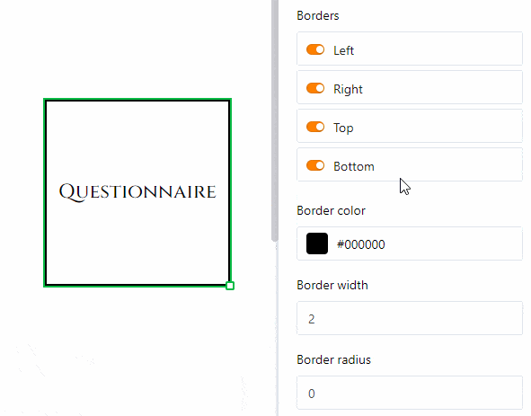

## Statisches Bild

Ein **statisches Bild** bietet Ihnen die Möglichkeit, **Bild-Dateien** wie Logos, Grafiken oder Hintergrundbilder in eine Seite einzubinden, um ein grundlegendes Seiten-Layout zu gestalten. Im Gegensatz zu Bildern, die aus [Bild-Spalten]() Ihrer Tabelle stammen, verändert sich ein statisches Bild nicht und bleibt unabhängig von den Einträgen in der Tabelle gleich. Allerdings müssen Sie die entsprechende Bild-Datei **manuell hochladen**.

### Position und Größe des Bildes verändern

Sie können durch Eingabe der **X-** und **Y-Koordinaten** die Position des Bildes auf der Seite bestimmen. Alternativ können Sie das Bild auch einfach **per Drag-and-Drop** an die gewünschte Stelle verschieben.

 

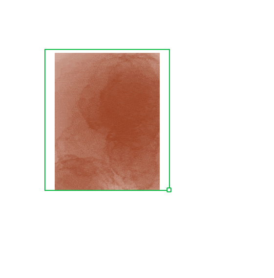

Mithilfe der Felder **Breite** und **Höhe** verändern Sie die Größe des Bildes. Bei der **Drehung** stellen Sie den Winkel ein, in dem das Bild um seinen linken oberen Eckpunkt gedreht wird. Alternativ können Sie die **Größe des Bildes** auch direkt auf der Seite verändern, indem Sie mit der **rechten Maustaste** auf das Bild klicken und am kleinen **Quadrat** an der rechten unteren Ecke des Rahmens **ziehen**.

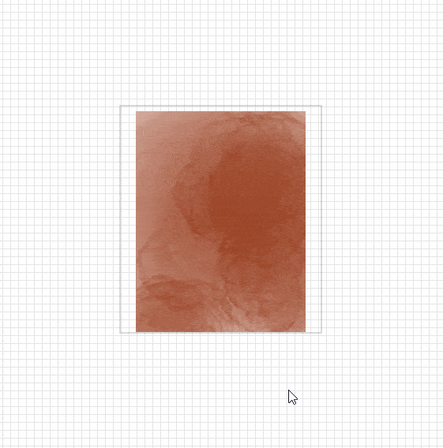

Sobald Sie **mehrere Bilder** verwenden, werden diese in **Ebenen** übereinandergelegt. Wenn Sie die **Reihenfolge** der Ebenen ändern möchten, können Sie dies über die Einstellungen tun. Klicken Sie auf die verschiedenen Schaltflächen, um das Bild entweder **eine Ebene nach vorne/hinten** oder gleich ganz **in den Vordergrund/ Hintergrund** zu verschieben.

### Bildeinstellungen

Um eine **Datei in den Bildrahmen einzufügen**, klicken Sie unter **Bild** auf das Feld mit dem **Dokument-Symbol** oder per **Doppelklick** direkt in den Bildrahmen auf der Seite. Wählen Sie im sich öffnenden Fenster eine Bild-Datei von Ihrem Gerät aus und laden Sie sie hoch.

Wählen Sie mit den **Füllmodi Anpassen**, **Ausfüllen** und **Dehnen**, wie das Bild in den Rahmen eingepasst werden soll.

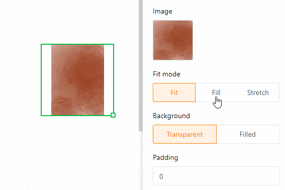

Vor allem bei der Verwendung von PNG-Dateien mit transparentem Hintergrund kann es sinnvoll sein, wenn Sie in den Einstellungen den **Hintergrund** mit einer **Farbe** füllen. Dies funktioniert aber auch bei anderen Dateiformaten. Klicken Sie auf **Ausgefüllt** und wählen Sie eine Hintergrundfarbe, indem Sie den Hexadezimal-Farbcode eintragen oder auf das Farbfeld klicken.

Erhöhen Sie den **Innenabstand des Bildes**, um das Bild innerhalb des Rahmens zu verkleinern.

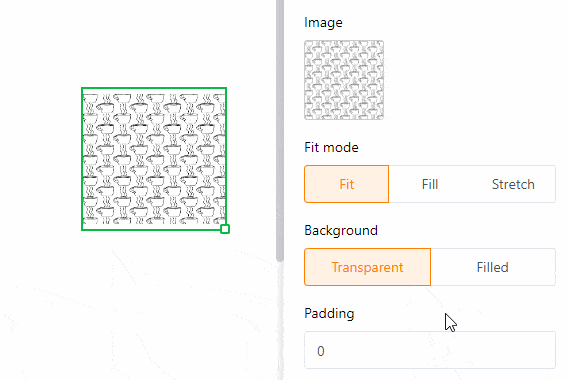

### Rahmeneinstellungen

Fügen Sie dem Bild einen **vollständigen Rahmen** hinzu, indem Sie die **Regler** für alle Seiten des Rechtecks aktivieren. Sie können dem Bild **einzelne Konturen** geben, wenn Sie nur die Regler für bestimmte Seiten aktivieren. Legen Sie die **Rahmenfarbe** fest, indem Sie den Hexadezimal-Farbcode eintragen oder auf das Farbfeld klicken. Um die **Rahmendicke** anzupassen, stellen Sie einfach den Zahlenwert ein.

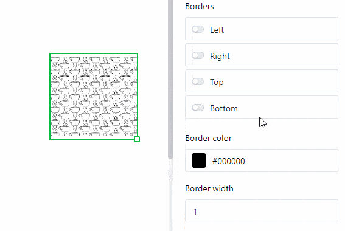

Mit dem **Rahmenradius** können Sie die **Ecken** des Bildrahmens so lange **abrunden**, bis ein **Kreisbogen** entsteht.

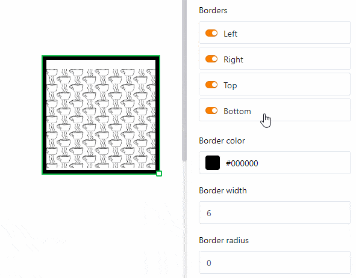

## Dynamische Elemente

Dynamische Elemente verändern sich aufgrund von bestimmten Kriterien, jedoch unabhängig von Einträgen in der Tabelle. Diese Felder sind **vorausgefüllt** und passen ihre Inhalte **automatisch** an. Es gibt drei dynamische Elemente: 

- **Aktuelles Datum**
- **Vorlagenname**
- **Aktueller Benutzer**

Die **Einstellungen**, die Sie für dynamische Elemente vornehmen können, sind die gleichen wie für statische Textelemente.

### Aktuelles Datum

Das **aktuelle Datum** passt sich automatisch an den heutigen Tag an, ohne dass Sie diesen manuell einstellen müssen. So können Sie beispielsweise personalisierte Anschreiben erstellen, ohne dass sich ein veraltetes Datum einschleichen kann.

Als einzige zusätzliche Einstellung im Vergleich zu statischen Textelementen kommt die **Formateinstellung** hinzu. Hier können Sie aus den regional verschiedenen Schreibweisen für Datumsangaben wählen.

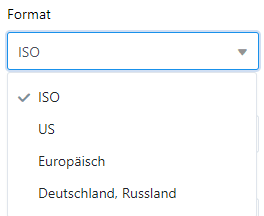

### Vorlagenname

Sie können den Namen des Seitendesigns, welches Sie gerade bearbeiten, in die Seite einbetten. Sollten Sie den **Vorlagennamen** ändern, passt sich der Text in diesem Feld automatisch an.

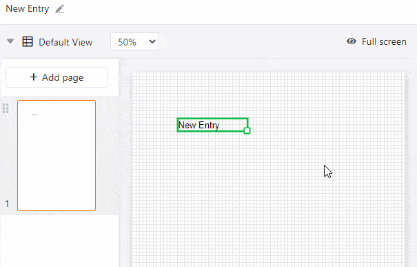

### Aktueller Benutzer

Im Feld **Aktueller Benutzer** taucht Ihr eigener Name auf, sofern Sie gerade über Ihren Account Veränderungen an der Vorlage vornehmen. Sobald ein anderes **Teammitglied** die Vorlage im Seitendesign-Plugin aufruft, wird dessen Name angezeigt.

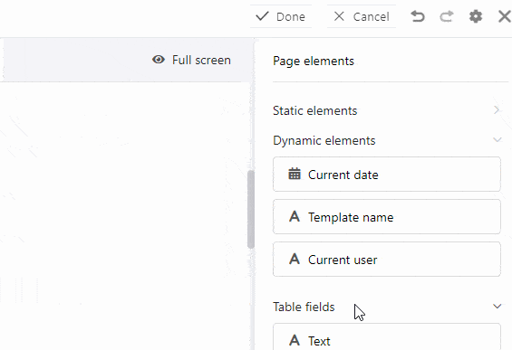

## Tabellenfelder

Als Tabellenfelder listet das Seitendesign-Plugin **alle Spalten der Tabelle** auf, aus denen Sie Daten in die Seite einbauen können. Da es an der Anzahl und am Typ der Spalten liegt, welche Tabellenfelder Sie zur Auswahl haben, verfügen Sie je nach Tabelle über unterschiedliche Möglichkeiten. Der Inhalt der Felder hängt von den Daten in der Tabelle ab und ändert sich je nach Eintrag (Datensatz in einer Zeile).

Wenn Sie über die Navigationsoptionen **Vorheriger Eintrag** und **Nächster Eintrag** zwischen den Einträgen wechseln, werden in den Tabellenfeldern automatisch Daten aus anderen Zeilen angezeigt.

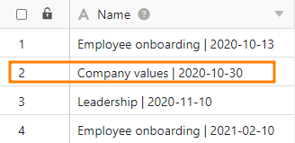

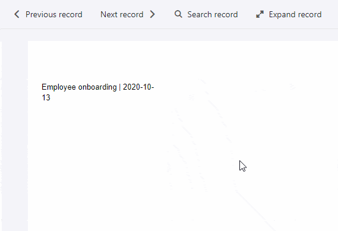

Dies macht deutlich: Mithilfe von Tabellenfeldern können Sie in Ihrer Vorlage schnell Informationen aus den jeweiligen Datensätzen darstellen und verschiedene Versionen eines Dokuments erstellen. Über die Schaltfläche **Eintrag erweitern** können Sie zudem die **Zeilendetails** öffnen, um den jeweiligen Eintrag in der Tabelle zu bearbeiten.

### Anwendungsbeispiel

Die **Spalten** der Tabelle “Budget Book” sollen im Seitendesign-Plugin als **Tabellenfelder** dargestellt werden.

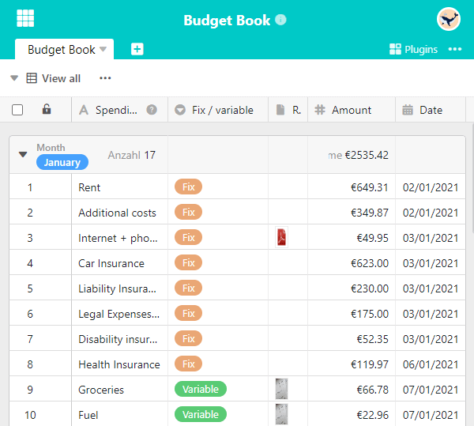

Erstellen Sie im Plugin eine **neue Seite** oder öffnen Sie ein **gespeichertes Seitendesign**. Die Spalten der Tabelle stehen Ihnen nun bei den **Seitenelementen** als Tabellenfelder zur Verfügung.

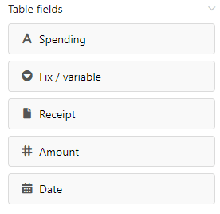

Ziehen Sie die Tabellenfelder **per Drag-and-Drop** an die gewünschten Stellen auf der Seite. Die Tabellenfelder sind **automatisch** mit den Spalten-Informationen eines Eintrags ausgefüllt.

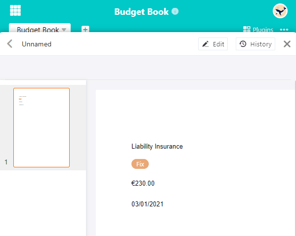

### Unterschied zwischen Seiten und Einträgen

Es ist wichtig, den Unterschied zwischen Einträgen und Seiten zu verstehen. **Seiten** beziehen sich immer auf dieselbe Zeile einer Tabelle, während **Einträge** die Datensätze aus unterschiedlichen Zeilen darstellen.

Seiten können Sie hinzufügen, um das Dokument zu erweitern und eine **mehrseitige Vorlage** zu erstellen. Klicken Sie dazu auf den Button **Seite hinzufügen**.

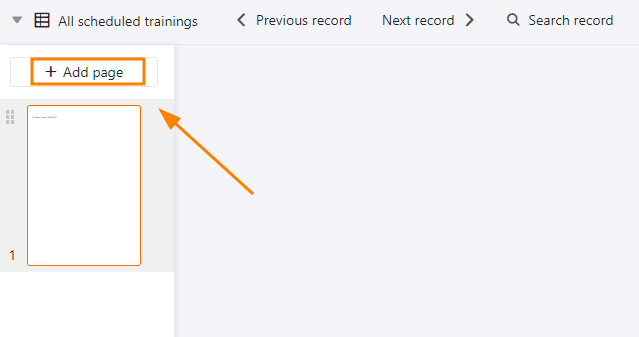

Über einen **Rechtsklick** können Sie ein Drop-down-Menü aufrufen, welches Ihnen zusätzliche Optionen für eine Seite bietet.

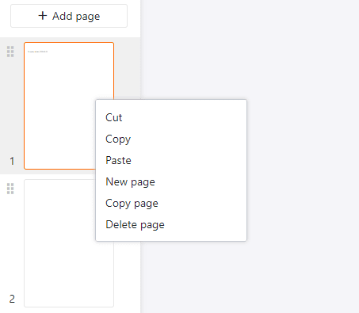

Um zwischen den Seiten zu **wechseln**, klicken Sie in der Seiten-Leiste einfach die entsprechende **Seiten-Miniatur** an. Sie können die **Reihenfolge der Seiten** ändern, indem Sie die Maustaste auf den **sechs Punkten**  gedrückt halten und die Seiten-Miniatur **verschieben**.

## Ansichtselemente

Außerdem haben Sie zwei **Ansichtselemente** zur Auswahl. Das Element **Alle Einträge der Ansicht** erlaubt es Ihnen, den gesamten Tabellenausschnitt, der in einer Ansicht definiert wurde, in die Seite einzubetten. Der **Ansichtsname** enthält nur den Namen der ausgewählten Ansicht.

## Kopf- und Fußzeile

**Kopf- und Fußzeilen** können Sie als spezielle Bereiche in eine Seite einfügen und mit mehreren Elementen füllen, wobei Sie über Inhalt und Anordnung der Elemente selbst entscheiden. Mit Kopf- und Fußzeilen haben Sie die Möglichkeit, **Seitenzahlen** einzufügen und mehrere Elemente gleichzeitig zu sperren.



### Einstellungsmöglichkeiten

Sie können nur die **Höhe** von Kopf- und Fußzeilen variieren, da sich diese immer über die **gesamte Seitenbreite** erstrecken. Im Feld **Höhe** geben Sie den gewünschten Zahlenwert ein oder verändern ihn über die **Pfeiltasten** oder scrollen mit dem **Mausrad**.

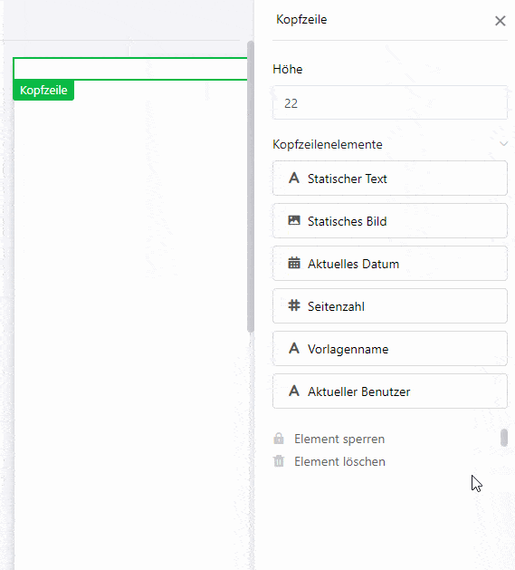

Alternativ können Sie die Höhe auch direkt auf der Seite verändern, indem Sie mit der **rechten Maustaste** auf die Kopf- oder Fußzeile klicken und am kleinen **Quadrat** an der rechten unteren Ecke des Rahmens **ziehen**.

### Elemente in Kopf- und Fußzeilen

Sie können sechs verschiedene Elemente in Kopf- und Fußzeilen einfügen.

**Statische Elemente**:
- Statischer Text
- Statisches Bild

**Dynamische Elemente**:
- Aktuelles Datum
- Seitenzahl
- Vorlagenname
- Aktueller Benutzer



### Sperren und Löschen

Sie können Kopf- und Fußzeilen **sperren** oder **löschen**, indem Sie die jeweilige Option anwählen. Wenn Sie eine Kopf- oder Fußzeile sperren, sind auch **alle Elemente** gesperrt, die Sie zuvor in diesen Bereich eingefügt haben. Das Gleiche gilt für das Löschen, wodurch Sie alle Elemente in einer Kopf- oder Fußzeile mitlöschen.

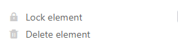
