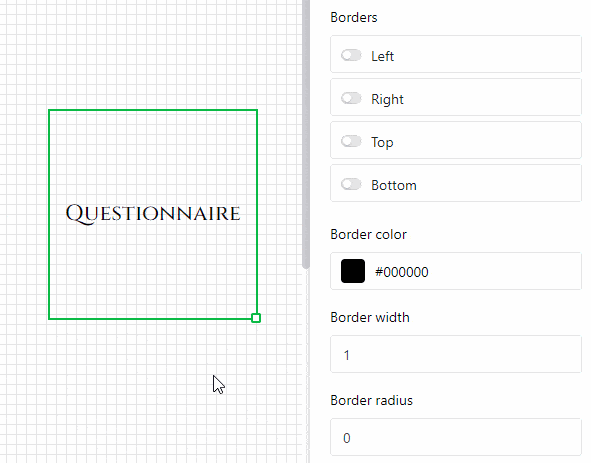

The **page design plugin** offers you a variety of options for visualizing the information in a table in the form of personalized cover letters, business cards and newsletters, among other things. With the help of **static elements** you can create page layouts that are supplemented by **dynamic elements** and **table fields**.

Read the article [Activating a plugin in a base]() to find out how to activate the page design plugin and add it to your toolbar.

## Add a new page design

1. Open the **page design plugin**.
   
2. Click on the **new page with the plus symbol**.
   
3. Select the option **Create blank page**.
   
4. Here you can make the following **settings**:
   - Select the **table** from which you want to use data.
   - Decide on a **paper size**.
   - Specify **portrait format** or **landscape format** for the page layout.
   



## Save and edit a page design

If you have created a new page design, you can save it via the  **Done** button. You can edit it again after clicking on the  **Edit** button in the same place.

Outside of edit mode, you can see the saved  **Versions** of the page design and restore them.



You can undo or redo individual editing steps by clicking on the **arrow icons**  and .

Via the button  **Full screen** button to display the page design across your entire screen. If you want to save a document as a PDF on your device, click  **PDF**, enter the **name of the export file** and confirm with **Export**.

Click on  **Print** to print the **current entry** or **all entries in the view**. As soon as you confirm with **Print**, the usual window opens in which you can make the print settings on your device.

## The page design overview

In the **page design overview**, which you can access via the **back arrow**  in the top left-hand corner, you can see all your saved designs. If you move the mouse pointer over a document there and click on the **three dots** that appear, a drop-down menu opens with the options **Rename**, **Copy**, **Export** and **Delete**.



## Page elements

The **page elements** offer you the option of designing **standardized layouts**. You can choose between the following elements:

- Static elements
- Dynamic elements
- Table fields
- View elements
- Header and footer

### Activating the elements

You activate an element by embedding the respective field **by drag-and-drop** in the page. You can then move the element on the page by clicking and dragging it with the mouse.

### Selecting and setting the elements

Select an element inserted on the page by clicking on it with the **right mouse button**. In the panel to the right of the page, you will see various **setting options** depending on the selected element. You can find out more about the respective options in the following chapters on the elements.

### Lock, duplicate and delete elements

You can **lock**, **duplicate** or **delete** an element with one click by selecting the corresponding options.

## Static text

The **static text** offers you the option of integrating **text elements** such as headings or body text into a page. This is very useful for creating **templates for documents** that you can later personalize with data from your table.

Unlike text that comes from text columns in your table, static text does not change and remains the same regardless of the entries in the table. However, you must manually **insert** and **format** the corresponding **text**.

### Change the position and size of the text element

You can determine the position of the text element on the page by entering the **X-** and **Y-coordinates**. Alternatively, you can also simply move the text element to the desired position **by drag and drop**.

The **Width** and **Height** fields change the size of the text frame. Alternatively, you can also change the **size** directly on the page by clicking on the text field with the **right mouse button** and **dragging** the small **square** at the bottom right-hand corner of the frame.

With **Rotation**, you set the angle at which you can rotate the text box around its top left-hand corner. This function allows you to create **vertical lettering** (at 90 or 270 degrees).

As soon as you use **several text elements**, these are superimposed in **layers**. If you want to change the **order** of the layers, you can do this via the settings. Click on the various buttons to move the text either **one layer to the front/back** or completely **to the foreground/background**.

### Text settings

Enter the text either in the **text field** in the settings or in the **text frame** directly on the page. You can select a text frame on the page at any time by clicking on it with the **right mouse button**.

Set the **font**, the **font size** and the **font weight**.

You can adjust the **line height** as well as the **horizontal** and **vertical alignment** of the text in the corresponding fields.

Change the **text color** by entering the hexadecimal color code or clicking on the color field. You can adjust the **Background color** in the same way if you select the **Filled** option.

Increase the **Internal spacing of the text** to reduce the area filled with text within the frame.

### Frame settings

Add a **complete frame** to the text by activating the **controllers** for all sides of the rectangle. You can give the text **individual outlines** if you only activate the sliders for certain sides. Specify the **frame color** by entering the hexadecimal color code or clicking on the color field. To adjust the **frame thickness**, simply set the numerical value.

You can use the **frame radius** to **round off** the **corners** of the frame until a **circular arc** is created.

## Static image

A **static image** offers you the option of integrating **image files** such as logos, graphics or background images into a page to create a basic page layout. In contrast to images that originate from [image columns](() of your table, a static image does not change and remains the same regardless of the entries in the table. However, you must upload the corresponding image file **manually**.

### Change the position and size of the image

You can determine the position of the image on the page by entering the **X-** and **Y-coordinates**. Alternatively, you can simply drag and drop the image to the desired position.

Use the **Width** and **Height** fields to change the size of the image. For **Rotation**, set the angle at which the image is rotated around its top left corner point. Alternatively, you can also change the **size of the image** directly on the page by clicking on the image with the **right mouse button** and **dragging** the small **square** at the bottom right-hand corner of the frame.

As soon as you use **several images**, these are superimposed in **layers**. If you want to change the **order** of the layers, you can do this via the settings. Click on the various buttons to move the image either **one layer to the front/back** or completely **to the foreground/background**.

### Image settings

To insert a **file into the image frame**, click on the field with the **document symbol** under **image** or **double-click** directly in the image frame on the page. In the window that opens, select an image file from your device and upload it.

Use the **Customize**, **Fill** and **Stretch** fill modes to select how the image should be fitted into the frame.

Especially when using PNG files with a transparent background, it can be useful if you fill the **background** with a **color** in the settings. However, this also works for other file formats. Click on **Filled** and select a background color by entering the hexadecimal color code or clicking on the color field.

Increase the **internal spacing of the image** to reduce the size of the image within the frame.

### Frame settings

Add a **full frame** to the image by activating the **controllers** for all sides of the rectangle. You can give the image **individual contours** if you only activate the sliders for certain sides. Specify the **frame color** by entering the hexadecimal color code or clicking on the color field. To adjust the **frame thickness**, simply set the numerical value.

You can use the **frame radius** to **round off** the **corners** of the image frame until a **circular arc** is created.

## Dynamic elements

Dynamic elements change based on certain criteria, but independently of entries in the table. These fields are **pre-filled** and adjust their contents **automatically**. There are three dynamic elements:

- **Current date**
- **Template name**
- **Current user**

The **settings** that you can make for dynamic elements are the same as for static text elements.

### Current date

The **current date** automatically adjusts to the current date without you having to set it manually. This allows you to create personalized cover letters, for example, without an outdated date creeping in.

The only additional setting compared to static text elements is the **Format setting**. Here you can choose from the different regional spellings for dates.

### Template name

You can embed the name of the page design you are currently editing in the page. If you change the **template name**, the text in this field will automatically adapt.

### Current user

Your own name appears in the **Current user** field if you are currently making changes to the template via your account. As soon as another **team member** calls up the template in the page design plugin, their name is displayed.

## Table fields

As table fields, the page design plugin lists **all columns of the table** from which you can insert data into the page. As it depends on the number and type of columns which table fields you have to choose from, you have different options depending on the table. The content of the fields depends on the data in the table and changes depending on the entry (data record in a row).

If you switch between the entries using the **Previous entry** and **Next entry** navigation options, data from other rows is automatically displayed in the table fields.

This makes it clear: with the help of table fields, you can quickly display information from the respective data records in your template and create different versions of a document. You can also use the **Expand record** button to open the **Row details** to edit the respective entry in the table.

### Application example

The **columns** of the "Budget Book" table are to be displayed as **table fields** in the page design plugin.

Create a **new page** in the plugin or open a **saved page design**. The columns of the table are now available as table fields in the **page elements**.

**Drag and drop** the table fields to the desired positions on the page. The table fields are **automatically** filled with the column information of an entry.

### Difference between pages and entries

It is important to understand the difference between entries and pages. **Pages** always refer to the same row in a table, while **entries** represent the data records from different rows.

You can add pages to expand the document and create a **multi-page template**. To do this, click on the **Add page** button.

By **right-clicking** you can call up a drop-down menu which offers you additional options for a page.

To **switch** between the pages, simply click on the corresponding **page thumbnail** in the page bar. You can change the **order of the pages** by holding down the mouse button on the **six dots**  and **moving** the page thumbnail.

## View elements

You also have two **view elements** to choose from. The **All view items** element allows you to embed the entire table section defined in a view into the page. The **View name** only contains the name of the selected view.

## Header and footer

**You can insert headers and footers** as special areas on a page and fill them with several elements, whereby you decide on the content and arrangement of the elements yourself. With headers and footers, you have the option of inserting **page numbers** and blocking several elements at the same time.



### Setting options

You can only vary the **height** of headers and footers, as these always extend over the **total page width**. In the **Height** field, enter the desired numerical value or change it using the **arrow keys** or scroll with the **mouse wheel**.

Alternatively, you can also change the height directly on the page by clicking on the header or footer with the **right mouse button** and **dragging** the small **square** at the bottom right-hand corner of the frame.

### Elements in headers and footers

You can insert six different elements in headers and footers.

**Static elements**:
- Static text
- Static image

**Dynamic elements**:
- Current date
- Page number
- Template name
- Current user



### Lock and delete

You can **lock** or **delete** headers and footers by selecting the respective option. If you lock a header or footer, **all elements** that you have previously inserted in this area are also locked. The same applies to deleting, whereby you also delete all elements in a header or footer.

