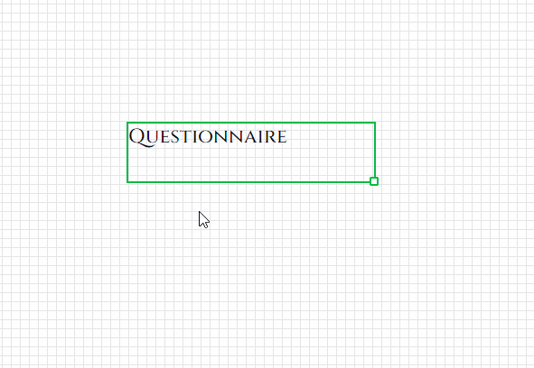
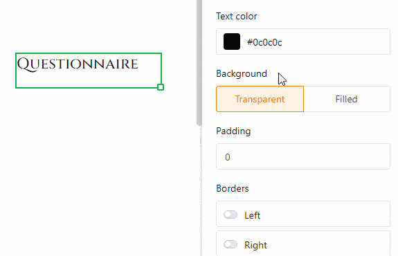
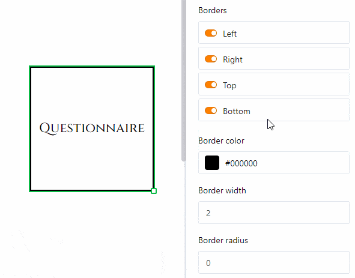
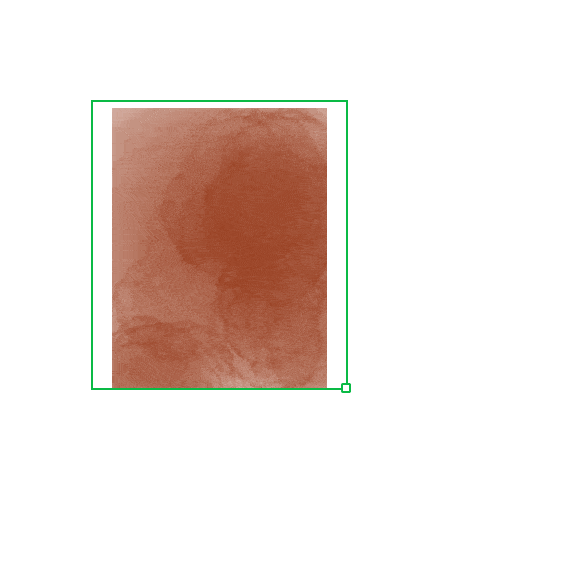

El **plugin de diseño de páginas** le ofrece una gran variedad de posibilidades para visualizar la información de una tabla en forma de cartas personalizadas, tarjetas de visita y circulares. Mediante **elementos estáticos** puede crear diseños de página que se complementan con **elementos dinámicos** y **campos de tabla**.

Lea el artículo [Activar un plugin en una base]() para saber cómo activar el plugin de diseño de páginas y añadirlo a su barra de herramientas.

## Añadir un nuevo diseño de página

1. Abra el **plugin de diseño de páginas**.
   
2. Haga clic en la **nueva página con el símbolo de más**.
   
3. Seleccione la opción **Crear página en blanco**.
   
4. Aquí puede realizar los siguientes **ajustes**:
   * Elija la **tabla** de la que desea utilizar los datos.
   * Seleccione un **tamaño de papel**.
   * Establezca la **orientación vertical u horizontal** para el diseño de la página.
    



## Guardar y editar un diseño de página

Una vez creado un nuevo diseño de página, puede guardarlo mediante el botón  **Hecho**. Puede volver a editarlo haciendo clic en el mismo lugar en el botón  **Editar**.

Fuera del modo de edición puede ver y restaurar las  **versiones** guardadas del diseño de página.



Con un clic en los **símbolos de flecha**  y  puede deshacer o rehacer pasos de edición individuales.

Mediante el botón  **Pantalla completa** puede ver el diseño de página en toda la pantalla. Si desea guardar un documento como PDF en su dispositivo, haga clic en  **PDF**, introduzca el **nombre del archivo de exportación** y confirme con **Exportar**.

Haga clic en  **Imprimir** para imprimir la **entrada actual** o **todas las entradas de la vista**. Una vez que confirme con **Imprimir**, se abrirá la ventana habitual donde podrá configurar los ajustes de impresión en su dispositivo.

## Vista general del diseño de páginas

En la **vista general del diseño de páginas**, a la que se accede mediante la **flecha de retroceso**  en la esquina superior izquierda, puede ver todos sus diseños guardados. Si pasa el cursor sobre un documento y hace clic en los **tres puntos** que aparecen, se abre un menú desplegable con las opciones **Renombrar**, **Copiar**, **Exportar** y **Eliminar**.



## Elementos de página

Los **elementos de página** le permiten crear **diseños estandarizados**. Tiene la opción de elegir entre los siguientes elementos:

* Elementos estáticos
* Elementos dinámicos
* Campos de tabla
* Elementos de vista
* Encabezado y pie de página

### Activar elementos

Puede activar un elemento **arrastrando y soltando** el campo correspondiente en la página. Después, puede moverlo por la página haciendo clic y arrastrándolo con el ratón.

### Seleccionar y configurar elementos

Para seleccionar un elemento insertado en la página, haga clic con el **botón derecho del ratón** sobre él. En el panel derecho de la página verá varias **opciones de configuración** según el elemento seleccionado. Más detalles sobre las opciones se explican en los siguientes capítulos.

### Bloquear, duplicar y eliminar elementos

Puede **bloquear**, **duplicar** o **eliminar** un elemento haciendo clic en las opciones correspondientes.

## Texto estático

El **texto estático** le permite insertar **elementos de texto** como títulos o párrafos en una página. Esto es muy útil para crear **plantillas de documentos** que luego personalizará con datos de su tabla.

A diferencia de los textos provenientes de columnas de texto de su tabla, el texto estático no cambia y permanece igual independientemente de las entradas de la tabla. No obstante, debe **insertar y formatear** el texto manualmente.

### Cambiar posición y tamaño del elemento de texto

Puede definir la posición del elemento de texto introduciendo las **coordenadas X** e **Y**. Alternativamente, puede moverlo a la ubicación deseada mediante **arrastrar y soltar**.

Los campos de **ancho** y **alto** ajustan el tamaño del marco de texto. También puede cambiar el tamaño directamente en la página haciendo clic con el **botón derecho del ratón** en el campo de texto y arrastrando el pequeño **cuadro** en la esquina inferior derecha del marco.

La opción de **rotación** permite definir el ángulo en el que girar el texto desde su esquina superior izquierda. Esto le permite crear **textos verticales** (a 90 o 270 grados).

Cuando utilice **varios elementos de texto**, estos se superponen en **capas**. Puede cambiar el **orden de las capas** en los ajustes. Haga clic en los botones correspondientes para mover el texto **una capa adelante/atrás** o completamente **al frente/fondo**.

### Configuración del texto

Introduzca el texto en el **campo de texto** en los ajustes o directamente en el **marco de texto** en la página. Puede seleccionar un marco de texto en cualquier momento haciendo clic con el **botón derecho del ratón** sobre él.

Configure el **tipo de letra**, el **tamaño** y el **grosor** del texto.

Puede ajustar la **altura de línea**, así como la **alineación horizontal y vertical** del texto en los campos correspondientes.

Cambie el **color del texto** introduciendo el código de color hexadecimal o haciendo clic en el campo de color. Puede ajustar el **color de fondo** de la misma manera si selecciona la opción **Relleno**.

Aumente el **espaciado interior del texto** para reducir el área ocupada por el texto dentro del marco.

### Configuración del marco

Añada un **marco completo** al texto activando los **controles** para todos los lados del rectángulo. También puede añadir **contornos individuales** activando solo los controles de ciertos lados. Establezca el **color del marco** introduciendo un código de color hexadecimal o haciendo clic en el campo de color. Para ajustar el **grosor del marco**, simplemente introduzca el valor numérico.

Con el **radio del marco** puede **redondear las esquinas** del mismo hasta formar un **arco**.

## Imagen estática

Una **imagen estática** le permite insertar **archivos de imagen** como logotipos, gráficos o imágenes de fondo en una página para diseñar la disposición básica de la misma. A diferencia de las imágenes que provienen de [columnas de imagen]() de su tabla, una imagen estática no cambia y permanece igual independientemente de las entradas de la tabla. No obstante, debe **cargar el archivo de imagen manualmente**.

### Cambiar posición y tamaño de la imagen

Puede definir la posición de la imagen introduciendo las **coordenadas X** e **Y**. Alternativamente, puede mover la imagen a la ubicación deseada mediante **arrastrar y soltar**.

Con los campos de **ancho** y **alto** puede cambiar el tamaño de la imagen. La opción de **rotación** le permite definir el ángulo de rotación de la imagen desde su esquina superior izquierda. También puede cambiar el **tamaño de la imagen** directamente en la página haciendo clic con el **botón derecho del ratón** en la imagen y arrastrando el pequeño **cuadro** en la esquina inferior derecha del marco.

Cuando utilice **varias imágenes**, estas se disponen en **capas** superpuestas. Puede cambiar el **orden de las capas** en los ajustes. Haga clic en los botones correspondientes para mover la imagen **una capa adelante/atrás** o completamente **al frente/fondo**.

### Configuración de la imagen

Para **insertar un archivo en el marco de imagen**, haga clic en el campo bajo **Imagen** con el **símbolo de documento** o haga **doble clic** directamente en el marco de imagen en la página. En la ventana que se abre, seleccione un archivo de imagen desde su dispositivo y súbalo.

Elija entre los **modos de ajuste: Ajustar**, **Rellenar** y **Estirar**, cómo desea que la imagen se adapte al marco.

Especialmente al utilizar archivos PNG con fondo transparente, puede resultar útil **rellenar el fondo** con un **color** en los ajustes. Esto también funciona con otros formatos de archivo. Haga clic en **Relleno** y seleccione un color de fondo introduciendo un código hexadecimal o haciendo clic en el campo de color.

Aumente el **espaciado interior de la imagen** para reducir el área ocupada por la imagen dentro del marco.

### Configuración del marco

Agregue un **marco completo** a la imagen activando los **controles** para todos los lados del rectángulo. También puede agregar **contornos individuales** activando solo los controles de ciertos lados. Establezca el **color del marco** introduciendo un código de color hexadecimal o haciendo clic en el campo de color. Para ajustar el **grosor del marco**, simplemente introduzca el valor numérico.

Con el **radio del marco** puede **redondear las esquinas** del marco de la imagen hasta formar un **arco**.

## Elementos dinámicos

Los elementos dinámicos cambian según ciertos criterios, pero independientemente de las entradas en la tabla. Estos campos están **prellenados** y actualizan su contenido **automáticamente**. Hay tres elementos dinámicos:

* **Fecha actual**
* **Nombre de la plantilla**
* **Usuario actual**

La **configuración** de los elementos dinámicos es la misma que para los elementos de texto estático.

### Fecha actual

La **fecha actual** se actualiza automáticamente al día en curso, sin necesidad de ajustarla manualmente. Esto permite crear, por ejemplo, cartas personalizadas sin que aparezca una fecha obsoleta.

Como única opción adicional en comparación con los elementos de texto estático, puede elegir el **formato de fecha**. Aquí podrá seleccionar entre distintos formatos regionales para la visualización de fechas.

### Nombre de la plantilla

Puede insertar en la página el nombre del diseño de página que está editando. Si cambia el **nombre de la plantilla**, el texto en este campo se actualiza automáticamente.

### Usuario actual

En el campo **Usuario actual** aparece su propio nombre si está haciendo cambios en la plantilla desde su cuenta. Si otro **miembro del equipo** abre la plantilla en el plugin de diseño de páginas, aparecerá su nombre.

## Campos de tabla

El plugin de diseño de páginas enumera como campos de tabla **todas las columnas de la tabla** desde las cuales puede insertar datos en la página. Según la cantidad y tipo de columnas, tendrá distintas opciones disponibles. El contenido de los campos depende de los datos de la tabla y cambia según la entrada (registro en una fila).

Al utilizar las opciones de navegación **Entrada anterior** y **Siguiente entrada**, se mostrarán automáticamente los datos de otras filas en los campos de tabla.

Esto demuestra que los campos de tabla permiten mostrar rápidamente información de registros individuales y generar diferentes versiones de un documento. Con el botón **Expandir entrada** también puede abrir los **detalles de fila** para editar la entrada correspondiente en la tabla.

### Ejemplo de aplicación

Las **columnas** de la tabla “Budget Book” deben mostrarse en el plugin como **campos de tabla**.

Cree una **nueva página** o abra un **diseño de página guardado** en el plugin. Las columnas de la tabla estarán ahora disponibles en los **elementos de página** como campos de tabla.

Arrastre los campos de tabla **mediante arrastrar y soltar** a los lugares deseados de la página. Los campos de tabla se llenan **automáticamente** con la información de las columnas de una entrada.

### Diferencia entre páginas y entradas

Es importante entender la diferencia entre entradas y páginas. Las **páginas** siempre hacen referencia a la misma fila de una tabla, mientras que las **entradas** son los registros de distintas filas.

Puede añadir páginas para ampliar el documento y crear una **plantilla de varias páginas**. Para ello, haga clic en el botón **Añadir página**.

Con un **clic derecho** puede abrir un menú desplegable con opciones adicionales para la página.

Para **cambiar entre páginas**, simplemente haga clic en la **miniatura** correspondiente en la barra lateral. Puede cambiar el **orden de las páginas** manteniendo presionado el **icono de seis puntos**  y arrastrando la miniatura a otra posición.

## Elementos de vista

También puede elegir entre dos **elementos de vista**. El elemento **Todas las entradas de vista** permite incrustar en la página toda la sección de tabla definida en una vista. El elemento **Nombre de vista** sólo contiene el nombre de la vista seleccionada.

## Encabezado y pie de página

**Puede insertar encabezados y pies de página** como áreas especiales en una página y rellenarlas con varios elementos, decidiendo usted mismo el contenido y la disposición de los elementos. Con los encabezados y pies de página, tiene la opción de insertar **números de página** y bloquear varios elementos al mismo tiempo.



### Opciones de configuración

Sólo puede variar la **altura** de los encabezados y pies de página, ya que éstos siempre se extienden sobre el **ancho total de la página**. En el campo **Altura**, introduzca el valor numérico deseado o modifíquelo con las **flechas** o la **rueda del ratón**.

También puede cambiar la altura directamente en la página haciendo clic en la cabecera o en el pie de página con el **botón derecho del ratón** y **arrastrando** el pequeño **cuadrado** de la esquina inferior derecha del marco.

### Elementos de cabecera y pie de página

Puedes insertar seis elementos diferentes en los encabezados y pies de página.

**Elementos estáticos**:
- Texto estático
- Imagen estática

**Elementos dinámicos**:
- Fecha actual
- Número de página
- Nombre de la plantilla
- Usuario actual



### Bloquear y borrar

Puede **bloquear** o **borrar** cabeceras y pies de página seleccionando la opción correspondiente. Si bloquea una cabecera o un pie de página, también se bloquearán **todos los elementos** que haya insertado previamente en esa zona. Lo mismo ocurre al borrar, ya que también se borran todos los elementos de una cabecera o pie de página.

