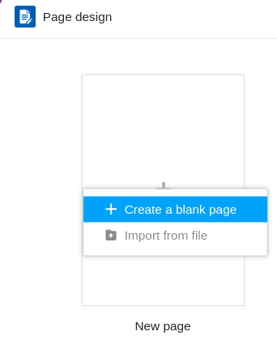
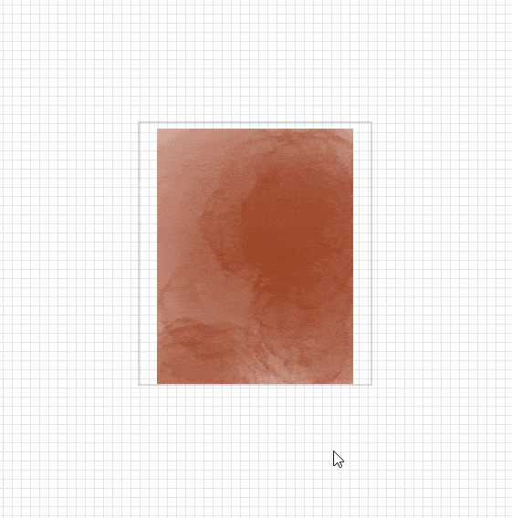
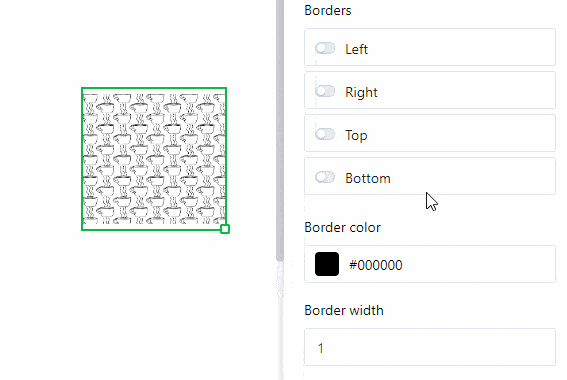
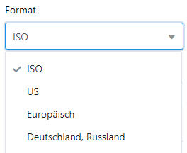
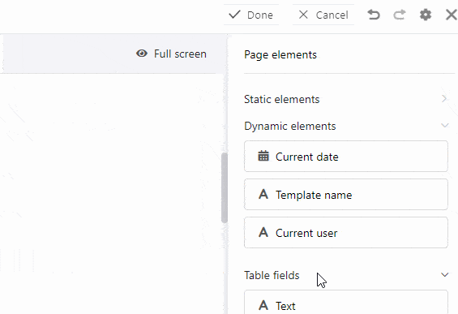
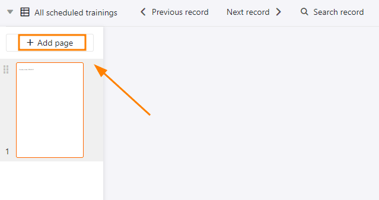

Le **plug-in de conception de pages** vous offre une multitude de possibilités pour visualiser les informations d'un tableau, entre autres sous la forme de lettres d'accompagnement personnalisées, de cartes de visite et de lettres circulaires. Vous pouvez créer des mises en page à l'aide d'**éléments statiques**, complétés par des **éléments dynamiques** et **des champs de tableau**.

Consultez l'article [Activer un plugin dans une base]() pour savoir comment activer le plugin de conception de page et l'ajouter à votre barre d'outils.

## Ajouter une nouvelle page

1. Ouvrez le **plugin de conception de page**.

2. Cliquez sur la **nouvelle page avec l'icône "plus"**.

3. Sélectionnez l'option **Créer une page vierge**.

4. Vous pouvez y trouver les **réglages**:
    - Sélectionnez le **tableau** à partir duquel vous souhaitez utiliser les données.
    - Décidez de la **taille du papier**.
    - Définissez le **format portrait** ou **paysage** pour la mise en page.



## Enregistrer et modifier un design de page

Lorsque vous avez créé une nouvelle page, vous pouvez l'**enregistrer** en cliquant sur le bouton  **Terminé**. Vous pouvez à nouveau la modifier après avoir cliqué au même endroit sur le bouton  **Modifier**.

En dehors du mode édition, vous pouvez consulter et restaurer les  **versions** enregistrées de votre design.



En cliquant sur les **icônes fléchées**  et , vous pouvez annuler ou rétablir des étapes de traitement individuelles.

En cliquant sur le bouton  **Plein écran**, vous pouvez afficher le design de la page sur tout votre écran. Si vous souhaitez enregistrer un document au format PDF sur votre appareil, cliquez sur  **PDF**, saisissez le **nom du fichier d'exportation** et confirmez en cliquant sur **Exporter**.

Cliquez sur  **Imprimer** pour imprimer l'**entrée actuelle** ou **toutes les entrées de la vue**. Dès que vous confirmez en cliquant sur **Imprimer**, la fenêtre habituelle s'ouvre et vous permet de définir les paramètres d'impression sur votre appareil.

## L'aperçu du design des pages

Dans l'**aperçu du design des pages**, auquel vous accédez en cliquant sur la **flèche de retour**  dans le coin supérieur gauche, vous voyez tous vos modèles enregistrés. Si vous y placez le curseur de la souris sur un document et cliquez sur les **trois points** qui apparaissent, un menu déroulant s'ouvre avec les options **Renommer**, **Copier**, **Exporter** et **Supprimer**.



## Éléments de page

Les **éléments de page** vous offrent la possibilité de concevoir **des mises en page standardisées**. Vous avez le choix entre les éléments suivants :

- Éléments statiques
- Éléments dynamiques
- Champs du tableau
- Eléments de vue
- En-tête et pied de page

### Activer les éléments

Vous activez un élément en intégrant le champ correspondant dans la page **par glisser-déposer**. Ensuite, vous pouvez également déplacer l'élément sur la page en cliquant dessus avec la souris et en le faisant glisser.

### Sélectionner et régler les éléments

Vous pouvez sélectionner un élément inséré sur la page en cliquant dessus avec **le bouton droit de la souris**. Dans le tableau de bord à droite de la page, vous voyez différentes **possibilités de réglage** en fonction de l'élément sélectionné. Vous trouverez plus d'informations sur les options respectives dans les chapitres suivants.

### Verrouiller, dupliquer et supprimer des éléments

Vous pouvez **verrouiller**, **dupliquer** ou **supprimer** un élément en un seul clic, en sélectionnant les options correspondantes.

## Texte statique

Le **texte statique** vous offre la possibilité d'intégrer des **éléments de texte** comme des titres ou du texte courant dans une page. C'est très utile pour créer des **modèles de documents** que vous pourrez ensuite personnaliser avec des données de votre tableau.

Contrairement aux textes issus des colonnes de texte de votre tableau, un texte statique ne change pas et reste le même quelles que soient les entrées du tableau. Vous devez toutefois **insérer** et **formater manuellement** le texte correspondant.

### Modifier la position et la taille de l'élément de texte

Vous pouvez déterminer la position de l'élément de texte sur la page en entrant les **coordonnées X** et **Y**. Vous pouvez aussi simplement déplacer l'élément de texte **par glisser-déposer** à l'endroit souhaité.

 

Les champs **largeur** et **hauteur** modifient la taille du cadre de texte. Vous pouvez également modifier la **taille** directement sur la page en cliquant avec le **bouton droit de la souris** sur le champ de texte et en **tirant** sur le petit **carré** situé dans le coin inférieur droit du cadre.

Pour la **rotation**, vous réglez l'angle selon lequel vous pouvez faire pivoter le champ de texte autour de son coin supérieur gauche. Avec cette fonction, vous avez la possibilité de créer des **titres verticaux** (à 90 ou 270 degrés).

Dès que vous utilisez **plusieurs éléments de texte**, ceux-ci sont superposés en **plans**. Si vous souhaitez modifier l'**ordre** des calques, vous pouvez le faire via les paramètres. Cliquez sur les différents boutons pour déplacer le texte soit **d'un niveau vers l'avant/l'arrière** ou carrément **au premier plan/à l'arrière-plan**.

### Paramètres de texte

Saisissez le texte soit dans le **champ de texte** dans les paramètres, soit dans le **cadre de texte** directement sur la page. Vous pouvez sélectionner un cadre de texte sur la page à tout moment en cliquant dessus avec le **bouton droit de la souris**.

Réglez la **police**, la **taille de la police** et la **épaisseur de la police**.

Vous pouvez adapter la **hauteur des lignes** ainsi que les **alignements horizontaux** et **verticaux** du texte dans les champs correspondants.

Modifiez la **couleur du texte** en saisissant le code couleur hexadécimal ou en cliquant sur le champ de couleur. Vous pouvez adapter la **couleur d'arrière-plan** de la même manière en sélectionnant l'option **Remplissage**.

Augmentez la **distance intérieure du texte** pour réduire la zone remplie de texte à l'intérieur du cadre.

### Paramètres du cadre

Ajoutez un **cadre complet** au texte en activant les **règles** pour tous les côtés du rectangle. Vous pouvez donner au texte des **contours individuels** en n'activant les curseurs que pour certains côtés. Définissez la **couleur du cadre** en saisissant le code couleur hexadécimal ou en cliquant sur le champ de couleur. Pour ajuster l'**épaisseur du cadre**, il suffit de régler la valeur numérique.

Le **rayon du cadre** permet de **arrondir** les **coins** du cadre jusqu'à obtenir un **arc de cercle**.

## Image statique

Une **image statique** vous offre la possibilité d'intégrer des **fichiers d'image** tels que des logos, des graphiques ou des images d'arrière-plan dans une page afin de concevoir une mise en page de base. Contrairement aux images provenant de [colonnes d'images]() de votre tableau, une image statique ne change pas et reste la même indépendamment des entrées du tableau. Vous devez cependant télécharger **manuellement** le fichier image correspondant.

### Modifier la position et la taille de l'image

Vous pouvez déterminer la position de l'image sur la page en entrant les **coordonnées X** et **Y**. Vous pouvez aussi simplement déplacer l'image **par glisser-déposer** à l'endroit souhaité.

 

Les champs **Largeur** et **Hauteur** permettent de modifier la taille de l'image. Pour la **rotation**, vous définissez l'angle de rotation de l'image autour de son coin supérieur gauche. Vous pouvez également modifier la **taille de l'image** directement sur la page en cliquant avec le **bouton droit de la souris** sur l'image et en **tirant** sur le petit **carré** situé dans le coin inférieur droit du cadre.

Dès que vous utilisez **plusieurs images**, celles-ci sont superposées en **calques**. Si vous souhaitez modifier l'ordre des calques, vous pouvez le faire via les paramètres. Cliquez sur les différents boutons pour déplacer l'image soit **d'un niveau vers l'avant/l'arrière**, soit complètement **au premier plan/à l'arrière-plan**.

### Réglages de l'image

Pour insérer un **fichier dans le cadre d'image**, cliquez sous **Image** sur le champ avec le symbole **Document** ou par **double clic** directement dans le cadre d'image sur la page. Dans la fenêtre qui s'ouvre, sélectionnez un fichier image de votre appareil et téléchargez-le.

Choisissez avec les **modes de remplissage Adapter**, **Remplir** et **Etirer** comment l'image doit être ajustée dans le cadre.

Surtout lors de l'utilisation de fichiers PNG avec un arrière-plan transparent, il peut être utile de remplir le **arrière-plan** avec une **couleur** dans les paramètres. Mais cela fonctionne également pour d'autres formats de fichiers. Cliquez sur **Rempli** et choisissez une couleur d'arrière-plan en saisissant le code couleur hexadécimal ou en cliquant sur le champ de couleur.

Augmentez la **distance intérieure de l'image** pour réduire l'image à l'intérieur du cadre.

### Paramètres du cadre

Ajoutez un **cadre complet** à l'image en activant les **règles** pour tous les côtés du rectangle. Vous pouvez donner à l'image des **contours individuels** en n'activant les curseurs que pour certains côtés. Définissez la **couleur du cadre** en saisissant le code couleur hexadécimal ou en cliquant sur le champ de couleur. Pour ajuster l'**épaisseur du cadre**, il suffit de régler la valeur numérique.

Le **rayon du cadre** permet de **arrondir** les **coins** du cadre de l'image jusqu'à obtenir un **arc de cercle**.

## Éléments dynamiques

Les éléments dynamiques changent en fonction de certains critères, mais indépendamment des entrées dans le tableau. Ces champs sont **préremplis** et adaptent **automatiquement** leur contenu. Il existe trois éléments dynamiques : 

- **Date actuelle**
- **Nom de la page**
- **Utilisateur actuel**

Les **réglages** que vous pouvez effectuer pour les éléments dynamiques sont les mêmes que pour les éléments de texte statiques.

### Date actuelle

La **date actuelle** s'adapte automatiquement au jour actuel, sans que vous deviez la régler manuellement. Cela vous permet par exemple de créer des lettres de motivation personnalisées sans qu'une date obsolète ne s'y glisse.

Le seul paramètre supplémentaire par rapport aux éléments de texte statiques est le **réglage du format**. Ici, vous pouvez choisir parmi les différentes orthographes régionales pour les dates.

### Nom de la page

Vous pouvez intégrer le nom de la page que vous êtes en train de modifier dans la page. Si vous modifiez le nom du **document**, le texte dans ce champ s'adapte automatiquement.

### Utilisateur actuel

Dans le champ **Utilisateur actuel**, votre propre nom apparaît si vous êtes en train d'effectuer des modifications sur le modèle via votre compte. Dès qu'un autre **membre de l'équipe** appelle le modèle dans le plugin de conception de page, son nom est affiché.

## Champs du tableau

Le plug-in de conception de pages liste comme champs de tableau **toutes les colonnes du tableau** à partir desquelles vous pouvez intégrer des données dans la page. Comme le nombre et le type de colonnes déterminent les champs de tableau que vous pouvez sélectionner, vous disposez de différentes possibilités selon le tableau. Le contenu des champs dépend des données dans le tableau et change en fonction de l'entrée (enregistrement dans une ligne).

Si vous passez d'un enregistrement à l'autre à l'aide des options de navigation **Enregistrement précédent** et **Enregistrement suivant**, les champs du tableau affichent automatiquement les données d'autres lignes.

Cela montre clairement que les champs de tableau vous permettent d'afficher rapidement dans votre page des informations provenant des enregistrements correspondants et de créer différentes versions d'un document. Le bouton **Développer l'entrée** vous permet également d'ouvrir les **Détails de la ligne** afin de modifier l'entrée correspondante dans le tableau.

### Exemple d'application

Les **colonnes** du tableau "Budget Book" doivent être représentées dans le plugin de conception de pages sous forme de **champs de tableau**.

Créez une **nouvelle page** dans le plugin ou ouvrez un **design de page** enregistré. Les colonnes du tableau sont maintenant à votre disposition dans les **éléments de page** en tant que champs de tableau.

Faites glisser les champs du tableau **par glisser-déposer** à l'endroit souhaité sur la page. Les champs de tableau sont **automatiquement** remplis avec les informations de colonne d'une entrée.

### Différence entre les pages et les entrées

Il est important de comprendre la différence entre les entrées et les pages. Les **pages** se réfèrent toujours à la même ligne d'un tableau, tandis que les **entrées** représentent les enregistrements de différentes lignes.

Vous pouvez ajouter des pages pour développer le document et créer un modèle **multi-pages**. Pour ce faire, cliquez sur le bouton **Ajouter une page**.

Un **clic droit** vous permet d'accéder à un menu déroulant qui vous offre des options supplémentaires pour une page.

Pour **changer de page**, il suffit de cliquer sur la **miniature de page** correspondante dans la barre des pages. Vous pouvez modifier l'**ordre des pages** en maintenant le bouton de la souris enfoncé sur les **six points**  et en **déplaçant** la miniature de la page.

## Eléments de vue

Vous avez également le choix entre deux **éléments de vue**. L'élément **Toutes les entrées de la vue** vous permet d'intégrer dans la page toute la section de tableau définie sous la vue. Le **nom de la vue** contient uniquement le nom de la vue sélectionnée.

## En-tête et pied de page

Vous pouvez insérer des **en-têtes et des pieds de page** comme zones spéciales dans une page et les remplir **avec plusieurs éléments**, en décidant vous-même du contenu et de la disposition des éléments. Avec les en-têtes et les pieds de page, vous avez la possibilité d'insérer **des numéros de page** et de verrouiller plusieurs éléments en même temps.



### Possibilités de réglage

Vous ne pouvez faire varier que la **hauteur** des en-têtes et des pieds de page, car ceux-ci s'étendent toujours sur **toute la largeur de la page**. Dans le champ **Hauteur**, saisissez la valeur numérique souhaitée ou modifiez-la à l'aide des **touches fléchées** ou faites défiler avec la **molette de la souris**.

Vous pouvez également modifier la hauteur directement sur la page en cliquant avec **le bouton droit de la souris** sur l'en-tête ou le pied de page et **en faisant glisser** le petit **carré** situé dans le coin inférieur droit du cadre.

### Éléments d'en-tête et de pied de page

Vous pouvez insérer les éléments suivants dans les en-têtes et les pieds de page :

**Éléments statiques** :
- Texte statique
- Image statique

**Éléments dynamiques** :
- Date actuelle
- Nombre de pages
- Nom de la page
- Utilisateur actuel



### Blocage et suppression

Vous pouvez **verrouiller** ou **supprimer** les en-têtes et les pieds de page en sélectionnant l'option correspondante. Si vous verrouillez un en-tête ou un pied de page, **tous les éléments** que vous avez insérés auparavant dans cette zone sont également verrouillés. Il en va de même pour la suppression, qui entraîne la suppression de tous les éléments d'un en-tête ou d'un pied de page.

