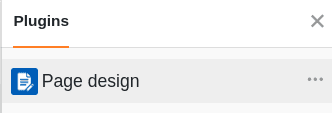
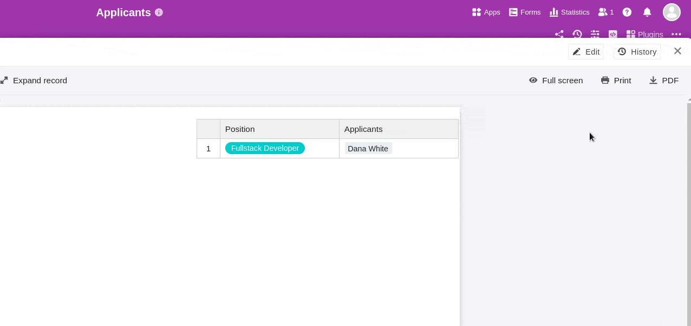
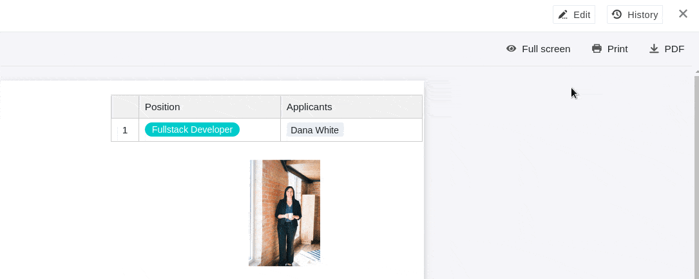
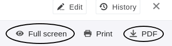
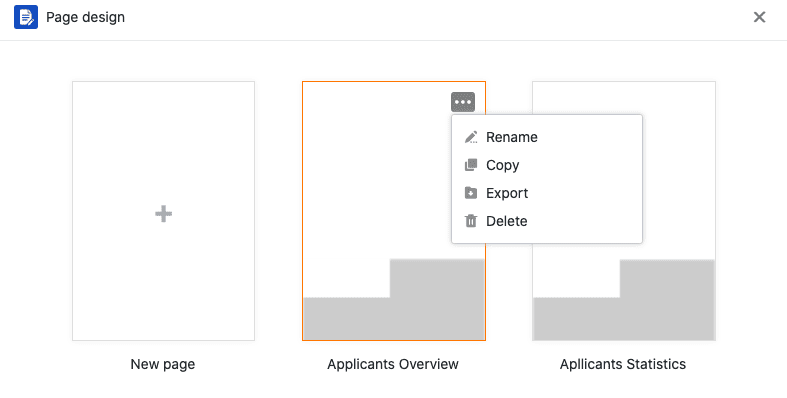

Le **plug-in de conception de pages** vous offre une multitude de possibilités pour visualiser les informations d'un tableau, entre autres sous la forme de lettres d'accompagnement personnalisées, de cartes de visite et de lettres circulaires. Vous pouvez créer des mises en page à l'aide d'**éléments statiques**, complétés par des **éléments dynamiques** et **des champs de tableau**.

Consultez l'article [Activer un plugin dans une base]() pour savoir comment activer le plugin de conception de page et l'ajouter à votre barre d'outils.

## Ajouter une nouvelle page

1. Ouvrez le **plugin de conception de page**.

3. Cliquez sur la **nouvelle page avec l'icône "plus"**.

5. Sélectionnez l'option **Créer une page vierge**.

7. Vous pouvez y trouver les **Réglages** de l'entreprise :

    - Sélectionnez la **table** à partir de laquelle vous souhaitez utiliser les données.
    - Décidez de la **taille du papier**.
    - Définissez le **format portrait** ou **paysage** pour la mise en page.

    



## Enregistrer et modifier un modèle

Lorsque vous avez créé une nouvelle page, vous pouvez l'**enregistrer** comme **modèle** en cliquant sur le bouton  **Terminé**. Vous pouvez à nouveau la modifier après avoir cliqué au même endroit sur le bouton  **Modifier**.



En cliquant sur les **icônes fléchées**  et , vous pouvez annuler ou rétablir des étapes de traitement individuelles.

En dehors du mode édition, vous pouvez consulter et restaurer les **versions** enregistrées  de votre modèle.

En cliquant sur le bouton  **Plein écran**, vous pouvez afficher le design de la page sur tout votre écran. Si vous souhaitez enregistrer un document au format PDF sur votre appareil, cliquez sur  **PDF**, saisissez le **nom du fichier d'exportation** et confirmez en cliquant sur **Exporter**.

Cliquez sur  **Imprimer** pour imprimer l'**entrée actuelle** ou **toutes les entrées de la vue**. Dès que vous confirmez en cliquant sur **Imprimer**, la fenêtre habituelle s'ouvre et vous permet de définir les paramètres d'impression sur votre appareil.

## L'aperçu du design des pages

Dans l'**aperçu du design de la page**, auquel vous accédez en cliquant sur la **flèche de retour**  dans le coin supérieur gauche, vous voyez tous vos modèles enregistrés. Si vous y placez le curseur de la souris sur un document et cliquez sur les **trois points** qui apparaissent, un menu déroulant s'ouvre avec les options **Renommer**, **Copier**, **Exporter** et **Supprimer**.



## Éléments latéraux

Les **éléments de page** vous offrent la possibilité de concevoir **des mises en page standardisées**. Vous avez le choix entre les éléments suivants :

- Éléments statiques
- Éléments dynamiques
- Champs du tableau
- Eléments de vue
- En-tête et pied de page

## Activer les éléments

Vous activez un élément en intégrant le champ correspondant dans la page **par glisser-déposer**. Ensuite, vous pouvez également déplacer l'élément sur la page en cliquant dessus avec la souris et en le faisant glisser.

## Sélectionner et régler les éléments

Vous pouvez sélectionner un élément inséré sur la page en cliquant dessus avec **le bouton droit de la souris**. Dans le tableau de bord à droite de la page, vous voyez différentes **possibilités de réglage** en fonction de l'élément sélectionné. Vous trouverez plus d'informations sur les options respectives dans les articles d'aide liés aux éléments suivants.

## Éléments statiques

Il existe [des images statiques](https://seatable.io/fr/docs/seitendesign-plugin/statisches-bild/) et [des textes statiques](https://seatable.io/fr/docs/seitendesign-plugin/statischer-text/). Pour ces éléments, vous devez insérer **manuellement** des textes ou des images. Les informations des éléments restent les mêmes, même si les entrées du tableau changent.

## Éléments dynamiques

[Les éléments dynamiques](https://seatable.io/fr/docs/seitendesign-plugin/dynamische-elemente/) changent en fonction de certains critères, mais indépendamment des entrées dans le tableau. Ces champs sont **préremplis** et adaptent **automatiquement** leur contenu. Il existe trois éléments dynamiques : **Date actuelle**, **Nom du modèle** et **Utilisateur actuel**.

## Champs du tableau

En tant que [champs de tableau](https://seatable.io/fr/docs/seitendesign-plugin/tabellenfelder/), le plugin de conception de pages liste **toutes les colonnes du tableau** à partir desquelles vous pouvez intégrer des données dans la page. Le contenu des champs dépend des lignes du tableau et change en fonction de l'entrée.

## Eléments de vue

Vous avez également le choix entre deux **éléments d'affichage**. L'élément **Toutes les entrées de la vue** vous permet d'intégrer dans la page toute la section de tableau définie sous la vue. Le **nom de la vue** contient uniquement le nom de la vue sélectionnée.

## En-tête et pied de page

Vous pouvez insérer des **en-têtes et des pieds de page** comme zones spéciales dans une page et les remplir **avec plusieurs éléments**, en décidant vous-même du contenu et de la disposition des éléments. Avec les en-têtes et les pieds de page, vous avez la possibilité d'insérer **des numéros de page** et de verrouiller plusieurs éléments en même temps.



### Possibilités de réglage

Vous ne pouvez faire varier que la **hauteur** des en-têtes et des pieds de page, car ceux-ci s'étendent toujours sur **toute la largeur de la page**. Dans le champ **Hauteur**, saisissez la valeur numérique souhaitée ou modifiez-la à l'aide des **touches fléchées** ou faites défiler avec la **molette de la souris**.

Vous pouvez également modifier la hauteur directement sur la page en cliquant avec **le bouton droit de la souris** sur l'en-tête ou le pied de page et **en faisant glisser** le petit **carré** situé dans le coin inférieur droit du cadre.

### Éléments d'en-tête et de pied de page

Vous pouvez insérer les éléments suivants dans les en-têtes et les pieds de page :

### Éléments statiques :

- [Texte statique](https://seatable.io/fr/docs/seitendesign-plugin/statischer-text/)
- [Image statique](https://seatable.io/fr/docs/seitendesign-plugin/statisches-bild/)

### Éléments dynamiques :

- [Date actuelle](https://seatable.io/fr/docs/seitendesign-plugin/dynamische-elemente/)
- Nombre de pages
- [Nom du modèle](https://seatable.io/fr/docs/seitendesign-plugin/dynamische-elemente/)
- [Utilisateur actuel](https://seatable.io/fr/docs/seitendesign-plugin/dynamische-elemente/)



### Blocage et suppression

Vous pouvez **verrouiller** ou **supprimer** les en-têtes et les pieds de page en sélectionnant l'option correspondante. Si vous verrouillez un en-tête ou un pied de page, **tous les éléments** que vous avez insérés auparavant dans cette zone sont également verrouillés. Il en va de même pour la suppression, qui entraîne la suppression de tous les éléments d'un en-tête ou d'un pied de page.

