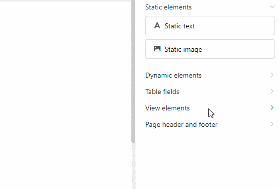
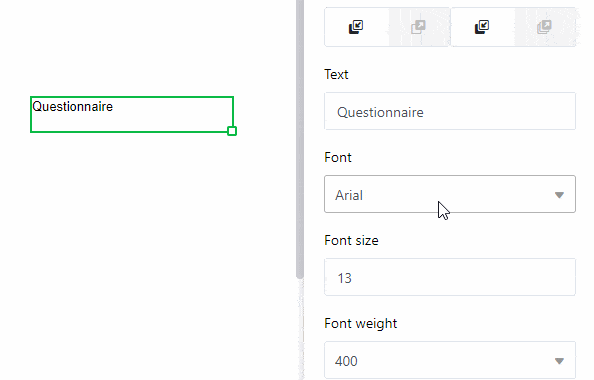
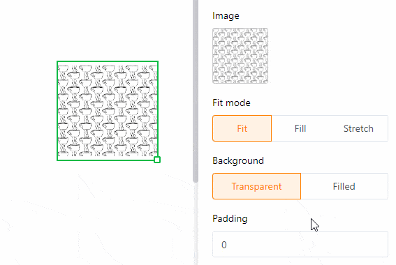

O **plugin de desenho de páginas** oferece-lhe uma vasta gama de opções para visualizar as informações numa tabela sob a forma de cartas de apresentação personalizadas, cartões de visita e boletins informativos, entre outras coisas. Com a ajuda de **elementos estáticos**, pode criar layouts de página que são complementados por **elementos dinâmicos** e **campos de tabela**.

Leia o artigo [Ativar um plugin numa base]() para saber como ativar o plugin de desenho de páginas e adicioná-lo à sua barra de ferramentas.

## Adicionar um novo design de página

1. Abra o **plugin de design de página**.
   
2. Clique na **nova página com o símbolo de mais**.
   
3. Selecionar a opção **Criar página em branco**.
   
4. Aqui pode efetuar as seguintes **configurações**:
   - Selecionar a **tabela** a partir da qual pretende utilizar os dados.
   - Decidir o **tamanho do papel**.
   - Especificar o **formato de retrato** ou o **formato de paisagem** para a apresentação da página.
   



## Guardar e editar um design de página

Depois de ter criado um novo design de página, pode guardá-lo utilizando o botão  **Terminado**. Pode voltar a editá-lo depois de clicar no botão  **Editar** no mesmo sítio.

Fora do modo de edição, pode guardar as  **Versões** do design da página e restaurá-las.



Pode anular ou refazer passos de edição individuais clicando nos ícones de **seta**  e .

Através do botão  **Teclado completo** para mostrar o design da página em todo o ecrã. Se pretender guardar um documento como PDF no seu dispositivo, clique em  **PDF**, introduza o **nome do ficheiro de exportação** e confirme com **Exportar**.

Clique em  **Imprimir** para imprimir a **entrada atual** ou **todas as entradas na vista**. Assim que confirmar com **Imprimir**, abre-se a janela habitual na qual pode efetuar as definições de impressão no seu dispositivo.

## A visão geral do design de páginas

Na **visão geral do design de páginas**, a que pode aceder através da **seta para trás**  no canto superior esquerdo, pode ver todos os seus designs guardados. Se passar o ponteiro do rato sobre um documento e clicar nos **três pontos** que aparecem, abre-se um menu pendente com as opções **Renomear**, **Copiar**, **Exportar** e **Eliminar**.



## Elementos da página

Os **elementos de página** oferecem-lhe a possibilidade de conceber **planos normalizados**. Pode escolher entre os seguintes elementos:

- Elementos estáticos
- Elementos dinâmicos
- Campos de tabela
- Elementos de visualização
- Cabeçalho e rodapé

### Ativar os elementos

Para ativar um elemento, insira o respetivo campo **arrastando e largando** na página. Pode então mover o elemento na página clicando e arrastando-o com o rato.

### Selecionar e definir os elementos

Selecione um elemento inserido na página clicando nele com o **botão direito do rato**. No painel à direita da página, verá várias **opções de configuração** dependendo do elemento selecionado. Pode obter mais informações sobre as respectivas opções nos capítulos seguintes sobre os elementos.

### Bloquear, duplicar e eliminar elementos

Pode **bloquear**, **duplicar** ou **eliminar** um elemento com um clique, selecionando as opções correspondentes.

## Texto estático

O **texto estático** oferece-lhe a opção de integrar **elementos de texto** tais como cabeçalhos ou corpo de texto numa página. Isto é muito útil para criar **templates para documentos** que pode mais tarde personalizar com dados da sua tabela.

Ao contrário do texto proveniente de colunas de texto na sua tabela, o texto estático não se altera e permanece o mesmo independentemente das entradas na tabela. No entanto, é necessário **inserir** e **formatar** manualmente o **texto** correspondente.

### Alterar a posição e o tamanho do elemento de texto

Pode determinar a posição do elemento de texto na página introduzindo as coordenadas **X** e **Y**. Em alternativa, também pode simplesmente mover o elemento de texto para a posição pretendida **arrastando e largando**.

Os campos **Largura** e **Altura** alteram o tamanho da moldura de texto. Em alternativa, também pode alterar o **tamanho** diretamente na página, clicando no campo de texto com o **botão direito do rato** e **arrastando** o pequeno **quadrado** no canto inferior direito da moldura.

Com **Rotação**, define o ângulo em que pode rodar a caixa de texto em torno do seu canto superior esquerdo. Esta função permite-lhe criar **letras verticais** (a 90 ou 270 graus).

Quando utiliza **vários elementos de texto**, estes são sobrepostos em **camadas**. Se quiser alterar a **ordem** das camadas, pode fazê-lo através das definições. Clique nos diferentes botões para deslocar o texto **uma camada para a frente/para trás** ou completamente **para o primeiro plano/para o fundo**.

### Definições de texto

Introduza o texto no **campo de texto** nas definições ou na **quadro de texto** diretamente na página. Pode selecionar uma moldura de texto na página em qualquer altura, clicando nela com o **botão direito do rato**.

Defina o **font**, o **tamanho do font** e o **peso do font**.

Pode ajustar a **altura da linha**, bem como o **alinhamento horizontal** e **vertical** do texto nos campos correspondentes.

Altere a **cor do texto** introduzindo o código hexadecimal da cor ou clicando no campo da cor. Pode ajustar a **cor de fundo** da mesma forma se selecionar a opção **Preenchido**.

Aumente o **Espaçamento interno do texto** para reduzir a área preenchida com texto dentro da moldura.

### Definições do quadro

Adicione uma **quadro completo** ao texto activando os **controladores** para todos os lados do retângulo. Pode dar ao texto **contornos individuais** se ativar apenas os controlos deslizantes para determinados lados. Especifique a **cor da moldura** introduzindo o código de cor hexadecimal ou clicando no campo de cor. Para ajustar a **espessura da moldura**, basta definir o valor numérico.

Pode utilizar o **raio do quadro** para **arredondar** os **cantos** do quadro até criar um **arco circular**.

## Imagem estática

Uma **imagem estática** oferece-lhe a opção de integrar **arquivos de imagem** como logótipos, gráficos ou imagens de fundo numa página para criar um layout de página básico. Ao contrário das imagens que têm origem nas [colunas de imagens]() da sua tabela, uma imagem estática não muda e permanece a mesma independentemente das entradas na tabela. No entanto, é necessário carregar o ficheiro de imagem correspondente **manualmente**.

### Alterar a posição e o tamanho da imagem

Pode determinar a posição da imagem na página introduzindo as coordenadas **X** e **Y**. Em alternativa, pode simplesmente arrastar e largar a imagem para a posição pretendida.

Utilize os campos **Largura** e **Altura** para alterar o tamanho da imagem. Para **Rotação**, defina o ângulo em que a imagem é rodada em torno do ponto do canto superior esquerdo. Em alternativa, também pode alterar o **tamanho da imagem** diretamente na página, clicando na imagem com o **botão direito do rato** e **arrastando** o pequeno **quadrado** no canto inferior direito da moldura.

Assim que utilizar **várias imagens**, estas são sobrepostas em **camadas**. Se quiser alterar a **ordem** das camadas, pode fazê-lo através das definições. Clique nos vários botões para mover a imagem **uma camada para a frente/para trás** ou completamente **para o primeiro plano/para o fundo**.

### Definições de imagem

Para inserir um **ficheiro na moldura da imagem**, clique no campo com o símbolo **documento** em **imagem** ou **clique duas vezes** diretamente na moldura da imagem na página. Na janela que se abre, selecione um ficheiro de imagem do seu dispositivo e carregue-o.

Utilize os modos de preenchimento **Personalizar**, **Preencher** e **Esticar** para selecionar a forma como a imagem deve ser encaixada na moldura.

Especialmente quando utiliza ficheiros PNG com um fundo transparente, pode ser útil preencher o **fundo** com uma **cor** nas definições. No entanto, isto também funciona para outros formatos de ficheiro. Clique em **Preenchido** e selecione uma cor de fundo introduzindo o código de cor hexadecimal ou clicando no campo de cor.

Aumente o **espaço interno da imagem** para reduzir o tamanho da imagem dentro da moldura.

### Definições do quadro

Adicione uma **quadro completo** à imagem activando os **controladores** para todos os lados do retângulo. Pode dar à imagem **contornos individuais** activando apenas os controlos deslizantes para determinados lados. Especifique a **cor da moldura** introduzindo o código de cor hexadecimal ou clicando no campo de cor. Para ajustar a **espessura da moldura**, basta definir o valor numérico.

Pode utilizar o **raio da moldura** para **arredondar** os **cantos** da moldura da imagem até criar um **arco circular**.

## Elementos dinâmicos

Os elementos dinâmicos mudam com base em determinados critérios, mas independentemente das entradas na tabela. Estes campos são **preenchidos** e ajustam o seu conteúdo **automaticamente**. Existem três elementos dinâmicos:

- **Data atual**
- **Nome do modelo**
- **Utilizador atual**

As **configurações** que pode efetuar para os elementos dinâmicos são as mesmas que para os elementos de texto estáticos.

### Data atual

A **data atual** ajusta-se automaticamente à data atual sem ter de a definir manualmente. Isto permite-lhe criar cartas de apresentação personalizadas, por exemplo, sem que uma data desactualizada apareça.

A única definição adicional em comparação com os elementos de texto estáticos é a definição **Formato**. Aqui pode escolher entre as diferentes ortografias regionais para as datas.

### Nome do modelo

Pode incorporar na página o nome do design da página que está a editar atualmente. Se alterar o **nome do modelo**, o texto neste campo adaptar-se-á automaticamente.

### Utilizador atual

O seu próprio nome aparece no campo **Utilizador atual** se estiver a fazer alterações ao modelo através da sua conta. Assim que outro **membro da equipa** chamar o modelo no plugin de design da página, o seu nome é apresentado.

## Campos da tabela

Como campos de tabela, o plugin de design de página lista **todas as colunas da tabela** a partir das quais pode inserir dados na página. Como depende do número e do tipo de colunas dos campos de tabela que tem de escolher, tem diferentes opções consoante a tabela. O conteúdo dos campos depende dos dados da tabela e muda consoante a entrada (registo de dados numa linha).

Se o usuário alternar entre as entradas utilizando as opções de navegação **Entrada anterior** e **Entrada seguinte**, os dados de outras linhas são automaticamente exibidos nos campos de tabela.

Isto torna claro: com a ajuda dos campos de tabela, pode rapidamente apresentar informações dos respectivos registos de dados no seu modelo e criar diferentes versões de um documento. Também pode utilizar o botão **Expandir entrada** para abrir os **Detalhes da linha** e editar a respectiva entrada na tabela.

### Exemplo de aplicação

As **colunas** da tabela "Livro de orçamento" devem ser apresentadas como **campos de tabela** no plugin de design da página.

Crie uma **nova página** no plugin ou abra um **desenho de página guardado**. As colunas da tabela estão agora disponíveis como campos de tabela nos **elementos de página**.

**Arraste e largue** os campos de tabela para as posições pretendidas na página. Os campos de tabela são preenchidos **automaticamente** com as informações da coluna de uma entrada.

### Diferença entre páginas e entradas

É importante compreender a diferença entre entradas e páginas. As **páginas** referem-se sempre à mesma linha de uma tabela, enquanto as **entradas** representam os registos de dados de linhas diferentes.

Pode adicionar páginas para expandir o documento e criar um **modelo de várias páginas**. Para o fazer, clique no botão **Adicionar página**.

Ao clicar com o **botão direito do rato**, pode aceder a um menu pendente que lhe oferece opções adicionais para uma página.

Para **alterar** entre as páginas, basta clicar na **magnatura da página** correspondente na barra de páginas. Pode alterar a **ordem das páginas** mantendo o botão do rato premido sobre os **seis pontos**  e **movendo** a miniatura da página. 

## Elementos de vista

Também tem dois **elementos de vista** para escolher. O elemento **Todos os itens da vista** permite-lhe incorporar na página toda a secção da tabela definida numa vista. O elemento **Nome da vista** contém apenas o nome da vista selecionada.

## Cabeçalho e rodapé

**Pode inserir cabeçalhos e rodapés** como áreas especiais numa página e preenchê-las com vários elementos, decidindo o conteúdo e a disposição dos elementos. Com cabeçalhos e rodapés, tem a opção de inserir **números de página** e bloquear vários elementos ao mesmo tempo.



### Opções de configuração

Só pode variar a **altura** dos cabeçalhos e rodapés, uma vez que estes se estendem sempre sobre a **largura total da página**. No campo **Altura**, introduza o valor numérico pretendido ou altere-o utilizando as **teclas de seta** ou desloque-se com a **roda do rato**.

Em alternativa, também pode alterar a altura diretamente na página, clicando no cabeçalho ou rodapé com o **botão direito do rato** e **arrastando** o pequeno **quadrado** no canto inferior direito da moldura.

### Elementos em cabeçalhos e rodapés

Pode inserir seis elementos diferentes nos cabeçalhos e rodapés.

**Elementos estáticos**:
- Texto estático
- Imagem estática

**Elementos dinâmicos**:
- Data atual
- Número da página
- Nome do modelo
- Utilizador atual



### Bloquear e apagar

Pode **bloquear** ou **eliminar** cabeçalhos e rodapés selecionando a respectiva opção. Se bloquear um cabeçalho ou rodapé, **todos os elementos** que tenha inserido anteriormente nesta área são também bloqueados. O mesmo se aplica à eliminação, em que também são eliminados todos os elementos num cabeçalho ou rodapé.

