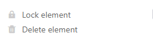

**Плагин оформления страниц** предлагает вам широкий выбор вариантов визуализации информации в таблице в виде персонализированных сопроводительных писем, визитных карточек, информационных бюллетеней и т.д. Вы можете использовать **статические элементы** для создания макетов страниц, которые дополняются **динамическими элементами** и **полями таблиц**.

Прочитайте статью [Активация плагина в базе](), чтобы узнать, как активировать плагин Page Design и добавить его на панель инструментов.

## Добавить новую страницу

1. Откройте **плагин дизайна страницы**.

3. Нажмите на **новую страницу с символом плюса**.

5. Выберите опцию **Создать пустую страницу**.

7. Здесь вы можете найти следующее **Настройки** сделать:

    - Выберите **таблицу**, данные из которой вы хотите использовать.
    - Определитесь с **форматом бумаги**.
    - Установите **книжную** или **альбомную** ориентацию страницы.

    



## Сохранение и редактирование шаблона

Когда вы создали новую страницу, вы можете **сохранить** ее как **шаблон** с помощью кнопки  **Done**. Вы можете отредактировать его снова, нажав на кнопку  **Edit** в том же месте.



Нажав на **символы стрелок**  и , вы можете отменить или повторить отдельные шаги редактирования.

Вне режима редактирования вы можете просматривать и восстанавливать сохраненные  **версии** вашего шаблона.

Используйте кнопку  **Полный экран**, чтобы отобразить дизайн страницы на весь экран. Если вы хотите сохранить документ в формате PDF на своем устройстве, нажмите  **PDF**, введите **имя экспортируемого файла** и подтвердите команду **Export**.

Нажмите на  **Печать**, чтобы распечатать **текущую запись** или **все записи в представлении**. Как только вы подтвердите команду **Print**, откроется обычное окно, в котором вы зададите настройки печати на вашем аппарате.

## Обзор дизайна страницы

В **обзоре дизайна страницы**, куда вы попадаете с помощью **стрелки назад**  в левом верхнем углу, вы можете увидеть все сохраненные шаблоны. Если навести указатель мыши на документ и нажать на появившиеся **три точки**, откроется выпадающее меню с опциями **Переименовать**, **Копировать**, **Экспортировать** и **Удалить**.



## Боковые элементы

**Элементы страниц** позволяют создавать **стандартизированные макеты**. У вас есть выбор между следующими элементами:

- Статические элементы
- Динамические элементы
- Поля таблицы
- Элементы вида
- Верхний и нижний колонтитулы

## Активация элементов

Вы активируете элемент, внедряя соответствующее поле в страницу с **помощью перетаскивания**. После этого вы также можете перемещать элемент на странице, щелкая и перетаскивая его мышью.

## Выбор и установка элементов

Вы выбираете элемент, вставленный на страницу, щелкая по нему **правой кнопкой мыши**. На панели в правой части страницы вы увидите различные **параметры настройки** в зависимости от выбранного элемента. Подробнее о соответствующих опциях можно узнать в связанных статьях справки для следующих элементов.

## Статические элементы

Существуют [статичные изображения](https://seatable.io/ru/docs/seitendesign-plugin/statisches-bild/) и [статичные тексты](https://seatable.io/ru/docs/seitendesign-plugin/statischer-text/). Для этих элементов необходимо ввести тексты или изображения **вручную**. Информация об элементах остается неизменной, даже если записи в таблице меняются.

## Динамические элементы

[Динамические элементы](https://seatable.io/ru/docs/seitendesign-plugin/dynamische-elemente/) изменяются на основе определенных критериев, но независимо от записей в таблице. Эти поля **предварительно заполняются** и **автоматически** корректируют свое содержимое. Есть три динамических элемента: **Текущая дата**, **имя шаблона** и **текущий пользователь**.

## Поля таблицы

В качестве [полей таблицы](https://seatable.io/ru/docs/seitendesign-plugin/tabellenfelder/) плагин дизайна страницы перечисляет **все столбцы таблицы**, данные из которых можно включить в страницу. Содержимое полей зависит от строк таблицы и меняется в зависимости от записи.

## Элементы вида

У вас также есть два **элемента просмотра** на выбор. Элемент **All View Entries** позволяет встроить в страницу весь раздел таблицы, определенный для данного представления. **Имя представления** содержит только имя выбранного представления.

## Верхний и нижний колонтитулы

Вы можете вставлять **верхние и нижние колон** титулы как специальные области на странице и заполнять их **несколькими элементами**, при этом вы сами определяете содержание и расположение элементов. С помощью верхних и нижних колонтитулов вы можете вставлять **номера страниц** и блокировать несколько элементов одновременно.



### Параметры настройки

Вы можете изменить только **высоту** заголовков и колонтитулов, поскольку они всегда простираются по **всей ширине страницы**. В поле **Высота** введите нужное числовое значение или измените его с помощью **клавиш со стрелками** или прокрутки **колесиком мыши**.

Кроме того, высоту можно изменить непосредственно на странице, **щелкнув правой кнопкой мыши** на верхнем или нижнем колонтитуле и **перетащив** маленький **квадратик** в правом нижнем углу рамки.

### Элементы верхнего и нижнего колонтитулов

В верхние и нижние колонтитулы можно вставлять следующие элементы:

### Статические элементы:

- [Статический текст](https://seatable.io/ru/docs/seitendesign-plugin/statischer-text/)
- [Статичное изображение](https://seatable.io/ru/docs/seitendesign-plugin/statisches-bild/)

### Динамические элементы:

- [Текущая дата](https://seatable.io/ru/docs/seitendesign-plugin/dynamische-elemente/)
- Номер страницы
- [Имя шаблона](https://seatable.io/ru/docs/seitendesign-plugin/dynamische-elemente/)
- [Текущий пользователь](https://seatable.io/ru/docs/seitendesign-plugin/dynamische-elemente/)



### Блокировка и удаление

Вы можете **заблокировать** или **удалить** верхние и нижние колонтитулы, выбрав соответствующую опцию. Если вы заблокируете верхний или нижний колонтитул, **все элементы**, которые вы ранее вставляли в эту область, также будут заблокированы. То же самое относится и к удалению, при котором вы также удаляете все элементы в верхнем или нижнем колонтитуле.

