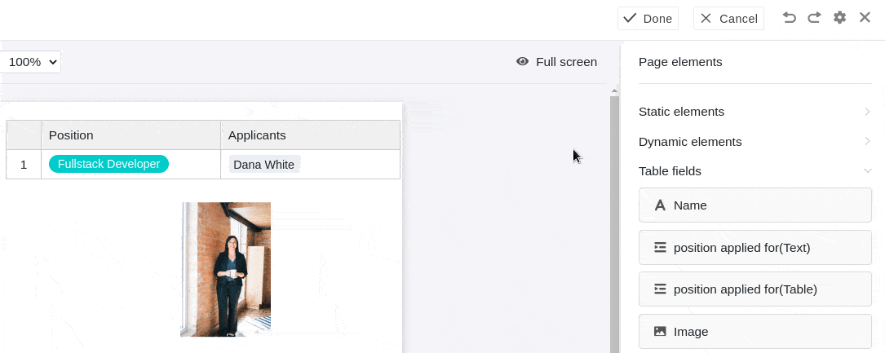
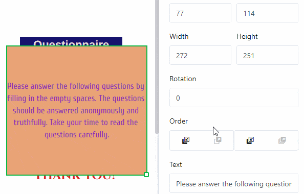
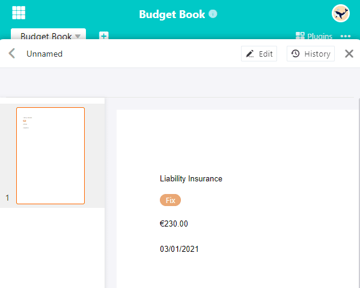

Плагин **Дизайн страниц** предлагает вам широкий спектр возможностей для визуализации информации в таблице в виде персонализированных сопроводительных писем, визитных карточек, информационных бюллетеней и т. д. С помощью **статических элементов** вы можете создавать макеты страниц, которые дополняются **динамическими элементами** и **табличными полями**.

Прочитайте статью [Активация плагина в базе](), чтобы узнать, как активировать плагин дизайна страниц и добавить его на панель инструментов.

## Добавить новый дизайн страницы

1. откройте плагин **Дизайн страниц**.
   
2. нажмите на **новую страницу с символом плюса**.
   
3. выберите опцию **Создать пустую страницу**.
   
4. здесь вы можете сделать следующие **настройки**:
   - Выберите **таблицу**, из которой вы хотите использовать данные.
   - Определитесь с **размером бумаги**.
   - Укажите **портретный формат** или **ландшафтный формат** для макета страницы.
   



## Сохранение и редактирование дизайна страницы

Создав новый дизайн страницы, вы можете сохранить его с помощью кнопки  **Готово**. Вы можете отредактировать его снова, нажав на кнопку  **Редактировать** в том же месте.

Вне режима редактирования вы можете сохранить сохраненные  **версии** дизайна страницы и восстановить их.



Вы можете отменить или повторить отдельные шаги редактирования, нажав на **значки со стрелками**  и .

С помощью кнопки  **Полный экран**, чтобы отобразить дизайн страницы на весь экран. Если вы хотите сохранить документ в формате PDF на своем устройстве, нажмите  **PDF**, введите **имя экспортируемого файла** и подтвердите нажатием **Экспорт**.

Нажмите на  **Печать**, чтобы распечатать **текущую запись** или **все записи в представлении**. После подтверждения **Печать** откроется обычное окно, в котором вы можете задать настройки печати на вашем устройстве.

## Обзор дизайна страницы

В **обзоре дизайна страниц**, доступ к которому осуществляется с помощью **стрелки назад**  в левом верхнем углу, вы можете увидеть все сохраненные дизайны. Если навести указатель мыши на документ и нажать на появившиеся **три точки**, откроется выпадающее меню с опциями **Переименовать**, **Копировать**, **Экспорт** и **Удалить**.



## Элементы страницы

Элементы **страницы** позволяют создавать **стандартизированные макеты**. Вы можете выбрать один из следующих элементов:

- Статические элементы
- Динамические элементы
- Поля таблицы
- Элементы представления
- Верхний и нижний колонтитулы

### Активация элементов

Вы активируете элемент, внедряя соответствующее поле **посредством перетаскивания** на страницу. Затем вы можете перемещать элемент на странице, щелкая и перетаскивая его мышью.

### Выбор и настройка элементов

Выберите элемент, вставленный на страницу, щелкнув по нему **правой кнопкой мыши**. На панели справа от страницы вы увидите различные **настройки** в зависимости от выбранного элемента. Подробнее о соответствующих опциях вы можете узнать в следующих главах, посвященных элементам.

### Блокировка, дублирование и удаление элементов

Вы можете **заблокировать**, **дублировать** или **удалить** элемент одним щелчком мыши, выбрав соответствующие опции.

## Статический текст

Функция **статический текст** позволяет интегрировать на страницу **текстовые элементы**, такие как заголовки или основной текст. Это очень удобно для создания **шаблонов документов**, которые впоследствии можно персонализировать с помощью данных из таблицы.

В отличие от текста, поступающего из текстовых колонок таблицы, статический текст не изменяется и остается неизменным независимо от записей в таблице. Однако вы должны вручную **вставить** и **форматировать** соответствующий **текст**.

### Изменение положения и размера текстового элемента

Вы можете определить положение текстового элемента на странице, введя **X-** и **Y-координаты**. Кроме того, можно просто переместить текстовый элемент в нужное место **перетаскиванием**.

Поля **Ширина** и **Высота** изменяют размер текстовой рамки. Кроме того, вы можете изменить **размер** прямо на странице, щелкнув по текстовому полю **правой кнопкой мыши** и **перетащив** маленький **квадратик** в правом нижнем углу рамки.

С помощью **Rotation** вы задаете угол, на который можно повернуть текстовое поле вокруг его левого верхнего угла. Эта функция позволяет создавать **вертикальные надписи** (на 90 или 270 градусов).

При использовании **нескольких текстовых элементов** они накладываются друг на друга в **слоях**. Если вы хотите изменить **порядок** слоев, вы можете сделать это через настройки. Нажимайте на различные кнопки, чтобы переместить текст либо **на один слой вперед/назад**, либо полностью **на передний/задний план**.

### Настройки текста

Введите текст либо в поле **текст** в настройках, либо в **текстовый фрейм** непосредственно на странице. Вы можете в любой момент выбрать текстовый фрейм на странице, щелкнув по нему **правой кнопкой мыши**.

Установите **шрифт**, **размер шрифта** и **вес шрифта**.

В соответствующих полях можно настроить **высоту строки**, а также **горизонтальное** и **вертикальное выравнивание** текста.

Измените **цвет текста**, введя шестнадцатеричный код цвета или щелкнув по полю цвета. Аналогичным образом можно изменить **цвет фона**, если выбрать опцию **Заливка**.

Увеличьте **Внутренний интервал текста**, чтобы уменьшить область, заполненную текстом в рамке.

### Настройки фрейма

Добавьте **полную рамку** к тексту, активировав **контроллеры** для всех сторон прямоугольника. Вы можете придать тексту **индивидуальные очертания**, если активируете ползунки только для определенных сторон. Задайте **цвет рамки**, введя шестнадцатеричный код цвета или щелкнув по полю цвета. Чтобы настроить **толщину рамки**, просто установите числовое значение.

С помощью параметра **радиус рамки** можно **закруглить** **уголки** рамки, пока не будет создана **круглая дуга**.

## Статичное изображение

Статические изображения** позволяют интегрировать **файлы изображений**, такие как логотипы, графические или фоновые изображения, в страницу для создания базового макета страницы. В отличие от изображений, создаваемых в [колонках изображений]() вашей таблицы, статическое изображение не меняется и остается неизменным независимо от записей в таблице. Однако вам придется загружать соответствующий файл изображения **вручную**.

### Изменение положения и размера изображения

Вы можете определить положение изображения на странице, введя **X-** и **Y-координаты**. Кроме того, вы можете просто перетащить изображение в нужное место.

Используйте поля **Ширина** и **Высота** для изменения размера изображения. В поле **Rotation** задайте угол, на который изображение будет повернуто вокруг верхней точки левого угла. Кроме того, вы можете изменить **размер изображения** прямо на странице, щелкнув на нем **правой кнопкой мыши** и **перетащив** маленький **квадрат** в правом нижнем углу рамки.

Если вы используете **несколько изображений**, они накладываются друг на друга в **слоях**. Если вы хотите изменить **порядок** слоев, вы можете сделать это через настройки. Нажимайте на различные кнопки, чтобы переместить изображение либо **на один слой вперед/назад**, либо полностью **на передний/задний план**.

### Настройки изображения

Чтобы вставить **файл в рамку изображения**, нажмите на поле с символом **документа** под **изображением** или **двойным щелчком мыши** непосредственно в рамке изображения на странице. В открывшемся окне выберите файл изображения с вашего устройства и загрузите его.

Используйте режимы заливки **Настроить**, **Заполнить** и **Растянуть**, чтобы выбрать способ размещения изображения в рамке.

Особенно при использовании PNG-файлов с прозрачным фоном может быть полезно заполнить **фон** с помощью **цвета** в настройках. Впрочем, это работает и для других форматов файлов. Нажмите на **Заливка** и выберите цвет фона, введя шестнадцатеричный код цвета или щелкнув по полю цвета.

Увеличьте **внутренний интервал изображения**, чтобы уменьшить размер изображения в кадре.

### Настройки кадра

Добавьте **полную рамку** к изображению, активировав **контроллеры** для всех сторон прямоугольника. Вы можете придать изображению **индивидуальные контуры**, активировав ползунки только для определенных сторон. Укажите **цвет рамки**, введя шестнадцатеричный код цвета или щелкнув по полю цвета. Чтобы настроить **толщину рамки**, просто установите числовое значение.

С помощью параметра **радиус рамки** можно **закруглить** **уголки** рамки изображения, пока не будет создана **круглая дуга**.

## Динамические элементы

Динамические элементы изменяются на основе определенных критериев, но независимо от записей в таблице. Эти поля **предварительно заполняются** и изменяют свое содержимое **автоматически**. Существует три динамических элемента:

- **Текущая дата**
- **Имя шаблона**
- **Текущий пользователь**

Настройки, которые вы можете сделать для динамических элементов, такие же, как и для статических текстовых элементов.

### Текущая дата

Параметр **текущая дата** автоматически подстраивается под текущую дату без необходимости задавать ее вручную. Это позволяет, например, создавать персонализированные сопроводительные письма, не допуская попадания в них устаревшей даты.

Единственная дополнительная настройка по сравнению со статичными текстовыми элементами - это настройка **Формат**. Здесь вы можете выбрать один из вариантов регионального написания даты.

### Имя шаблона

Вы можете вставить в страницу название дизайна страницы, который вы редактируете в данный момент. Если вы измените **имя шаблона**, текст в этом поле автоматически адаптируется.

### Текущий пользователь

Ваше собственное имя отображается в поле **Текущий пользователь**, если в данный момент вы вносите изменения в шаблон через свой аккаунт. Как только другой **член команды** вызовет шаблон в плагине дизайна страниц, отобразится его имя.

## Поля таблицы

В качестве полей таблицы плагин дизайна страницы перечисляет **все столбцы таблицы**, из которых вы можете вставить данные на страницу. Поскольку количество и тип столбцов зависит от того, какие поля таблицы вы можете выбрать, у вас есть разные варианты в зависимости от таблицы. Содержимое полей зависит от данных в таблице и меняется в зависимости от записи (записи данных в строке).

Если вы переключаетесь между записями с помощью навигационных опций **Предыдущая запись** и **Следующая запись**, данные из других строк автоматически отображаются в полях таблицы.

Таким образом, становится понятно, что с помощью полей таблицы можно быстро отобразить информацию из соответствующих записей данных в шаблоне и создать различные версии документа. С помощью кнопки **Развернуть запись** можно также открыть **Сведения о строке** для редактирования соответствующей записи в таблице.

### Пример применения

Столбцы таблицы "Бюджетная книга" должны отображаться как **табличные поля** в плагине оформления страницы.

Создайте **новую страницу** в плагине или откройте **сохраненный дизайн страницы**. Столбцы таблицы теперь доступны как поля таблицы в **элементах страницы**.

Перетащите поля таблицы в нужные места на странице. Поля таблицы **автоматически** заполняются информацией из столбцов записи.

### Разница между страницами и записями

Важно понимать разницу между записями и страницами. **Страницы** всегда относятся к одной и той же строке таблицы, в то время как **записи** представляют собой записи данных из разных строк.

Вы можете добавить страницы, чтобы расширить документ и создать **многостраничный шаблон**. Для этого нажмите на кнопку **Добавить страницу**.

Щелкнув правой кнопкой мыши, вы можете вызвать выпадающее меню, которое предлагает вам дополнительные опции для страницы.

Чтобы **переключаться** между страницами, просто нажмите на миниатюру соответствующей **страницы** на панели страниц. Вы можете изменить **порядок страниц**, удерживая кнопку мыши на **шести точках**  и **перемещая** миниатюру страницы.

## Элементы просмотра

У вас также есть два **элемента просмотра** на выбор. Элемент **Все записи представления** позволяет встроить в страницу весь раздел таблицы, определенный в представлении. Элемент **Имя вида** содержит только имя выбранного вида.

## Верхний и нижний колонтитулы

Вы можете вставить **верхние и нижние колонтитулы** как специальные области на странице и заполнить их несколькими элементами, при этом вы сами определяете их содержание и расположение. В верхних и нижних колонтитулах можно вставлять **номера страниц** и блокировать несколько элементов одновременно.



### Параметры настройки

Вы можете изменять только **высоту** верхних и нижних колонтитулов, поскольку они всегда превышают **общую ширину страницы**. В поле **Высота** введите нужное числовое значение или измените его с помощью **кнопок со стрелками** или прокрутки с помощью **колесика мыши**.

Кроме того, вы можете изменить высоту прямо на странице, щелкнув по верхнему или нижнему колонтитулу **правой кнопкой мыши** и **перетащив** маленький **квадрат** в правом нижнем углу рамки.

### Элементы в верхних и нижних колонтитулах

В верхние и нижние колонтитулы можно вставить шесть различных элементов.

**Статические элементы**:
- Статический текст
- Статическое изображение

**Динамические элементы**:
- Текущая дата
- Номер страницы
- Название шаблона
- Текущий пользователь



### Блокировка и удаление

Вы можете **заблокировать** или **удалить** верхние и нижние колонтитулы, выбрав соответствующую опцию. Если вы заблокируете верхний или нижний колонтитул, **все элементы**, которые вы ранее вставляли в эту область, также будут заблокированы. То же самое относится и к удалению, при котором удаляются все элементы в верхнем или нижнем колонтитуле.

